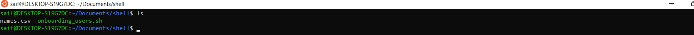
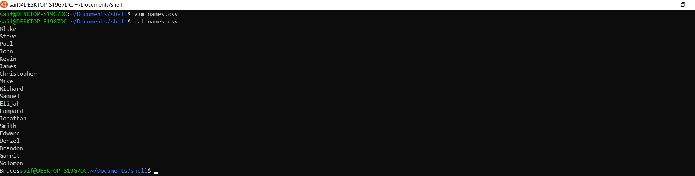
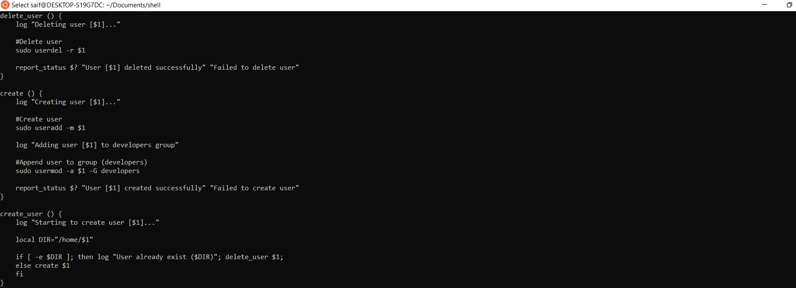
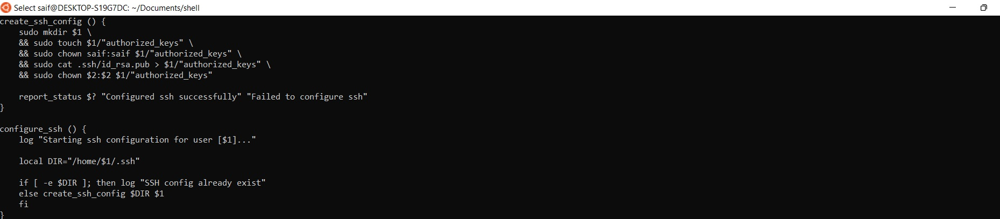
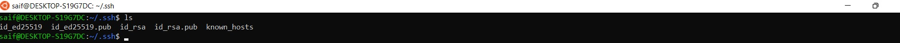

# **SHELL SCRIPTING**
In this project we would onboard 20 new Linux users onto a server and create a shell script that reads a csv file that contains the first name of the users to be onboarded.   

# **Step 1 - Create a names.csv file**

>#Create the project folder called Shell   
>`mkdir Shell`   
> 
>#Move into the Shell folder
>`cd Shell`   
> 
>#Create a csv file name names.csv   
>`touch names.csv`   
> 
>#Open the names.csv file   
>`vim names.csv`

*Created a names.csv file*  
 

*Content of names.csv file*  
 

*Part script to create user*  
 

*Part script to configure ssh for user*  
 

# **Step 2 - Configure current user with the correct public key and private key**
>#Change directory .ssh folder   
>`cd .ssh`   
> 
>#Create a file for the public key   
>`touch id_rsa.pub`   
> 
>#Open the file using your favorite editor and paste in the public key   
>`vi id_rsa.pub`   
> 
>#Create a file for your private key   
>`touch id_rsa`
>    
>#Open the file using your favorite editor and paste in the private key.   
>`vi id_rsa`
>    

*Created public and private keys*  
 

Test a few of the users randomly, and ensure that you are able to connect to the server using the private key and the public key