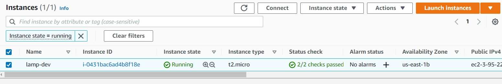
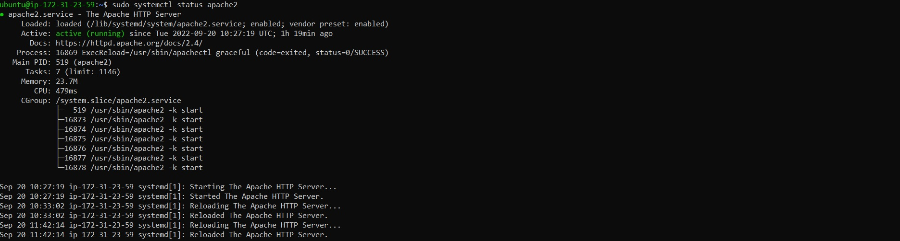
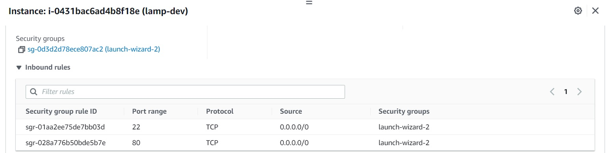
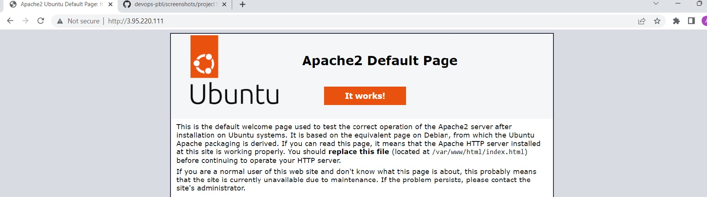
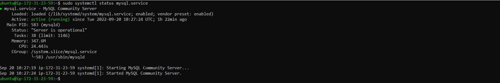
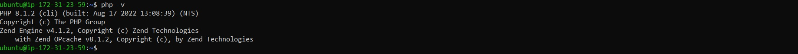
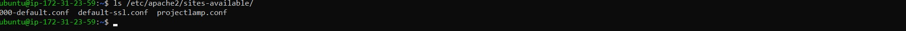
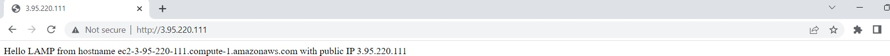
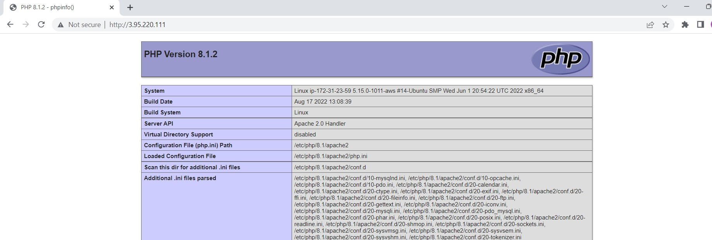

# **WEB STACK IMPLEMENTATION (LAMP STACK) IN AWS**
LAMP web stack is a technology stack that combines a set of frameworks and tools specifically chosen to work 
 together and used to develop a software product.  
 

# **Step 1 - Preparing prerequisites** 
In order to complete this project, an AWS account and a virtual server with Ubuntu Server OS is required.  
 

Creation of a new AWS account gives access to the free tier plan which allows to spin up a new EC2 instance
 (an instance of a virtual server) for free in only a matter of a few clicks.  
 

You can watch the videos below to learn how to Provision a server and connect to it.
- [AWS account setup and Provisioning an Ubuntu Server](https://www.youtube.com/watch?v=xxKuB9kJoYM&list=PLtPuNR8I4TvkwU7Zu0l0G_uwtSUXLckvh&index=6) 
- [Connecting to your EC2 Instance](https://www.youtube.com/watch?v=TxT6PNJts-s&list=PLtPuNR8I4TvkwU7Zu0l0G_uwtSUXLckvh&index=7)    
 

*EC2 machine in running state*  
 

Let us move on and configure our EC2 machine to serve a Web server!  
 

# **STEP 2 — INSTALLING APACHE AND UPDATING THE FIREWALL** 
What exactly is Apache?  
 

Apache HTTP Server is the most widely used web server software. Developed and maintained by Apache Software Foundation, 
 Apache is an open source software available for free. It runs on 67% of all webservers in the world. It is fast, reliable, and secure.  
 

The Apache web server is among the most popular web servers in the world. It’s well documented, has an active community
 of users, and has been in wide use for much of the history of the web, which makes it a great default choice for hosting 
 a website.   
    

Install Apache using Ubuntu’s package manager ‘*apt*’:
    

> #update a list of packages in package manager
 `sudo apt update`
 
 #run apache2 package installation
 `sudo apt install apache2`   

 To verify that apache2 is running as a Service in our OS, use following command:
>`sudo systemctl status apache2`  
           

 
*Verifying apache2 is running*  
 

Before we can receive any traffic by our Web Server, we need to open TCP port 80 which is the default port that web browsers use 
 to access web pages on the Internet   

 
*Opened port 80*  

 Now it is time for us to test how our Apache HTTP server can respond to requests from the Internet.
 Open a web browser of your choice and try to access following url
>`http://<Public-IP-Address>:80`

 If you see following page, then your web server is now correctly installed and accessible through your firewall.
 
 *Apache2 default page*   
 

# **STEP 3 — INSTALLING MYSQL** 
Now that you have a web server up and running, you need to install a Database Management System (DBMS) to be able to store and manage 
 data for your site in a relational database. MySQL is a popular relational database management system used within PHP environments, 
 so we will use it in our project.  
 
  
Again, use ‘apt’ to acquire and install this software:   
>`sudo apt install mysql-server`  
        

 
 *Verifying MYSQL is running*   
 

 It’s recommended that you run a security script that comes pre-installed with MySQL. This script will remove some insecure default settings 
 and lock down access to your database system. Before running the script you will set a password for the root user, using mysql_native_password 
 as default authentication method. We’re defining this user’s password as PassWord.1.   
 

>#Login to mysql as root
 `sudo mysql`  
 
#Change password
 `ALTER USER 'root'@'localhost' IDENTIFIED WITH mysql_native_password BY 'PassWord.1'`;
    
#exit the console
 `exit`
   

 Start the interactive script by running:
>`sudo mysql_secure_installation`
      

 When you’re finished, test if you’re able to log in to the MySQL console by typing:
>`sudo mysql -p`  
 #exit the console
 `exit`   
 

 For increased security, it’s best to have dedicated user accounts with less expansive privileges set up for every database, especially if you plan on 
 having multiple databases hosted on your server.   
 

Your MySQL server is now installed and secured. Next, we will install PHP, the final component in the LAMP stack.   
 

# **STEP 4 — INSTALLING PHP** 
You have Apache installed to serve your content and MySQL installed to store and manage your data. PHP is the component of our setup that will process
 code to display dynamic content to the end user. In addition to the php package, you’ll need php-mysql, a PHP module that allows PHP to communicate 
 with MySQL-based databases. You’ll also need libapache2-mod-php to enable Apache to handle PHP files. Core PHP packages will automatically be installed 
 as dependencies.  
 

To install these 3 packages at once, run:
>`sudo apt install php libapache2-mod-php php-mysql`   
 
#Confirm php is installed
 `php -v`   

 
 *Verifying PHP is installed*   
    

To test your setup with a PHP script, it’s best to set up a proper Apache Virtual Host to hold your website’s files and folders. Virtual host allows you to have  multiple websites located on a single machine and users of the websites will not even notice it.   
 

# **STEP 5 — CREATING A VIRTUAL HOST FOR YOUR WEBSITE USING APACHE** 
In this project, you will set up a domain called projectlamp, but you can replace this with any domain of your choice.   
  

Apache on Ubuntu 20.04 has one server block enabled by default that is configured to serve documents from the /var/www/html directory.
 
We will leave this configuration as is and will add our own directory next next to the default one.   
 

Create directory and assign ownership of the directory with your current system user:
>#Create directory for projectlamp
 `sudo mkdir /var/www/projectlamp`   
 #Assign ownership
  `sudo chown -R $USER:$USER /var/www/projectlamp`   
 

Then, create and add configuration settings to a new configuration file in Apache’s sites-available directory using your preferred command-line editor:   
>`sudo vi /etc/apache2/sites-available/projectlamp.conf`

 
 *Verifying porjectlamp config creation*   
    

You might want to disable the default website that comes installed with Apache. This is required if you’re not using a custom domain name, because in this 
 case Apache’s default configuration would overwrite your virtual host. To disable Apache’s default website use a2dissite command and enable the newly 
 created virtual host, type:
>#enable virtual host
 `sudo a2ensite projectlamp`   
 #disable default virtual host
 `sudo a2dissite 000-default`   
 #Validate config file for syntax errors 
 `sudo apache2ctl configtest`   
 #Reload apache2 to effect changes
 `sudo systemctl reload apache2`   

 Your new website is now active, but the web root /var/www/projectlamp is still empty. Create an index.html file in that location so that we can test that the 
 virtual host works as expected:   
 

>`sudo echo 'Hello LAMP from hostname' $(curl -s http://169.254.169.254/latest/meta-data/public-hostname) 'with public IP' $(curl -s http://169.254.169.254/latest/meta-data/public-ipv4) > /var/www/projectlamp/index.html`   
 

 
 *Verifying virtual host is serving projectlamp*   
    

# **STEP 6 — ENABLE PHP ON THE WEBSITE** 
With the default DirectoryIndex settings on Apache, a file named index.html will always take precedence over an index.php file. This is useful for setting up  maintenance pages in PHP applications, by creating a temporary index.html file containing an informative message to visitors. Because this page will take  precedence over the index.php page, it will then become the landing page for the application. Once maintenance is over, the index.html is renamed or removed 
 from the document root, bringing back the regular application page.   
   

Finally, we will create a PHP script to test that PHP is correctly installed and configured on your server.   
 

Now that you have a custom location to host your website’s files and folders, we’ll create a PHP test script to confirm that Apache is able to handle and process  requests for PHP files.   
 

Create a new file named index.php inside your custom web root folder and add the following file content:   
>`vim /var/www/projectlamp/index.php`
 
 #File content
 `<?php`
 `phpinfo();`   
 

 
 *Verifying virtualhost with php*   
    

After checking the relevant information about your PHP server through that page, it’s best to remove the file you created as it contains sensitive information about  your PHP environment -and your Ubuntu server. You can use rm to do so:   
>sudo rm /var/www/projectlamp/index.php   
 

 Congratulations! You have finished your very first REAL LIFE PROJECT by deploying a LAMP stack website in AWS Cloud!