# **LOAD BALANCER SOLUTION WITH NGINX AND SSL/TLS.**
In this project, we will register our website with LetsEnrcypt Certificate Authority to automate certificate issuance.

# **Step 1 - Preparing prerequisites** 
In order to complete this project, an AWS account, Jenkins Server(based on Ubuntu 20.04), RHEL8 Web Servers, one MySQL DB Server (based on Ubuntu 20.04) and one RHEL8 NFS server is required.  
 

Creation of a new AWS account gives access to the free tier plan which allows to spin up a new EC2 instance (an instance of a virtual server) for free in only a matter of a few clicks.  
 

You can watch the videos below to learn how to Provision a server and connect to it.
- [AWS account setup and Provisioning an Ubuntu Server](https://www.youtube.com/watch?v=xxKuB9kJoYM&list=PLtPuNR8I4TvkwU7Zu0l0G_uwtSUXLckvh&index=6) 
- [Connecting to your EC2 Instance](https://www.youtube.com/watch?v=TxT6PNJts-s&list=PLtPuNR8I4TvkwU7Zu0l0G_uwtSUXLckvh&index=7)    
 

# **Step 2 - Configure Nginx As A Load Balancer.** 
Create an EC2 VM based on Ubuntu Server 20.04 LTS and name it Nginx LB (do not forget to open TCP port 80 for HTTP connections, also open TCP port 443 – this port is used for secured HTTPS connections).   

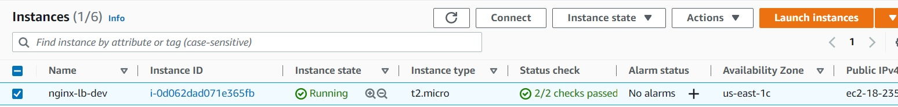
*Nginx loadbalancer server running*  
 

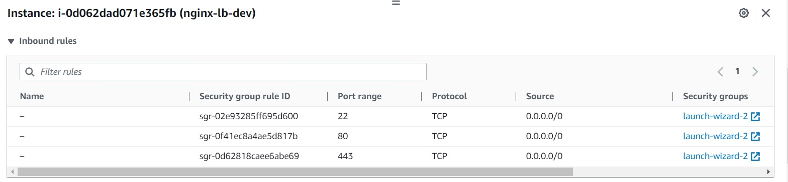
*Opened ports 80 and 443*  
 

Update /etc/hosts file for local DNS with Web Servers' name and their local IP addressess.    

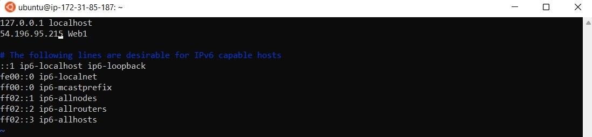
*Update hosts file*  
 

Install and configure Nginx as a load balancer to point traffic to resolvable DNS names of the webservers   
`sudo apt update && sudo apt install nginx`   

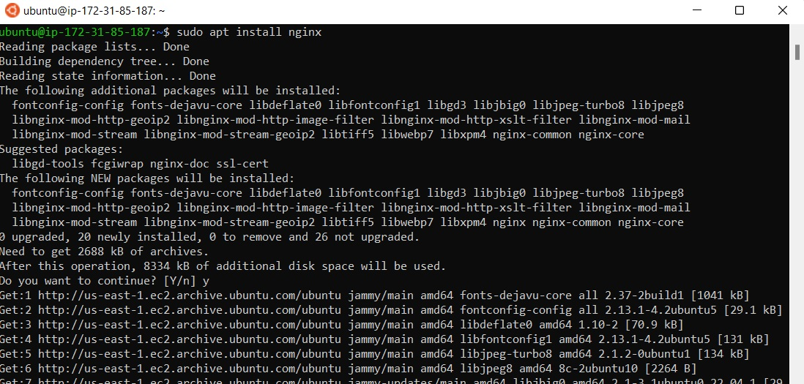
*Install Nginx*  
 

Configure Nginx LB using Web Servers' names defined in /etc/hosts   
`sudo vi /etc/nginx/nginx.conf`    
 
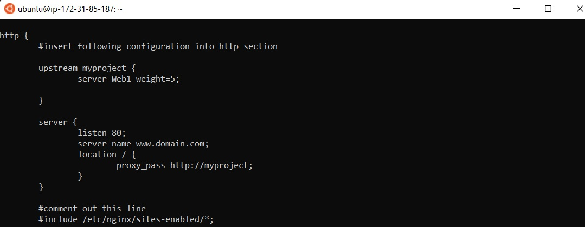
*Configure Nginx*  
 

# **Step 3 - Register A New Domain Name And Configure Secured Connection Using SSL/TLS Certificates.**    
Register a new domain name with any registrar of your choice in any domain zone (e.g. .com, .net, .org, .edu, .info, .xyz or any other).   
 
Assign an Elastic IP to your Nginx LB server and associate your domain name with this Elastic IP, the purpose of this is to ensure that the public IP address is static because everytime you restart, stop or start your EC2 instance, you get a new public IP address. When you want to associate your domain name, it is better to have a static IP address that does not change after reboot, thus Elastic IP is the solution for this problem.   
 
Assign an Elastic IP to your Nginx LB server and associate your domain name with this Elastic IP address.   

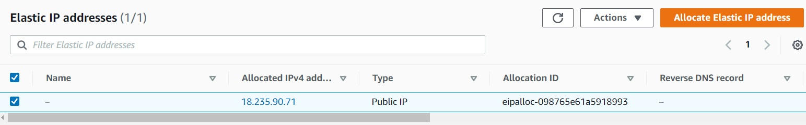
*Assign elastic ip*  
 

Associate the Elastic IP with the domain you created by filling the nameserver fields as shown below:

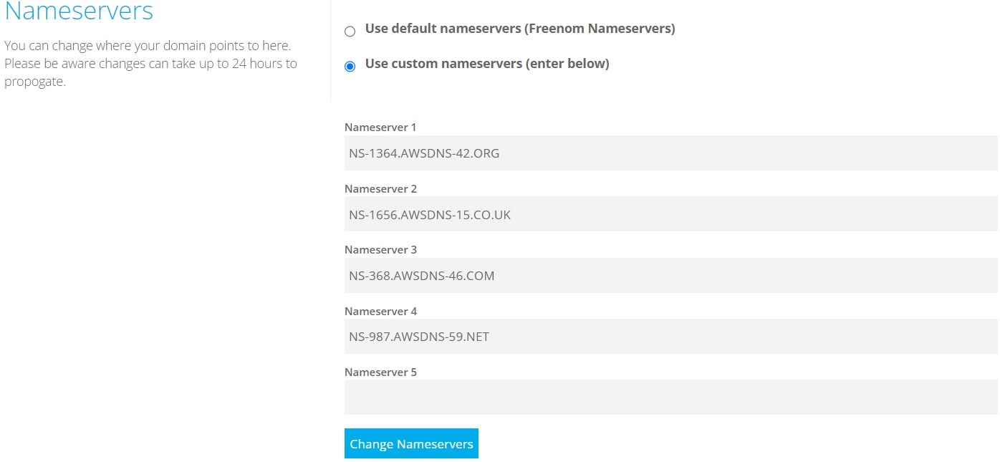
*Associate elastic ip*  
 

Configure your nginx sudo vi /etc/nginx/nginx.conf with server_name `www.<your-domain-name.com>` instead of server_name www.domain.com.
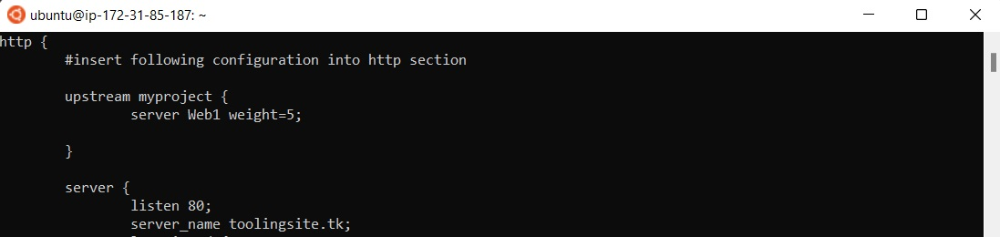
*Reconfigure nginx*  
 

Check that your Web Servers can be reached from your browser using new domain name using HTTP protocol - `http://<your-domain-name.com>`.   
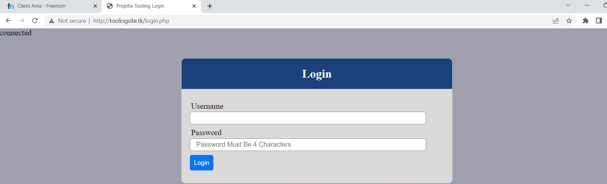
*Verifying reachability*  
 

Install certbot sudo snap install --classic certbot and request for an SSL/TLS certificate, make sure snapd service is active and running `sudo systemctl status snapd`.   
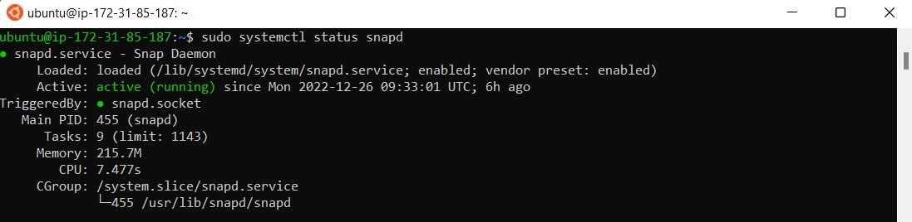
*Snap running*  
 

Request your certificate (just follow the certbot instructions – you will need to choose which domain you want your certificate to be issued for, domain name will be looked up from /etc/nginx/nginx.conf.   
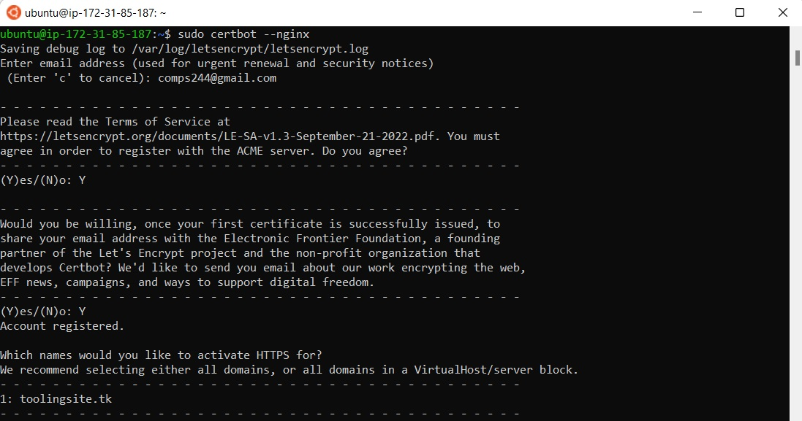
*Request certificate*  
 

Test secured access to the Web Solution by trying to reach `https://<your-domain-name.com>`.   
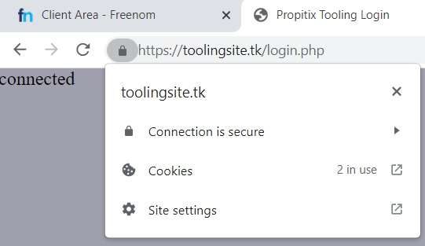   
*Test access*  
 

Set up periodical renewal of your SSL/TLS certificate
By default, LetsEncrypt certificate is valid for 90 days, so it is recommended to renew it at least every 60 days or more frequently.   
 
You can test renewal command in dry-run mode  `sudo certbot renew --dry-run`   

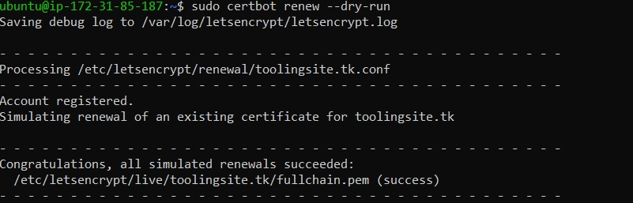   
*Test renewal*  
 

Best pracice is to have a scheduled job that to run renew command periodically. Let us configure a cronjob to run the command twice a day.   

To do so, lets edit the crontab file with the following command: `crontab -e`

Add following line:   
`* */12 * * *   root /usr/bin/certbot renew > /dev/null 2>&1`   

You can always change the interval of this cronjob if twice a day is too often by adjusting schedule expression.

