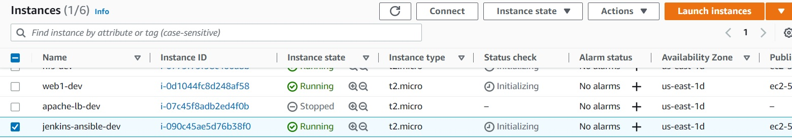

# **ANSIBLE CONFIGURATION MANAGEMENT.**
This Project will make you appreciate DevOps tools even more by making most of the routine tasks automated with Ansible Configuration Management, at the same time you will become confident at writing code using declarative language such as YAML.

# **Step 1 - Preparing prerequisites** 
In order to complete this project, an AWS account, Jenkins Server(based on Ubuntu 20.04), RHEL8 Web Servers, one MySQL DB Server (based on Ubuntu 20.04) and one RHEL8 NFS server is required.  
<br>

Creation of a new AWS account gives access to the free tier plan which allows to spin up a new EC2 instance (an instance of a virtual server) for free in only a matter of a few clicks.  
<br>

You can watch the videos below to learn how to Provision a server and connect to it.
- [AWS account setup and Provisioning an Ubuntu Server](https://www.youtube.com/watch?v=xxKuB9kJoYM&list=PLtPuNR8I4TvkwU7Zu0l0G_uwtSUXLckvh&index=6) 
- [Connecting to your EC2 Instance](https://www.youtube.com/watch?v=TxT6PNJts-s&list=PLtPuNR8I4TvkwU7Zu0l0G_uwtSUXLckvh&index=7)    
<br>

# **Step 2 - Install And Configure Ansible on EC2 Instance.** 
Update Name tag on your Jenkins EC2 Instance to Jenkins-Ansible. We will use this server to run playbooks.   


*Update name tag*  
<br>

In your GitHub account create a new repository and name it ansible-config-mgt.

Install Ansible   
```
sudo apt update

sudo apt install ansible
```


*Ansible installed*  
<br>

Configure Jenkins build job to save your repository content every time you change it.
* Create a new Freestyle project ansible in Jenkins and point it to your ‘ansible-config-mgt’ repository.
* Configure Webhook in GitHub and set webhook to trigger ansible build.
* Configure a Post-build job to save all (**) files, like you did it in Project 9.   


*Jenkins build job*  
<br>

Test your setup by making some change in README.MD file in master branch and make sure that builds starts automatically and Jenkins saves the files (build artifacts) in following folder   

`ls /var/lib/jenkins/jobs/ansible/builds/<build_number>/archive/`    

   
*Testing setup*  
<br>

Tip: Every time you stop/start your Jenkins-Ansible server – you have to reconfigure GitHub webhook to a new IP address, in order to avoid it, it makes sense to allocate an Elastic IP to your Jenkins-Ansible server (you have done it before to your LB server in Project 10). Note that Elastic IP is free only when it is being allocated to an EC2 Instance, so do not forget to release Elastic IP once you terminate your EC2 Instance.

# **Step 3 - Prepare your development environment using Visual Studio Code.** 
After you have successfully installed VSC, configure it to connect to your newly created GitHub repository.   

Clone down your ansible-config-mgt repo to your Jenkins-Ansible instance   
`git clone <ansible-config-mgt repo link>`

   
*Clone repo*  
<br>

# **Step 4 - Begin Ansible development** 
In your ansible-config-mgt GitHub repository, create a new branch that will be used for development of a new feature.   
   
*Created new branch*  
<br>

Tip: Give your branches descriptive and comprehensive names, for example, if you use Jira or Trello as a project management tool – include ticket number (e.g. PRJ-145) in the name of your branch and add a topic and a brief description what this branch is about – a bugfix, hotfix, feature, release (e.g. feature/prj-145-lvm)

Checkout the newly created feature branch to your local machine and start building your code and directory structure   

Create a directory and name it playbooks – it will be used to store all your playbook files.   

Create a directory and name it inventory – it will be used to keep your hosts organised.   

Within the playbooks folder, create your first playbook, and name it common.yml   

Within the inventory folder, create an inventory file (.yml) for each environment (Development, Staging Testing and Production) dev, staging, uat, and prod respectively.   
   
*Project structure*  
<br>

# **Step 5 - Set up an Ansible Inventory** 
An Ansible inventory file defines the hosts and groups of hosts upon which commands, modules, and tasks in a playbook operate. Since our intention is to execute Linux commands on remote hosts, and ensure that it is the intended configuration on a particular server that occurs. It is important to have a way to organize our hosts in such an Inventory.   

Save below inventory structure in the inventory/dev file to start configuring your development servers. Ensure to replace the IP addresses according to your own setup.   

Note: Ansible uses TCP port 22 by default, which means it needs to ssh into target servers from Jenkins-Ansible host – for this you can implement the concept of ssh-agent. Now you need to import your key into ssh-agent:   
```
eval `ssh-agent -s`
ssh-add <path-to-private-key>
```

Confirm the key has been added with the command below, you should see the name of your key   
`ssh-add -l`   

   
*Confirm key*  
<br>

Now, ssh into your Jenkins-Ansible server using ssh-agent   
`ssh -A ubuntu@public-ip`   

   
*SSH into jenkins*  
<br>

Update your inventory/dev.yml file with this snippet of code:   
```
[nfs]
<NFS-Server-Private-IP-Address> ansible_ssh_user='ec2-user'

[webservers]
<Web-Server1-Private-IP-Address> ansible_ssh_user='ec2-user'
<Web-Server2-Private-IP-Address> ansible_ssh_user='ec2-user'

[db]
<Database-Private-IP-Address> ansible_ssh_user='ec2-user' 

[lb]
<Load-Balancer-Private-IP-Address> ansible_ssh_user='ubuntu'
```

# **Step 6 - Create a Common Playbook** 
Update your playbooks/common.yml file with following code:

```
---
- name: update web, nfs and db servers
  hosts: webservers, nfs, db
  remote_user: ec2-user
  become: yes
  become_user: root
  tasks:
    - name: ensure wireshark is at the latest version
      yum:
        name: wireshark
        state: latest

- name: update LB server
  hosts: lb
  remote_user: ubuntu
  become: yes
  become_user: root
  tasks:
    - name: Update apt repo
      apt: 
        update_cache: yes

    - name: ensure wireshark is at the latest version
      apt:
        name: wireshark
        state: latest
```

# **Step 7 - Update GIT with the latest code** 
Now all of your directories and files live on your machine and you need to push changes made locally to GitHub.   

Commit your code into GitHub:   
```
git status

git add <selected files>

git commit -m "commit message"
```

   
*Commit and push*  
<br>
Create a Pull request (PR)   

Merge the code to the master branch.   

Head back on your terminal, checkout from the feature branch into the master, and pull down the latest changes.   

Once your code changes appear in master branch – Jenkins will do its job and save all the files (build artifacts) to `/var/lib/jenkins/jobs/ansible/builds/<build_number>/archive/` directory on Jenkins-Ansible server.

   
*Saved files*  
<br>

# **Step 8 - Run first Ansible test** 
Now, it is time to execute ansible-playbook command and verify if your playbook actually works:

```
cd ansible-config-mgt
ansible-playbook -i inventory/dev.yml playbooks/common.yml
```

You can go to each of the servers and check if wireshark has been installed by running which wireshark or wireshark --version


*Verifying wireshark*  
<br>
   
We just automated some routine tasks by implementing a Ansible project!
