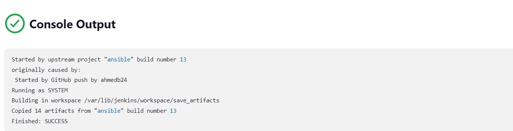

# **ANSIBLE REFACTORING AND STATIC ASSIGNMENTS (IMPORT AND ROLES)..**
In this project, we will continue working with ansible-config repository and make some improvements to our code. Now we need to refactor our Ansible code, create assignments, and use the imports functionality. Imports allow to effectively re-use previously created playbooks in a new playbook – it allows you to organize your tasks and reuse them when needed.


# **Step 1 - Preparing prerequisites** 
In order to complete this project, an AWS account, Jenkins Server(based on Ubuntu 20.04), RHEL8 Web Servers, one MySQL DB Server (based on Ubuntu 20.04) and one RHEL8 NFS server is required.  
<br>

Creation of a new AWS account gives access to the free tier plan which allows to spin up a new EC2 instance (an instance of a virtual server) for free in only a matter of a few clicks.  
<br>

You can watch the videos below to learn how to Provision a server and connect to it.
- [AWS account setup and Provisioning an Ubuntu Server](https://www.youtube.com/watch?v=xxKuB9kJoYM&list=PLtPuNR8I4TvkwU7Zu0l0G_uwtSUXLckvh&index=6) 
- [Connecting to your EC2 Instance](https://www.youtube.com/watch?v=TxT6PNJts-s&list=PLtPuNR8I4TvkwU7Zu0l0G_uwtSUXLckvh&index=7)    
<br>

# **Step 2 - Jenkins job enhancement** 
Lets make some changes to our Jenkins job, every new change in the code creates a seperate directory which is not very convenient when we want to run some commands from one place. Besides, it consumes space on Jenkins servers with each subsequent change. We will enhance it by introducing a new Jenkins project/job, which we will require Copy Artifact plugin.   

In the Jenkin-Ansible server, create a new directory called ansible-config-artifact, we will store there all artifacts after each build.   
   
Change permissions to this directory, so Jenkins could save files here.   

*Change permissions*  
<br>

Go to Jenkins web console -> Manage Jenkins -> Manage Plugins -> on Available tab search for Copy Artifact and install this plugin without restarting Jenkins.   

*Install artifact plugin*  
<br>

Create a new Freestyle project and name it save_artifacts. This project will be triggered by completion of the existing ansible project. Configure it accordingly.   

*Configure job*  
<br>

*Configure job*  
<br>

The main idea of save_artifacts project is to save artifacts into `/home/ubuntu/ansible-config-artifact` directory. To achieve this, create a Build step and choose Copy artifacts from other project, specify ansible as a source project and `/home/ubuntu/ansible-config-artifact` as a target directory.   

*Add build step*  
<br>

Test your set up by making some change in README.MD file inside your ansible-config-mgt repository (right inside master branch).

*Updated folder*  
<br>

Now our Jenkins pipeline is more neat and clean.

# **Step 3 - Refactor Ansible Code By Importing Other Playbooks Into site.yml** 
Before starting to refactor the codes, ensure that you have pulled down the latest code from master (main) branch, and creat a new branch, name it refactor. Let see code re-use in action by importing other playbooks   

Within playbooks folder, create a new file and name it site.yml, this file will now be considered as an entry point into the entire infrastructure configuration. The site.yml will become a parent to all other playbooks that will be developed.   

Create a new folder in root of the directory and name it static-assignment. The static-assignments folder is where all other children playbooks will be stored. This is merely for easy organization of your work. It is not an Ansible specific concept, therefore you can choose how you want to organize your work.

Move common.yml file into the newly created static-assignments folder.      
   
*Move file*  
<br>

Inside site.yml file, import common.yml playbook.   

*Update site.yml*  
<br>

The folder structure should look like this:   
   
*Folder structure*  
<br>

Create another playbook under static-assignments and name it common-del.yml. In this playbook, configure deletion of wireshark utility.

*Create common-del playbook*  
<br>

Update site.yml with - import_playbook: ../static-assignments/common-del.yml instead of common.yml and run it against dev servers
```
cd /home/ubuntu/ansible-config-mgt/

ansible-playbook -i inventory/dev.yml playbooks/site.yaml
```
   
*Update site.yml*  
<br>


*Running ansible*  
<br>

Make sure that wireshark is deleted on all the servers by running `wireshark --version`   

*Wireshark deleted*  
<br>

# **Step 4 - Configure UAT Webservers with a role 'Webserver'** 
Launch an EC2 instance using RHEL 8 image, we will use it as our uat server, so give it a name accordingly – web1-uat.   

*Instance running*  
<br>

To create a role, you must create a directory called roles/, relative to the playbook file or in /etc/ansible/ directory. Create a roles directory in the root, cd into the directory, use an Ansible utility called ansible-galaxy    

`mkdir roles && cd roles && ansible-galaxy init webserver`.    

The entire folder structure should look like below.   
   
*Folder structure*  
<br>

After removing unnecessary directories and files, the roles structure should look like this.   
   
*Updated folder structure*  
<br>

Update the inventory ansible-config/inventory/uat.yml file with IP addresses of the 2 UAT Webservers.
   
*update uat.yml*  
<br>

In /etc/ansible/ansible.cfg file uncomment roles_path string and provide a full path to your roles directory roles_path = `/home/ubuntu/ansible-config/roles`, so Ansible could know where to find configured roles.   

*Update ansible config*  
<br>

It is time to start adding some logic to the webserver role. Go into tasks directory, and within the main.yml file, start writing configuration tasks to do the following.

* Install and configure Apache (httpd service) 
* Clone Tooling website from GitHub https://github.com/Taiwolawal/tooling.git. 
* Ensure the tooling website code is deployed to /var/www/html on each of 2 UAT Web servers. 
* Make sure httpd service is started

The main.yml will consist of the following tasks.   

*Main.yml content*  
<br>

# **Step 5 - Reference 'Webserver' role.**
Within the static-assignments folder, create a new assignment for uat-webservers uat-webservers.yml. This is where you will reference the role.   

*New assignment*  
<br>

Remember that the entry point to our ansible configuration is the site.yml file therefore , we need to refer uat-webservers.yml role inside site.yml. The site.yml will look like:   

*Updated site.yml content*  
<br>

# **Step 6 - Commit & Test.**
Commit your changes, create a Pull Request and merge them to master (main) branch, make sure webhook triggered two consequent Jenkins jobs, they ran successfully and copied all the files to your Jenkins-Ansible server into `/home/ubuntu/ansible-config/` directory.   

*Triggered both jobs*  
<br>

Now run the playbook against the uat inventory.   

*running playbook against uat inventory*  
<br>

*Website running*  
<br>

You should be able to see the UAT Web server configured and you can try to reach it from your browser: `http://<Web1-UAT-Server-Public-IP-or-Public-DNS-Name>/index.php`.   

The Ansible architecture now looks like this:   
   
*Updated site.yml content*  
<br>
