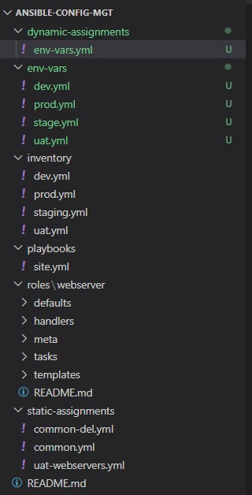
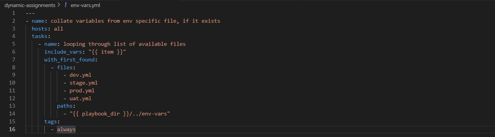
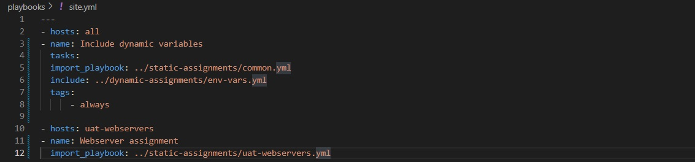
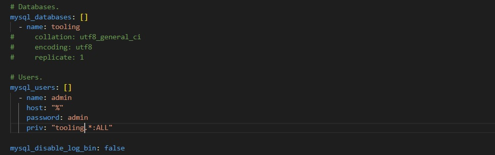
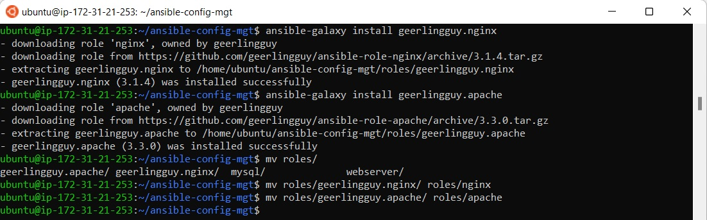
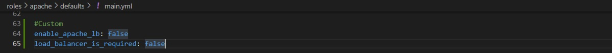
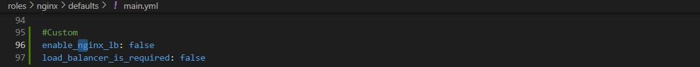

# **ANSIBLE DYNAMIC ASSIGNMENTS (INCLUDE) AND COMMUNITY ROLES**
In this project we will introduce dynamic assignments by using include module.

# **Step 1 - Preparing prerequisites** 
In order to complete this project, an AWS account, Jenkins Server(based on Ubuntu 20.04), RHEL8 Web Servers, one MySQL DB Server (based on Ubuntu 20.04) and one RHEL8 NFS server is required.  
<br>

Creation of a new AWS account gives access to the free tier plan which allows to spin up a new EC2 instance (an instance of a virtual server) for free in only a matter of a few clicks.  
<br>

You can watch the videos below to learn how to Provision a server and connect to it.
- [AWS account setup and Provisioning an Ubuntu Server](https://www.youtube.com/watch?v=xxKuB9kJoYM&list=PLtPuNR8I4TvkwU7Zu0l0G_uwtSUXLckvh&index=6) 
- [Connecting to your EC2 Instance](https://www.youtube.com/watch?v=TxT6PNJts-s&list=PLtPuNR8I4TvkwU7Zu0l0G_uwtSUXLckvh&index=7)    
<br>

# **Step 2 - Introducing dynamic assingnment into our structure** 
In our Github repository `https://github.com/<your-name>/ansible-config-mgt`, start a new branch and call it dynamic-assignments.

`git checkout -b dynamic-assignments`      
<br>

Create a new folder, name it dynamic-assignments, inside the folder create a file and name it env-vars.yml. Since we will be using the same Ansible to configure multiple environments, and each of these environments will have certain unique attributes, such as servername, ip-address etc., we will need a way to set values to variables per specific environment.   
<br>

For this reason, we will now create a folder to keep each environment’s variables file. Therefore, create a new folder env-vars, then for each environment, create new YAML files which we will use to set variables.   

Our layout should now look like this   
   
*Project structure with envs*  
<br>

Paste the instruction below into the env-vars.yml file.   

*env-vars.yml content*  
<br>

Notice 3 things to note here:   

* We used include_vars syntax instead of include, this is because Ansible developers decided to separate different features of the module.

  From Ansible version 2.8, the include module is deprecated and variants of include_* must be used. These are:
  
  include_role
  include_tasks
  include_vars
  In the same version, variants of import were also introduces, such as:
  
  import_role
  import_tasks

* We made use of special variables {{ playbook_dir }} and {{ inventory_file }}. {{ playbook_dir }} will help Ansible to determine the location of the running    playbook,  and from there navigate to other path on the filesystem.

  {{ inventory_file }} on the other hand will dynamically resolve to the name of the inventory file being used, then append .yml so that it picks up the required file within the env-vars folder.

* We are including the variables using a loop. with_first_found implies that, looping through the list of files, the first one found is used. This is good so that we can always set default values in case an environment specific env file does not exist.

# **Step 3 - Update site.yml with dynamic assignments** 
Update site.yml file to use of the dynamic assignment (At this point, we cannot test it yet).    
   
*Update site.yml to use dynamic assignment*  
<br>

Now it is time to create a role for MySQL database - it should install the MySQL package, create a database and configure users.

But why should we re-invent the wheel? There are tons of roles that have already been developed by other open source engineers out there.

These roles are actually production ready, and dynamic to accomodate most of Linux flavours.

With Ansible Galaxy again, we can simply download a ready to use ansible role, and keep going.   

# **Step 4 - Download Mysql Ansible Role.** 
You can browse available community roles [here](https://galaxy.ansible.com/home)   

We will be using a[ MySQL role developed by geerlingguy](https://galaxy.ansible.com/geerlingguy/mysql).    

On Jenkins-Ansible server make sure that git is installed with git --version, then go to ‘ansible-config-mgt’ directory and run.
```
git init
git pull https://github.com/<your-name>/ansible-config-mgt.git
git remote add origin https://github.com/<your-name>/ansible-config-mgt.git
git branch roles-feature
git switch roles-feature
```

Inside roles directory create your new MySQL role with ansible-galaxy install geerlingguy.mysql and rename the folder to mysql   
`mv geerlingguy.mysql/ mysql`   
<br>

Read README.md file, and edit roles configuration to use correct credentials for MySQL required for the tooling website.   
`Roles -> MYSQL -> Defaults -> Main.yml`
<br>

   
*Edit mysql roles configuration*  
<br>

Upload changes into your github.
```
git add .
git commit -m "Commit new role files into GitHub"
git push --set-upstream origin roles-feature
```

Create a pull request and merge it with the main branch on Github.

# **Step 5 - Load Balancer Roles.** 
We want to be able to choose which Load Balancer to use, Nginx or Apache, so we need to have two roles respectively:

* Nginx
* Apache

Install the Nginx Ansible Role and rename the folder to nginx

```
ansible-galaxy install geerlingguy.nginx
mv geerlingguy.nginx/ nginx
```

Install the Apache Ansible Role and rename the folder to apache
```
ansible-galaxy install geerlingguy.apache 
mv geerlingguy.apache/ apache
```

   
*Install nginx and apache*  
<br>

Since we cannot use both Nginx and Apache load balancer, we need to add a condition to enable either one - this is where we can make use of variables.   

Declare a variable in defaults/main.yml file inside the Nginx and Apache roles. Name each variables enable_nginx_lb and enable_apache_lb respectively.   

Set both values to false like this enable_nginx_lb: false and enable_apache_lb: false.   

Declare another variable in both roles load_balancer_is_required and set its value to false as well

   
*Update apache variables*  
<br>

   
*Update nginx variables*  
<br>

Update both assignment and site.yml files respectively   

loadbalancers.yml file is going to look like this (create this file in your static-assignments folder)
```
- hosts: lb
  roles:
    - { role: nginx, when: enable_nginx_lb and load_balancer_is_required }
    - { role: apache, when: enable_apache_lb and load_balancer_is_required }
```

Add this to the site.yml file
```
 - name: Loadbalancers assignment
       hosts: lb
         - import_playbook: ../static-assignments/loadbalancers.yml
        when: load_balancer_is_required 
```

Now we can make use of env-vars\uat.yml file to define which loadbalancer to use in UAT the environment by setting the respective environmental variable to true.

We will activate load balancer, and enable nginx by setting these in the respective environment’s env-vars file.

```
enable_nginx_lb: true
load_balancer_is_required: true
```

The same must work with apache LB, so we can switch it by setting respective environmental variable to true and other to false.

To test this, we can update inventory for each environment and run Ansible against each environment.

#### This concludes how to use Ansible configuration management tool to prepare UAT environment for Tooling web solution.

