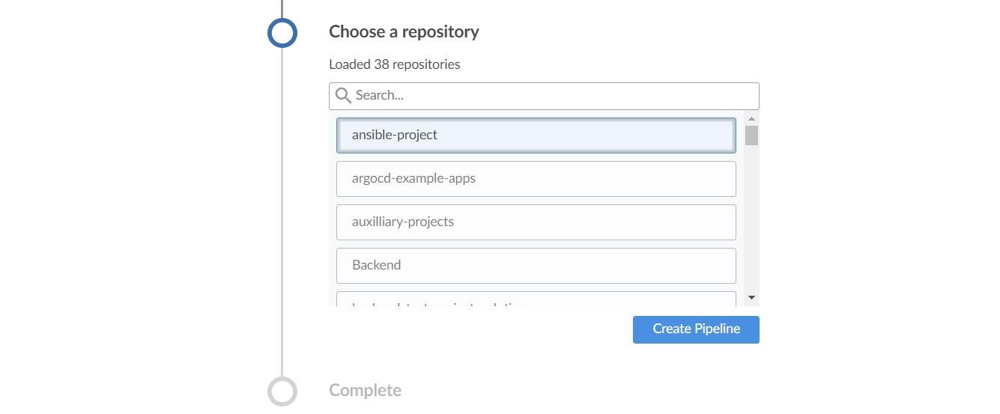
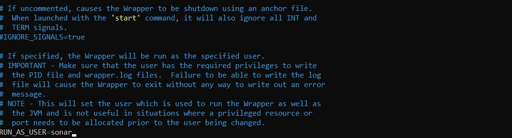
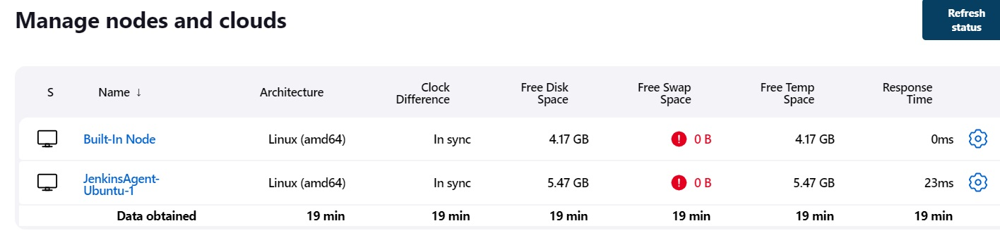
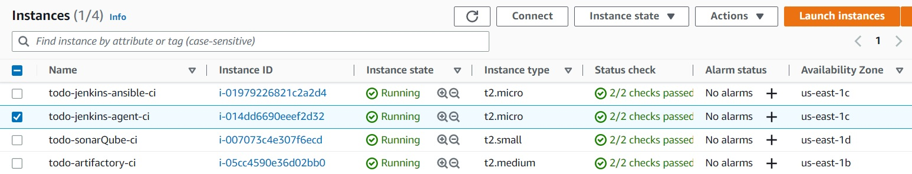

# **EXPERIENCE CONTINUOUS INTEGRATION WITH JENKINS | ANSIBLE | ARTIFACTORY | SONARQUBE | PHP**
In this project, we will understand and get hands on experience around the entire concept around CI/CD from applications perspective. 

# **Step 1 - Preparing prerequisites** 
In order to complete this project, an AWS account, Jenkins Server(based on Ubuntu 20.04), RHEL8 Web Servers and MySQL DB Servers (based on Ubuntu 20.04).
<br>

Creation of a new AWS account gives access to the free tier plan which allows to spin up a new EC2 instance (an instance of a virtual server) for free in only a matter of a few clicks.  
<br>

You can watch the videos below to learn how to Provision a server and connect to it.
- [AWS account setup and Provisioning an Ubuntu Server](https://www.youtube.com/watch?v=xxKuB9kJoYM&list=PLtPuNR8I4TvkwU7Zu0l0G_uwtSUXLckvh&index=6) 
- [Connecting to your EC2 Instance](https://www.youtube.com/watch?v=TxT6PNJts-s&list=PLtPuNR8I4TvkwU7Zu0l0G_uwtSUXLckvh&index=7)    
<br>

# **Step 2 - Ansible roles for CI environment** 
Add two more role to the ansible; 'SonarQube' and 'Artifactory'. Install Blue Ocean plugin in Jenkins Manage Jenkins and open it when installed. Click new pipeline to create a new pipeline 
   
*Create pipeline from blue ocean*  
<br>

Select GitHub   
   
*Select github*  
<br>

Connect Jenkins with GitHub   
   
*Connect Jenkins with GitHub*  
<br>

Login to Github and generate an access token.   
   
*Login to github*  
<br>

Copy Access Token   
   
*Copy access token*  
<br>

Paste the token and connect   
   
*Paste the token and connect*  
<br>

Create a new Pipeline   
   
*Create a new pipeline*  
<br>

At this point you may not have a Jenkinsfile in the Ansible repository, so Blue Ocean will attempt to give you some guidance to create one. But we do not need that. We will rather create one ourselves. So, click on Administration to exit the Blue Ocean console.   
   
*Exit console*  
<br>

Here is our newly created pipeline. It takes the name of your GitHub repository.   
   
*New pipeline*  
<br>

# **Step 3 - Create Jenkinsfile** 
Inside the Ansible project, create a new directory deploy and start a new file Jenkinsfile inside the directory.   
   
*New directory*  
<br>

Add the code snippet below to start building the Jenkinsfile gradually. This pipeline currently has just one stage called Build and the only thing we are doing is using the shell script module to echo Building Stage
```
pipeline {
    agent any

  stages {
    stage('Build') {
      steps {
        script {
          sh 'echo "Building Stage"'
        }
      }
    }
    }
}

```

Setup build configuration on the new pipeline   
   
*Configure pipeline*  
<br>

To really appreciate and feel the difference of Cloud Blue UI, it is recommended to try triggering the build from Blue Ocean interface. Click on `Blue Ocean` to open it   
   
*Click blue ocean*  
<br>

Select your project and click on the play button against the branch   
   
*Click play*  
<br>

Notice that this pipeline is a multibranch one. This means, if there were more than one branch in GitHub, Jenkins would have scanned the repository to discover them all and we would have been able to trigger a build for each branch.   

Let us see this in action.   

* Create a new git branch and name it feature/jenkinspipeline-stages
* Currently we only have the Build stage. Let us add another stage called Test. Paste the code snippet below and push the new changes to GitHub.
```
   pipeline {
    agent any

  stages {
    stage('Build') {
      steps {
        script {
          sh 'echo "Building Stage"'
        }
      }
    }

    stage('Test') {
      steps {
        script {
          sh 'echo "Testing Stage"'
        }
      }
    }
    }
}
```

To ensure that Jenkins see our new branch, we go to the ansible-project jobs and click on Scan Repository Now and refresh the page to show the new branch we have   
   
*Show new branch*  
<br>

Open Blue Ocean and click on the new branch we added to see the content   
   
*Updated content*  
<br>
Create a new branch, add more stages into the Jenkins file to simulate below phases. (Just add an echo command like we have in build and test stages)
* Package
* Deploy
* Clean up

For every job created in Jenkins, it creates a workspace for each job, thus more jobs created means more storage consumption. To avoid this type of issue, it is a good practice to ensure that at the beginning of the Jenkinsfile you clean the workspace and at the end also.   

Updated Jenkinsfile should look like this:   
   
*Updated Jenkinsfile*  
<br>

# **Step 3 - Running Ansible Playbook From Jenkins** 
Install ansible in Jenkins and the ansible plugin in Jenkins UI.   
`sudo apt install ansible` 
<br>

After installing ansible in the Jenkins UI, access global tool configuration and under the Ansible section, give a descriptive name and path to the ansible executable folder. This can be obtained via the command `which ansible`. Copy the path ignoring the ansible part.   

*Configure ansible in UI*  
<br>

Create the ssh credential in jenkins that ansible would use to connect to the remote hosts   

*Create ssh credentials*  
<br>


Using the pipeline syntax generator, create the required script for Jenkins to run the ansible playbook. Update `Jenkinsfile`, save and build

*Update jenkinsfile with ansible stage*  
<br>

Successful build of ansible running in jenkins   

*Successful build*  
<br>

But what if we need to deploy to other environments? To acheive this, we will parameterise the deployment. So that at the point of execution, the appropriate values are applied.

# **Step 4 - Parameterizing Jenkinsfile For Ansible Deployment** 
To deploy to other environments, we will need to use parameters.   

Update sit inventory with new servers
```
[tooling]
<SIT-Tooling-Web-Server-Private-IP-Address>

[todo]
<SIT-Todo-Web-Server-Private-IP-Address>

[nginx]
<SIT-Nginx-Private-IP-Address>

[db:vars]
ansible_user=ec2-user
ansible_python_interpreter=/usr/bin/python

[db]
<SIT-DB-Server-Private-IP-Address>
```

Update Jenkinsfile to introduce parameterization. Below is just one parameter. It has a default value in case if no value is specified at execution. It also has a description so that everyone is aware of its purpose.
```
pipeline {
    agent any

    parameters {
      string(name: 'inventory', defaultValue: 'dev',  description: 'This is the inventory file for the environment to deploy configuration')
    }
...
```

Notice that the default value loads up, but we can now specify which environment we want to deploy the configuration to. Simply type sit and hit Build   

*Select environment*  
<br>

# **Step 5 - CI/CD Pipeline For TODO Application** 
Our goal here is to deploy the application onto servers directly from Artifactory rather than from git. If you have not updated Ansible with an Artifactory role, simply use this guide to create an Ansible role for Artifactory (ignore the Nginx part). [Configure Artifactory on Ubuntu 20.04](https://www.howtoforge.com/tutorial/ubuntu-jfrog/)


*Artifactory running*  
<br>


### Prepare Jenkins   

* Fork the repository below into your GitHub account   
  `https://github.com/darey-devops/php-todo.git`

* On you Jenkins server, install PHP, its dependencies and Composer tool (Feel free to do this manually at first, then update your Ansible accordingly later)   
  `sudo apt install -y zip libapache2-mod-php phploc php-{xml,bcmath,bz2,intl,gd,mbstring,mysql,zip}`   
  
  *Install app dependencies*  
  <br>
  
* Install Jenkins plugins
  * [Plot Plugin](https://plugins.jenkins.io/plot/)
  * [Artifactory Plugin](https://www.jfrog.com/confluence/display/JFROG/Jenkins+Artifactory+Plug-in)   
  
  *Install jenkins plugins*  
  <br>

* In Jenkins UI configure Artifactory   
  
  *Configure artifactory in jenkins*  
  <br>

### Integrate Artifactory repository with Jenkins   

Create a dummy Jenkinsfile in the repository and using Blue Ocean, create a multibranch Jenkins pipeline   

*Multibranch Jenkins pipeline*  
<br>

On the database server, create database and user
```
Create database homestead;
CREATE USER 'homestead'@'%' IDENTIFIED BY 'sePret^i';
GRANT ALL PRIVILEGES ON * . * TO 'homestead'@'%';
```

Update the database connectivity requirements in the file .env.sample and update Jenkinsfile with proper pipeline configuration
```
pipeline {
    agent any

  stages {

     stage("Initial cleanup") {
          steps {
            dir("${WORKSPACE}") {
              deleteDir()
            }
          }
        }

    stage('Checkout SCM') {
      steps {
            git branch: 'main', url: 'https://github.com/darey-devops/php-todo.git'
      }
    }

    stage('Prepare Dependencies') {
      steps {
             sh 'mv .env.sample .env'
             sh 'composer install'
             sh 'php artisan migrate'
             sh 'php artisan db:seed'
             sh 'php artisan key:generate'
      }
    }
  }
}
```

Update the Jenkinsfile to include Unit tests step   
```
stage('Execute Unit Tests') {
  steps {
         sh './vendor/bin/phpunit'
  } 
```

*Updated Jenkinsfile with test*  
<br>

### Code Quality Analysis
For PHP the most commonly tool used for code quality analysis is phploc. [Read the article here for more](https://matthiasnoback.nl/2019/09/using-phploc-for-quick-code-quality-estimation-part-1/)   

The data produced by phploc can be ploted onto graphs in Jenkins.

* Add the code analysis step in Jenkinsfile. The output of the data will be saved in build/logs/phploc.csv file.
```
stage('Code Analysis') {
  steps {
        sh 'phploc app/ --log-csv build/logs/phploc.csv'

  }
}
```
* Plot the data using plot Jenkins plugin.
  
  This plugin provides generic plotting (or graphing) capabilities in Jenkins. Update the jenkinsfile to inclide the stage below

  ```
  stage('Plot Code Coverage Report') {
      steps {

            plot csvFileName: 'plot-396c4a6b-b573-41e5-85d8-73613b2ffffb.csv', csvSeries: [[displayTableFlag: false, exclusionValues: 'Lines of Code (LOC),Comment Lines of Code (CLOC),Non-Comment Lines of Code (NCLOC),Logical Lines of Code (LLOC)                          ', file: 'build/logs/phploc.csv', inclusionFlag: 'INCLUDE_BY_STRING', url: '']], group: 'phploc', numBuilds: '100', style: 'line', title: 'A - Lines of code', yaxis: 'Lines of Code'
            plot csvFileName: 'plot-396c4a6b-b573-41e5-85d8-73613b2ffffb.csv', csvSeries: [[displayTableFlag: false, exclusionValues: 'Directories,Files,Namespaces', file: 'build/logs/phploc.csv', inclusionFlag: 'INCLUDE_BY_STRING', url: '']], group: 'phploc', numBuilds: '100', style: 'line', title: 'B - Structures Containers', yaxis: 'Count'
            plot csvFileName: 'plot-396c4a6b-b573-41e5-85d8-73613b2ffffb.csv', csvSeries: [[displayTableFlag: false, exclusionValues: 'Average Class Length (LLOC),Average Method Length (LLOC),Average Function Length (LLOC)', file: 'build/logs/phploc.csv', inclusionFlag: 'INCLUDE_BY_STRING', url: '']], group: 'phploc', numBuilds: '100', style: 'line', title: 'C - Average Length', yaxis: 'Average Lines of Code'
            plot csvFileName: 'plot-396c4a6b-b573-41e5-85d8-73613b2ffffb.csv', csvSeries: [[displayTableFlag: false, exclusionValues: 'Cyclomatic Complexity / Lines of Code,Cyclomatic Complexity / Number of Methods ', file: 'build/logs/phploc.csv', inclusionFlag: 'INCLUDE_BY_STRING', url: '']], group: 'phploc', numBuilds: '100', style: 'line', title: 'D - Relative Cyclomatic Complexity', yaxis: 'Cyclomatic Complexity by Structure'      
            plot csvFileName: 'plot-396c4a6b-b573-41e5-85d8-73613b2ffffb.csv', csvSeries: [[displayTableFlag: false, exclusionValues: 'Classes,Abstract Classes,Concrete Classes', file: 'build/logs/phploc.csv', inclusionFlag: 'INCLUDE_BY_STRING', url: '']], group: 'phploc', numBuilds: '100', style: 'line', title: 'E - Types of Classes', yaxis: 'Count'
            plot csvFileName: 'plot-396c4a6b-b573-41e5-85d8-73613b2ffffb.csv', csvSeries: [[displayTableFlag: false, exclusionValues: 'Methods,Non-Static Methods,Static Methods,Public Methods,Non-Public Methods', file: 'build/logs/phploc.csv', inclusionFlag: 'INCLUDE_BY_STRING', url: '']], group: 'phploc', numBuilds: '100', style: 'line', title: 'F - Types of Methods', yaxis: 'Count'
            plot csvFileName: 'plot-396c4a6b-b573-41e5-85d8-73613b2ffffb.csv', csvSeries: [[displayTableFlag: false, exclusionValues: 'Constants,Global Constants,Class Constants', file: 'build/logs/phploc.csv', inclusionFlag: 'INCLUDE_BY_STRING', url: '']], group: 'phploc', numBuilds: '100', style: 'line', title: 'G - Types of Constants', yaxis: 'Count'
            plot csvFileName: 'plot-396c4a6b-b573-41e5-85d8-73613b2ffffb.csv', csvSeries: [[displayTableFlag: false, exclusionValues: 'Test Classes,Test Methods', file: 'build/logs/phploc.csv', inclusionFlag: 'INCLUDE_BY_STRING', url: '']], group: 'phploc', numBuilds: '100', style: 'line', title: 'I - Testing', yaxis: 'Count'
            plot csvFileName: 'plot-396c4a6b-b573-41e5-85d8-73613b2ffffb.csv', csvSeries: [[displayTableFlag: false, exclusionValues: 'Logical Lines of Code (LLOC),Classes Length (LLOC),Functions Length (LLOC),LLOC outside functions or classes ', file: 'build/logs/phploc.csv', inclusionFlag: 'INCLUDE_BY_STRING', url: '']], group: 'phploc', numBuilds: '100', style: 'line', title: 'AB - Code Structure by Logical Lines of Code', yaxis: 'Logical Lines of Code'
            plot csvFileName: 'plot-396c4a6b-b573-41e5-85d8-73613b2ffffb.csv', csvSeries: [[displayTableFlag: false, exclusionValues: 'Functions,Named Functions,Anonymous Functions', file: 'build/logs/phploc.csv', inclusionFlag: 'INCLUDE_BY_STRING', url: '']], group: 'phploc', numBuilds: '100', style: 'line', title: 'H - Types of Functions', yaxis: 'Count'
            plot csvFileName: 'plot-396c4a6b-b573-41e5-85d8-73613b2ffffb.csv', csvSeries: [[displayTableFlag: false, exclusionValues: 'Interfaces,Traits,Classes,Methods,Functions,Constants', file: 'build/logs/phploc.csv', inclusionFlag: 'INCLUDE_BY_STRING', url: '']], group: 'phploc', numBuilds: '100', style: 'line', title: 'BB - Structure Objects', yaxis: 'Count'

      }
    }
  ```

  
  *Updated Jenkinsfile*  
  <br>

  You should now see a Plot menu item on the left menu. Click on it to see the charts. (The analytics may not mean much to you as it is meant to be read by developers. So, you need not worry much about it – this is just to give you an idea of the real-world implementation).

  
  *Successful build with plot*  
  <br>

* Bundle the application code for into an artifact (archived package) upload to Artifactory   
  
  *Updated Jenkinsfile*  
  <br>

* Publish the resulted artifact into Artifactory   
  
  *Updated Jenkinsfile*  
  <br>

* Deploy the application to the dev environment by launching Ansible pipeline   
  
  *Updated Jenkinsfile*  
  <br>

  
  *Artifact uploaded to artifactory server*  
  <br>  
  
  
  *Ansible project job triggered*  
  <br>

  
  *app running after ansible project build*  
  <br>

  
  But how are we certain that the code being deployed has the quality that meets corporate and customer requirements? Even though we have implemented Unit Tests and Code Coverage Analysis with phpunit and phploc, we still need to implement Quality Gate to ensure that ONLY code with the required code coverage, and other quality standards make it through to the environments.   
  <br>
  To achieve this, we need to configure SonarQube – An open-source platform developed by SonarSource for continuous inspection of code quality to perform automatic reviews with static analysis of code to detect bugs, code smells, and security vulnerabilities.

# **Step 6 - SonarQube Installation** 
SonarQube is a tool that can be used to create quality gates for software projects, and the ultimate goal is to be able to ship only quality software code.   

Despite that DevOps CI/CD pipeline helps with fast software delivery, it is of the same importance to ensure the quality of such delivery. Hence, we will need SonarQube to set up Quality gates. In this project we will use predefined Quality Gates (also known as The Sonar Way). Software testers and developers would normally work with project leads and architects to create custom quality gates.

### Install SonarQube on Ubuntu 20.04 With PostgreSQL as Backend Database
Below is a step by step guide how to install SonarQube 7.9.3 version. It has a strong prerequisite to have Java installed since the tool is Java-based. MySQL support for SonarQube is deprecated, therefore we will be using PostgreSQL.

* Tune Linux Kernel
  This can be achieved by making session changes which does not persist beyond the current session terminal.
  ```
  sudo sysctl -w vm.max_map_count=262144
  sudo sysctl -w fs.file-max=65536
  ulimit -n 65536
  ulimit -u 4096

  #To make a permanent change, edit the file /etc/security/limits.conf and append the below
  sonarqube   -   nofile   65536
  sonarqube   -   nproc    4096

  #Before installing, let us update and upgrade system packages:
  sudo apt-get update
  sudo apt-get upgrade

  #Install wget and unzip packages
  sudo apt-get install wget unzip -y

  #Install OpenJDK and Java Runtime Environment (JRE) 11
  sudo apt-get install openjdk-11-jdk -y
  sudo apt-get install openjdk-11-jre -y
  ```

  Set default JDK – To set default JDK or switch to OpenJDK enter below command:   
  `sudo update-alternatives --config java`   

  
  *Config java*  
  <br>

  If you have multiple versions of Java installed, you should see a list like below:    
  
  *All java versions*  
  <br>

  
  *java version*  
  <br>

* Install and Setup PostgreSQL 10 Database for SonarQube
  ```
  #The command below will add PostgreSQL repo to the repo list:
  sudo sh -c 'echo "deb http://apt.postgresql.org/pub/repos/apt/ `lsb_release -cs`-pgdg main" >> /etc/apt/sources.list.d/pgdg.list'

  #Download PostgreSQL software
  wget -q https://www.postgresql.org/media/keys/ACCC4CF8.asc -O - | sudo apt-key add -

  #Install PostgreSQL Database Server
  sudo apt-get -y install postgresql postgresql-contrib

  #Start PostgreSQL Database Server
  sudo systemctl start postgresql

  #Enable it to start automatically at boot time
  sudo systemctl enable postgresql

  #Change the password for default postgres user (Pass in the password you intend to use, and remember to save it somewhere)
  sudo passwd postgres

  #Switch to the postgres user
  su - postgres

  #Create a new user by typing
  createuser sonar

  #Switch to the PostgreSQL shell and set a password for the newly created user for SonarQube database
  psql   
  ALTER USER sonar WITH ENCRYPTED password 'sonar';

  #Grant all privileges to sonar user on sonarqube Database.
  grant all privileges on DATABASE sonarqube to sonar;

  #Exit from the psql shell and switch back to the sudo user by running the exit command.
  \q 
  exit
  ```

  
  *Verify postgreSQL is running*  
  <br>

* Install SonarQube on Ubuntu 20.04 LTS
  ```
  #Navigate to the tmp directory to temporarily download the installation files
  cd /tmp && sudo wget https://binaries.sonarsource.com/Distribution/sonarqube/sonarqube-7.9.3.zip

  #Unzip the archive setup to /opt directory
  sudo unzip sonarqube-7.9.3.zip -d /opt

  #Move extracted setup to /opt/sonarqube directory
  sudo mv /opt/sonarqube-7.9.3 /opt/sonarqube
  ```

# **Step 7 - Configure SonarQube** 
We cannot run SonarQube as a root user, if you run using root user it will stop automatically. The ideal approach will be to create a separate group and a user to run SonarQube

```
#Create a group sonar
sudo groupadd sonar

#Now add a user with control over the /opt/sonarqube directory
sudo useradd -c "user to run SonarQube" -d /opt/sonarqube directory -g sonar sonar
sudo chown sonar:sonar /opt/sonarqube -R
```

Open SonarQube configuration file using your favourite text editor (e.g., nano or vim)
`sudo vim /opt/sonarqube/conf/sonar.properties`

Find, uncomment and update the following lines with the values of PostgreSQL Database username and password:
```
#sonar.jdbc.username=
#sonar.jdbc.password=
sonar.jdbc.url=jdbc:postgresql://localhost:5432/sonarqube
```

*Update username and password*  
<br>

Edit the sonar script file and set RUN_AS_USER   
`sudo nano /opt/sonarqube/bin/linux-x86-64/sonar.sh`   

*Update run as user*  
<br>

Now, to start SonarQube we need to do the following:
```
#Switch to sonar user
sudo su sonar

#Move to the script directory
cd /opt/sonarqube/bin/linux-x86-64

#Run the script to start SonarQube
./sonar.sh start

#Check SonarQube running status:
./sonar.sh status

#To check SonarQube logs, navigate to /opt/sonarqube/logs/sonar.log directory
tail /opt/sonarqube/logs/sonar.log
```

*Verifying sonarqube is running*  
<br>

### Configure SonarQube to run as a systemd service
Stop the currently running SonarQube service and run the script below to stop SonarQube   
`cd /opt/sonarqube/bin/linux-x86-64/ && ./sonar.sh stop`

Create a systemd service file for SonarQube to run as System Startup.   
` sudo nano /etc/systemd/system/sonar.service`

Add the configuration below for systemd to determine how to start, stop, check status, or restart the SonarQube service.
```
[Unit]
Description=SonarQube service
After=syslog.target network.target

[Service]
Type=forking

ExecStart=/opt/sonarqube/bin/linux-x86-64/sonar.sh start
ExecStop=/opt/sonarqube/bin/linux-x86-64/sonar.sh stop

User=sonar
Group=sonar
Restart=always

LimitNOFILE=65536
LimitNPROC=4096

[Install]
WantedBy=multi-user.target
```

Save the file and control the service with systemctl
```
sudo systemctl start sonar
sudo systemctl enable sonar
sudo systemctl status sonar
```

*Controlling sonarQube service*  
<br>

### Access SonarQube
To access SonarQube using browser, type server’s IP address followed by port 9000   
`http://server_IP:9000 OR http://localhost:9000`   

Login to SonarQube with default administrator username and password – admin   

*Login to sonarQube*  
<br>

Now, when SonarQube is up and running, it is time to setup our Quality gate in Jenkins.

# **Step 8 - Configure SonarQube and Jenkins for Quality Gate** 
* In Jenkins, [install SonarScanner plugin](https://docs.sonarqube.org/latest/analysis/scan/sonarscanner-for-jenkins/)   
  
  *Install sonarScanner plugin*  
  <br>
* Navigate to configure system in Jenkins. Add SonarQube server as shown below:   
  
  *Add sonarQube server*  
  <br>
* Generate authentication token in SonarQube
  
  *Generate authentication*  
  <br>

* Configure Quality Gate Jenkins Webhook in SonarQube – The URL should point to your Jenkins server `http://{JENKINS_HOST}/sonarqube-webhook/`
  
  *configure jenkins webhook*  
  <br>

* Setup SonarQube scanner from Jenkins – Global Tool Configuration
  
  *Setup sonarQube scanner*  
  <br>

### Update Jenkins Pipeline to include SonarQube scanning and Quality Gate
Below is the snippet for a Quality Gate stage in Jenkinsfile.

*Update jenkinsfile*  
<br>

NOTE: The above step will fail because we have not updated `sonar-scanner.properties

* Configure sonar-scanner.properties   
  `cd /var/lib/jenkins/tools/hudson.plugins.sonar.SonarRunnerInstallation/SonarQubeScanner/conf/`

  Open sonar-scanner.properties file   
  `sudo vi sonar-scanner.properties`

  Add configuration related to php-todo project
  ```
  sonar.host.url=http://<SonarQube-Server-IP-address>:9000
  sonar.projectKey=php-todo
  #----- Default source code encoding
  sonar.sourceEncoding=UTF-8
  sonar.php.exclusions=**/vendor/**
  sonar.php.coverage.reportPaths=build/logs/clover.xml
  sonar.php.tests.reportPath=build/logs/junit.xml
  ```

### End-to-End Pipeline Overview
if everything has worked out so far, we should have a view like below:

*End to end pipeline*  
<br>

### Conditionally deploy to higher environments
Assuming a basic gitflow implementation restricts only the develop branch to deploy code to Integration environment like sit.   

Let us update our Jenkinsfile to implement this:   

* First, we will include a When condition to run Quality Gate whenever the running branch is either develop, hotfix, release, main, or master   
  `when { branch pattern: "^develop*|^hotfix*|^release*|^main*", comparator: "REGEXP"}`

* Then we add a timeout step to wait for SonarQube to complete analysis and successfully finish the pipeline only when code quality is acceptable.   
  ```
  timeout(time: 1, unit: 'MINUTES') {
    waitForQualityGate abortPipeline: true
  }
  ```

* The complete stage will now look like this:   
  
  Complete stage  
  <br>

To test, create different branches and push to GitHub. You will realise that only branches other than develop, hotfix, release, main, or master will be able to deploy the code.    

If everything goes well, you should be able to see something like this:   

Running from main  
<br>


Running from other branch  
<br>

### Setup jenkins agent (Extras)
Due to performance and security reasons, it is encouraged to setup another machine or docker container (also known as the master node) to run scheduled jobs. This allows the master node to focus on rendering the UI and the agents to run the jobs.   

Setup new agent node in Jenkins

Setup agent  
<br>

Instance running

Instance running  
<br>

### Setup github webhooks (Extras)


Setup webhook  
<br>

