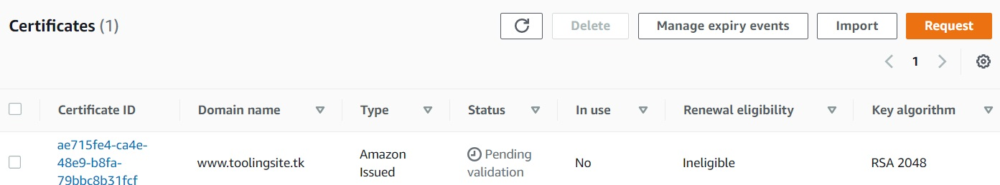

# **AWS CLOUD SOLUTION FOR 2 COMPANY WEBSITES USING A REVERSE PROXY TECHNOLOGY**
We will build a secure infrastructure inside AWS VPC (Virtual Private Cloud) network for a fictitious company (Choose an interesting name for it) that uses WordPress CMS for its main business website, and a Tooling Website (https://github.com/<your-name>/tooling) for their DevOps team. As part of the company’s desire for improved security and performance, a decision has been made to use a reverse proxy technology from NGINX to achieve this.

   
*Solution architecture*  
 

# **Step 1 - Preparing prerequisites** 
### Properly configure your AWS account and Organization Unit [Watch How To Do This Here](https://youtu.be/9PQYCc_20-Q)

* Create an AWS Master account. (Also known as Root Account)

* Within the Root account, create a sub-account and name it DevOps. (You will need another email address to complete this)
   
*Create sub-account*  
 

* Within the Root account, create an AWS Organization Unit (OU). Name it Dev. (We will launch Dev resources in there)   
   
*Create an OU*  
 

* Move the DevOps account into the Dev OU.
   
*Move account into dev OU*  
 

* Login to the newly created AWS account using the new email address.

### Create a free domain name for your fictitious company at Freenom domain registrar [here](https://www.freenom.com/).   
   
*Create domain*  
 

### Create a hosted zone in AWS, and map it to your free domain from Freenom. [Watch how to do that here](https://youtu.be/IjcHp94Hq8A)   
   
*Create a hosted zone*  
 

# **Step 2 - Set up a virtual private network (vpc)**
Create a VPC
   
*create vpc*  
 

Create subnets as shown in the architecture
   
*Create subnets*  
 

Create a route table and associate it with public subnets
   
*Create route table*  
 

Create an Internet Gateway
   
*Create internet gateway*  
 

Edit a route in public route table, and associate it with the Internet Gateway. (This is what allows a public subnet to be accisble from the Internet)
   
*Edit route*  
 

Create a Nat Gateway and assign one of the Elastic IPs (*The other 2 will be used by Bastion hosts)
   
*Create nat gateway*  
 

Create a Security Group for:
* Nginx Servers: Access to Nginx should only be allowed from a Application Load balancer (ALB). At this point, we have not created a load balancer, therefore we will update the rules later. For now, just create it and put some dummy records as a place holder.   
   
*Security group for nginx servers*  
 

* Bastion Servers: Access to the Bastion servers should be allowed only from workstations that need to SSH into the bastion servers. Hence, you can use your workstation public IP address. To get this information, simply go to your terminal and type curl www.canhazip.com   
   
*Security group for bastion servers*  
 

* Application Load Balancer: ALB will be available from the Internet   
   
*Security group for alb*  
 

* Webservers: Access to Webservers should only be allowed from the Nginx servers. Since we do not have the servers created yet, just put some dummy records as a place holder, we will update it later.
   
*Security group for web servers*  
 

* Data Layer: Access to the Data layer, which is comprised of Amazon Relational Database Service (RDS) and Amazon Elastic File System (EFS) must be carefully desinged – only webservers should be able to connect to RDS, while Nginx and Webservers will have access to EFS Mountpoint.
   
*security group for esf data layer*  
   
*security group for rds data layer*  
 

### Proceed With Compute Resources
You will need to set up and configure compute resources inside your VPC. The recources related to compute are:

* EC2 Instances
* Launch Templates
* Target Groups
* Autoscaling Groups
* TLS Certificates
* Application Load Balancers (ALB)

### Set Up Compute Resources for Nginx
Provision EC2 Instances for Nginx
* Create an EC2 Instance based on CentOS Amazon Machine Image (AMI) in any 2 Availability Zones (AZ) in any AWS Region (it is recommended to use the Region that is closest to your customers). Use EC2 instance of T2 family (e.g. t2.micro or similar)
   
*Provision nginx instances*  
 

* Ensure that it has the following software installed:
  * python
  * ntp
  * net-tools
  * vim
  * wget
  * telnet
  * epel-release
  * htop   
   
*Install softwares*  
 

* Create an AMI out of the EC2 instance
   
*create AMI*  
 

Prepare Launch Template For Nginx (One Per Subnet)
* Make use of the AMI to set up a launch template
   
*Create launch template*  
 

* Ensure the Instances are launched into a public subnet
   
*Ensure the instances are launched*  
 

* Assign appropriate security group
   
*Assign security group*  
 

* Configure Userdata to update yum package repository and install nginx
   
*Configure user data*  
 

Configure Target Groups
* Select Instances as the target type
* Ensure the protocol HTTPS on secure TLS port 443
* Ensure that the health check path is /healthstatus
* Register Nginx Instances as targets
* Ensure that health check passes for the target group

   
*Create target group*  
 

Configure Autoscaling For Nginx
* Select the right launch template
* Select the VPC
* Select both public subnets
* Enable Application Load Balancer for the AutoScalingGroup (ASG)
* Select the target group you created before
* Ensure that you have health checks for both EC2 and ALB
* The desired capacity is 2
* Minimum capacity is 2
* Maximum capacity is 4
* Set scale out if CPU utilization reaches 90%
* Ensure there is an SNS topic to send scaling notifications  

   
*Create nginx autoscaling*  
 

### Set Up Compute Resources for Bastion
Provision the EC2 Instances for Bastion
* Create an EC2 Instance based on CentOS Amazon Machine Image (AMI) per each Availability Zone in the same Region and same AZ where you created Nginx server
* Ensure that it has the following software installed:
  * python
  * ntp
  * net-tools
  * vim
  * wget
  * telnet
  * epel-release
  * htop   
* Create an AMI out of the EC2 instance

   
*Provision instances for bastion*  
 

### Set Up Compute Resources for Webservers
Provision the EC2 Instances for Webservers   
Now, you will need to create 2 separate launch templates for both the WordPress and Tooling websites

* Create an EC2 Instance (Centos) each for WordPress and Tooling websites per Availability Zone (in the same Region).
* Ensure that it has the following software installed:
  * python
  * ntp
  * net-tools
  * vim
  * wget
  * telnet
  * epel-release
  * htop
  * php
* Create an AMI out of the EC2 instance

   
*Provision instances for webservers*  
 

Prepare Launch Template For Webservers (One per subnet)
* Make use of the AMI to set up a launch template
* Ensure the Instances are launched into a private subnet
* Assign appropriate security group
* Configure Userdata to update yum package repository and install wordpress (Only required on the WordPress launch template)

   
*Prepare launch template for webservers*  
 

### TLS Certificates From Amazon Certificate Manager (ACM)
You will need TLS certificates to handle secured connectivity to your Application Load Balancers (ALB).

* Navigate to AWS ACM
* Request a public wildcard certificate for the domain name you registered in Freenom
* Use DNS to validate the domain name
* Tag the resource

   
*Request tls certificate*
 

# **Step 3 - Configure Application Load Balancer (ALB)**
Application Load Balancer To Route Traffic To NGINX

* Create an Internet facing ALB
* Ensure that it listens on HTTPS protocol (TCP port 443)
* Ensure the ALB is created within the appropriate VPC | AZ | Subnets
* Choose the Certificate from ACM
* Select Security Group
* Select Nginx Instances as the target group

   
*Configure alb for nginx*
 

Application Load Balancer To Route Traffic To Web Servers
Since the webservers are configured for auto-scaling, there is going to be a problem if servers get dynamically scalled out or in. Nginx will not know about the new IP addresses, or the ones that get removed. Hence, Nginx will not know where to direct the traffic.

To solve this problem, we must use a load balancer. But this time, it will be an internal load balancer. Not Internet facing since the webservers are within a private subnet, and we do not want direct access to them.

* Create an Internal ALB
* Ensure that it listens on HTTPS protocol (TCP port 443)
* Ensure the ALB is created within the appropriate VPC | AZ | Subnets
* Choose the Certificate from ACM
* Select Security Group
* Select webserver Instances as the target group
* Ensure that health check passes for the target group

   
*configure alb for web servers*
 

### Setup EFS
Amazon Elastic File System (Amazon EFS) provides a simple, scalable, fully managed elastic Network File System (NFS) for use with AWS Cloud services and on-premises resources. In this project, we will utulize EFS service and mount filesystems on both Nginx and Webservers to store data.

* Create an EFS filesystem
* Create an EFS mount target per AZ in the VPC, associate it with both subnets dedicated for data layer
* Associate the Security groups created earlier for data layer.
* Create an EFS access point. (Give it a name and leave all other settings as default)

   
*setup efs*
 

### Setup RDS
Pre-requisite: Create a KMS key from Key Management Service (KMS) to be used to encrypt the database instance.
 
To ensure that your databases are highly available and also have failover support in case one availability zone fails, we will configure a multi-AZ set up of RDS MySQL database instance. In our case, since we are only using 2 AZs, we can only failover to one, but the same concept applies to 3 Availability Zones. We will not consider possible failure of the whole Region, but for this AWS also has a solution – this is a more advanced concept that will be discussed in following projects.

To configure RDS, follow steps below:

* Create a subnet group and add 2 private subnets (data Layer)
* Create an RDS Instance for mysql 8.*.*
* To satisfy our architectural diagram, you will need to select either Dev/Test or Production Sample Template. But to minimize AWS cost, you can select the Do not   create a standby instance option under Availability & durability sample template (The production template will enable Multi-AZ deployment)
* Configure other settings accordingly (For test purposes, most of the default settings are good to go). In the real world, you will need to size the database appropriately. You will need to get some information about the usage. If it is a highly transactional database that grows at 10GB weekly, you must bear that in mind while configuring the initial storage allocation, storage autoscaling, and maximum storage threshold.
* Configure VPC and security (ensure the database is not available from the Internet)
* Configure backups and retention
* Encrypt the database using the KMS key created earlier
* Enable CloudWatch monitoring and export Error and Slow Query logs (for production, also include Audit)

   
*Create RDS*
 

### Configuring DNS with Route53
You need to ensure that the main domain for the WordPress website can be reached, and the subdomain for Tooling website can also be reached using a browser.

Create other records such as CNAME, alias and A records.

* Create an alias record for the root domain and direct its traffic to the ALB DNS name.
* Create an alias record for tooling.<yourdomain>.com and direct its traffic to the ALB DNS name.

   
*Configure DNS*
 

   
*Create alias for root*
 

   
*Create alias for subdomain*
 

   
*Accessing tooling website via root domain*
 

   
*Accessing wordpress website via subdomain*
 

