# **AUTOMATE INFRASTRUCTURE WITH IAC USING TERRAFORM PART 1**
In this project, we would automate the process of building an AWS infrastructure for 2 websites.

   
*Solution architecture*  
<br>

# **Step 1 - Preparing prerequisites** 
### Prerequisites before you begin writing Terraform code

* Knowledge of Terraform.
* Create an IAM user, name it terraform (ensure that the user has only programatic access to your AWS account) and grant this user AdministratorAccess permissions.   
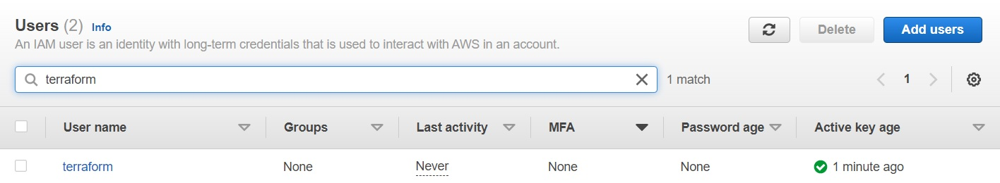   
*Create iam user*  
<br>
  
* Copy the secret access key and access key ID. Save them in a notepad temporarily.
* Configure programmatic access from your workstation to connect to AWS using the access keys copied above and a Python SDK (boto3). You must have Python 3.6 or higher on your workstation.
* Create an S3 bucket to store Terraform state file. You can name it something like `terraform-<yourname>-dev` (Note: S3 bucket names must be unique unique within a region partition, you can read about S3 bucket naming in this article).   
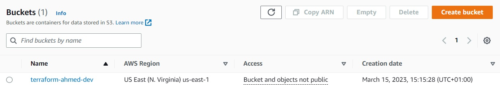   
*Create bucket*  
<br>

Make sure you can programmatically access your AWS account by running following commands in >python:
```
import boto3
s3 = boto3.resource('s3')
for bucket in s3.buckets.all():
    print(bucket.name)
```

You shall see your previously created S3 bucket name – `terraform-<yourname>-dev`
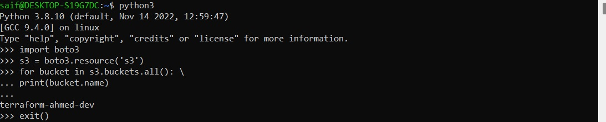   
*Available buckets*  
<br>

# **Step 2 - VPC | Subnets | Security Groups** 
### Let us create a directory structure
Your setup should look like this.

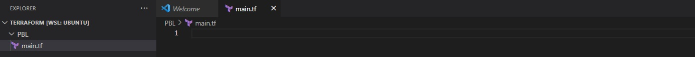   
*Setup*  
<br>

### Provider and VPC resource section
Set up Terraform CLI as per [this instruction.](https://learn.hashicorp.com/tutorials/terraform/install-cli)

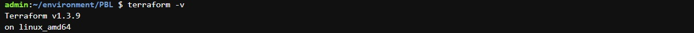   
*Verify terraform*  
<br>

* Add AWS as a provider, and a resource to create a VPC in the main.tf file.
* Provider block informs Terraform that we intend to build infrastructure within AWS.
* Resource block will create a VPC.

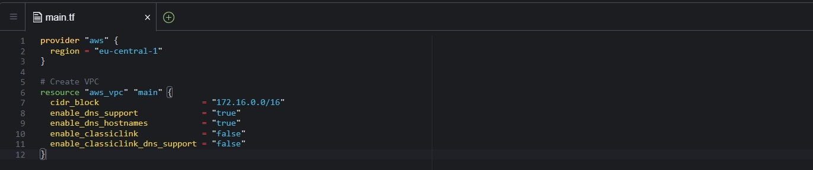   
*Create provider and vpc resource*  
<br>

* The next thing we need to do, is to download necessary plugins for Terraform to work. These plugins are used by providers and provisioners. At this stage, we only have provider in our main.tf file. So, Terraform will just download plugin for AWS provider.
* Lets accomplish this with terraform init command as seen in the below demonstration.

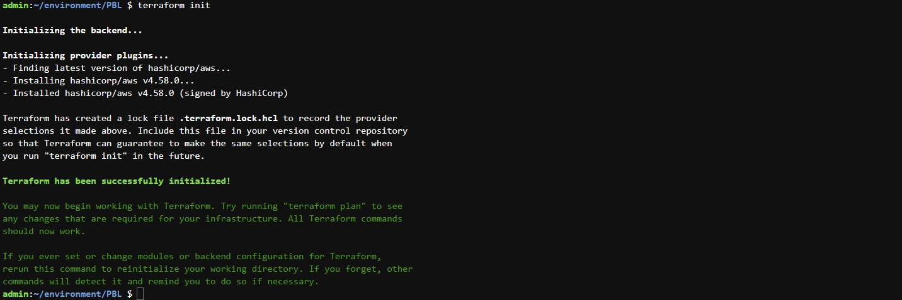   
*Initialize terraform*  
<br>

Moving on, let us create the only resource we just defined. aws_vpc. But before we do that, we should check to see what terraform intends to create before we tell it to go ahead and create it.

Run terraform plan
Then, if you are happy with changes planned, execute terraform apply

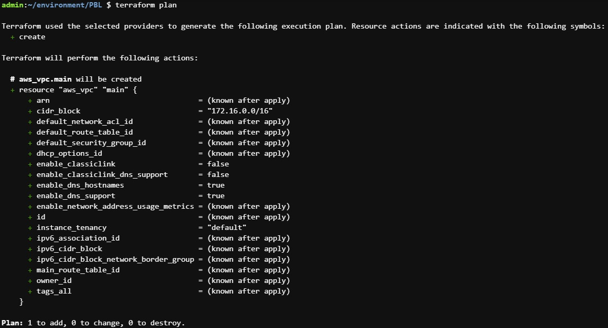   
*Terraform plan*  
<br>

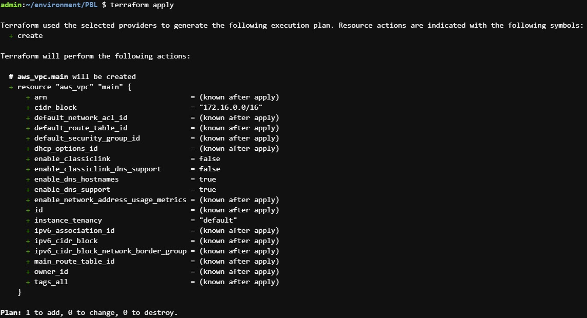   
*Terraform apply*  
<br>

### Subnets resource section
According to our architectural design, we require 6 subnets:

* 2 public
* 2 private for webservers
* 2 private for data layer
Let us create the first 2 public subnets.

Add below configuration to the main.tf file:
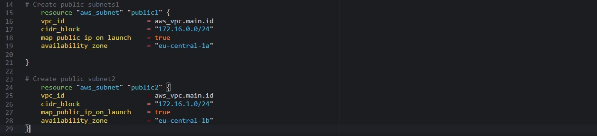   
*Add public subnet resource*  
<br>

Run terraform plan and terraform apply
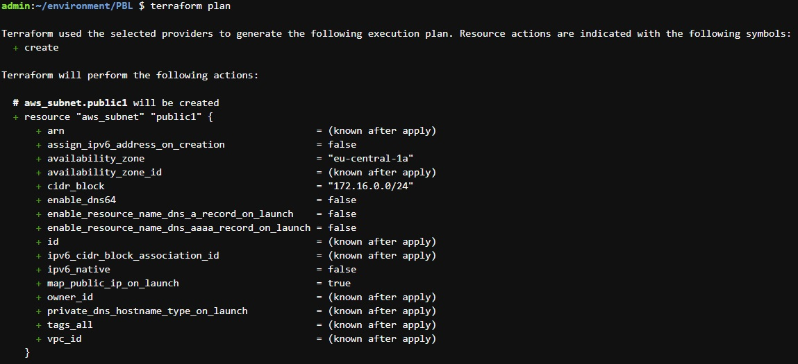   
*Terraform plan*  
<br>

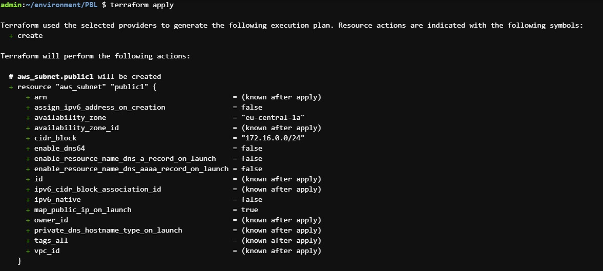   
*Terraform apply*  
<br>

### Hard coded values 
Remember our best practice hint from the beginning? Both the availability_zone and cidr_block arguments are hard coded. We should always endeavour to make our work dynamic

### Multiple Resource Blocks 
Notice that we have declared multiple resource blocks for each subnet in the code. This is bad coding practice. We need to create a single resource block that can dynamically create resources without specifying multiple blocks. Imagine if we wanted to create 10 subnets, our code would look very clumsy. So, we need to optimize this by introducing a count argument.

Now let us improve our code by refactoring it.

First, destroy the current infrastructure. Since we are still in development, this is totally fine. Otherwise, DO NOT DESTROY an infrastructure that has been deployed to production.

To destroy whatever has been created run terraform destroy command, and type yes after evaluating the plan.

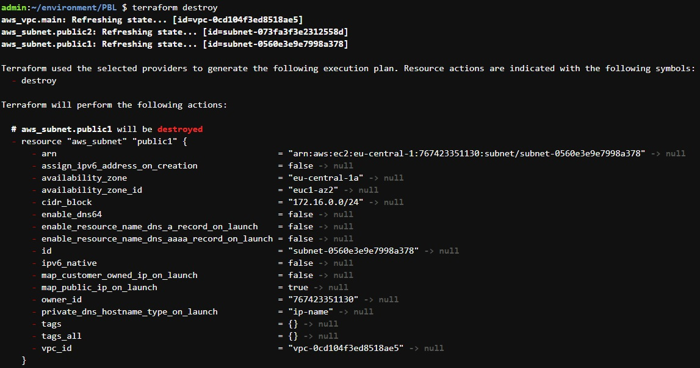   
*Terraform destroy*  
<br>

# **Step 3 - Fixing The Problems By Code Refactoring**
### Fixing Hard Coded Values
We will introduce variables, and remove hard coding.

* Starting with the provider block, declare a variable named region, give it a default value, and update the provider section by referring to the declared variable.
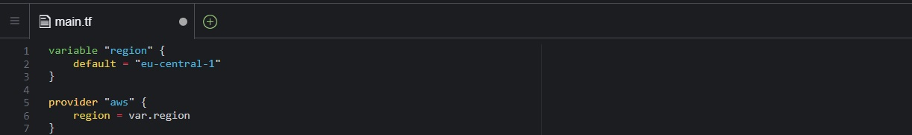   
*Decalre variable*  
<br>

* Do the same to cidr value in the vpc block, and all the other arguments.

```
variable "region" {
  default = "eu-central-1"
}

variable "vpc_cidr" {
  default = "172.16.0.0/16"
}

variable "enable_dns_support" {
  default = "true"
}

variable "enable_dns_hostnames" {
  default = "true"
}

variable "enable_classiclink" {
  default = "false"
}

variable "enable_classiclink_dns_support" {
  default = "false"
}

provider "aws" {
  region = var.region
}

# Create VPC
resource "aws_vpc" "main" {
  cidr_block                     = var.vpc_cidr
  enable_dns_support             = var.enable_dns_support
  enable_dns_hostnames           = var.enable_dns_hostnames
  enable_classiclink             = var.enable_classiclink
  enable_classiclink_dns_support = var.enable_classiclink_dns_support
}
```

### Fixing multiple resource blocks
This is where things become a little tricky. It’s not complex, we are just going to introduce some interesting concepts. Loops & Data sources

Let us fetch Availability zones from AWS, and replace the hard coded value in the subnet’s availability_zone section.
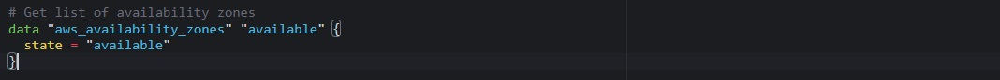   
*AWS availability zones data source*  
<br>

To make use of this new data resource, we will need to introduce a count argument in the subnet block: Something like this.
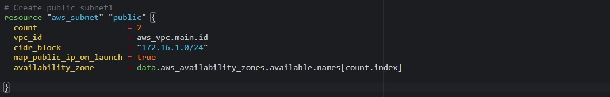   
*Using AWS availability zones data source*  
<br>

But we still have a problem. If we run Terraform with this configuration, it may succeed for the first time, but by the time it goes into the second loop, it will fail because we still have cidr_block hard coded. The same cidr_block cannot be created twice within the same VPC. So, we have a little more work to do.

### Let’s make cidr_block dynamic
We will introduce a function cidrsubnet() to make this happen. It accepts 3 parameters. Let us use it first by updating the configuration, then we will explore its internals.

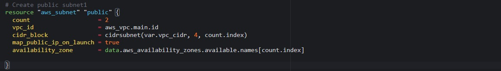   
*Using cidrsubnet*  
<br>

### The final problem to solve is removing hard coded count value
If we cannot hard code a value we want, then we will need a way to dynamically provide the value based on some input. Since the data resource returns all the AZs within a region, it makes sense to count the number of AZs returned and pass that number to the count argument.

To do this, we can introuduce length() function, which basically determines the length of a given list, map, or string.

Now we can simply update the public subnet block like this

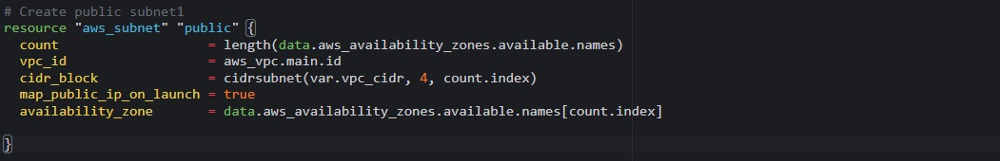   
*Update public subnet block*  
<br>

What we have now, is sufficient to create the subnet resource required. But if you observe, it is not satisfying our business requirement of just 2 subnets. The length function will return number 3 to the count argument, but what we actually need is 2.

Now, let us fix this.

* Declare a variable to store the desired number of public subnets, and set the default value
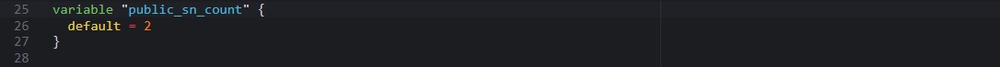   
*Desired public subnets variable*  
<br>

* Next, update the count argument with a condition. Terraform needs to check first if there is a desired number of subnets. Otherwise, use the data returned by the lenght function. See how that is presented below.
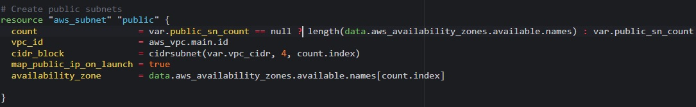   
*Update count argument*  
<br>
 
Now the entire configuration should now look like this
```
# Get list of availability zones
data "aws_availability_zones" "available" {
state = "available"
}

variable "region" {
      default = "eu-central-1"
}

variable "vpc_cidr" {
    default = "172.16.0.0/16"
}

variable "enable_dns_support" {
    default = "true"
}

variable "enable_dns_hostnames" {
    default ="true" 
}

variable "enable_classiclink" {
    default = "false"
}

variable "enable_classiclink_dns_support" {
    default = "false"
}

  variable "public_sn_count" {
      default = 2
}

provider "aws" {
  region = var.region
}

# Create VPC
resource "aws_vpc" "main" {
  cidr_block                     = var.vpc_cidr
  enable_dns_support             = var.enable_dns_support 
  enable_dns_hostnames           = var.enable_dns_support
  enable_classiclink             = var.enable_classiclink
  enable_classiclink_dns_support = var.enable_classiclink

}

# Create public subnets
resource "aws_subnet" "public" {
  count  = var.public_sn_count == null ? length(data.aws_availability_zones.available.names) : var.public_sn_count   
  vpc_id = aws_vpc.main.id
  cidr_block              = cidrsubnet(var.vpc_cidr, 4 , count.index)
  map_public_ip_on_launch = true
  availability_zone       = data.aws_availability_zones.available.names[count.index]

}
```

# **Step 4 - Introducing variables.tf & terraform.tfvars**
Instead of havng a long list of variables in main.tf file, we can actually make our code a lot more readable and better structured by moving out some parts of the configuration content to other files.

* Create a new file and name it variables.tf
* Copy all the variable declarations into the new file.
* Create another file, name it terraform.tfvars
* Set values for each of the variables.

Main.tf
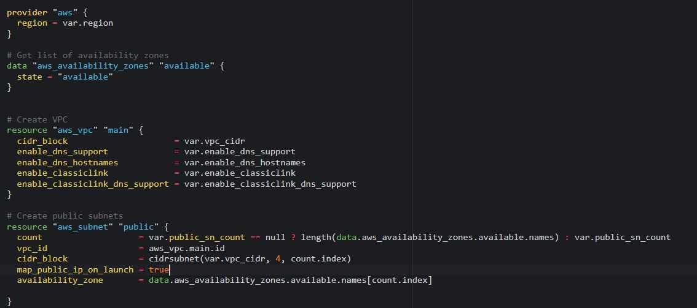   
*Content of main.tf*  
<br>

Variables.tf
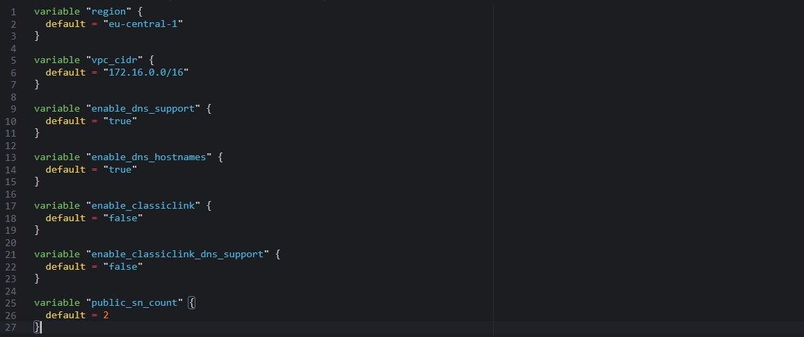   
*Content of variables.tf*  
<br>

terraform.tfvars
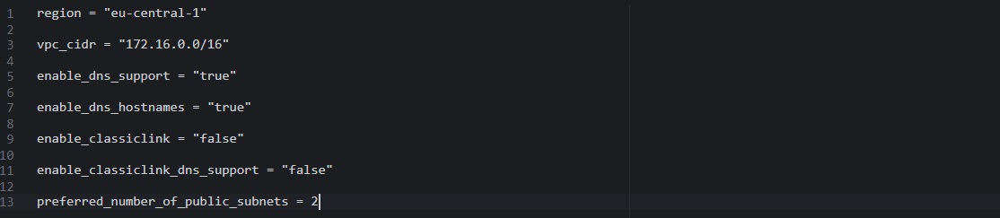   
*Content of terraform.tfvars*  
<br>

Run terraform plan and ensure everything works
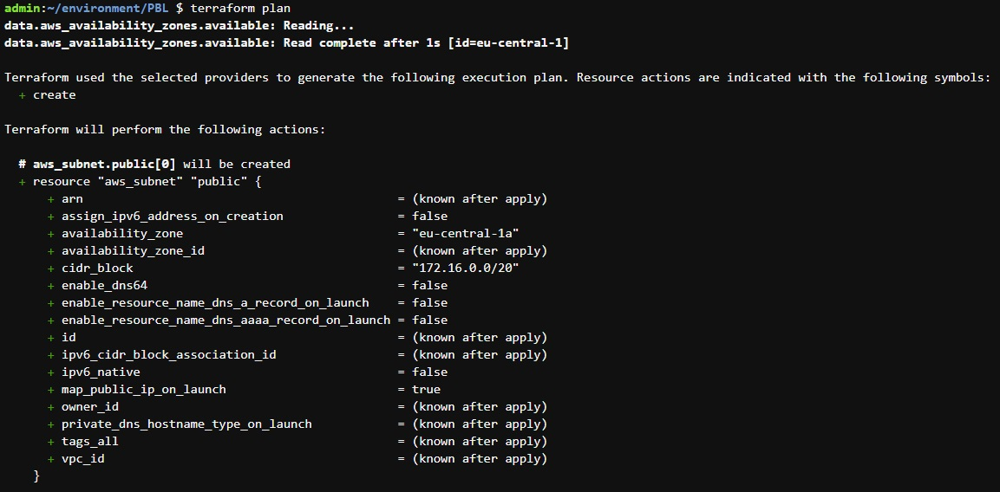   
*Terraform plan*  
<br>

### This shows how to create and delete AWS Network Infrastructure programmatically with Terraform!
