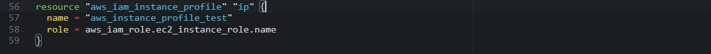
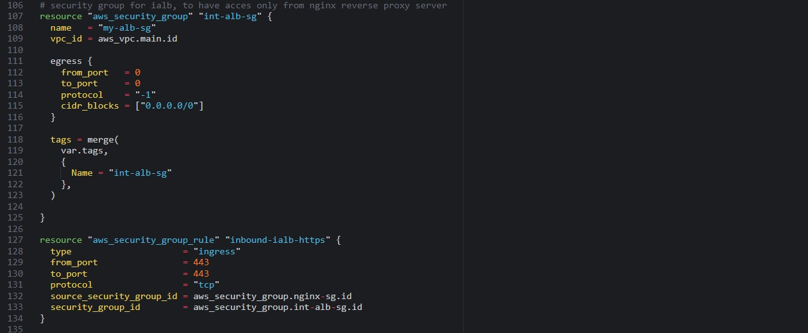
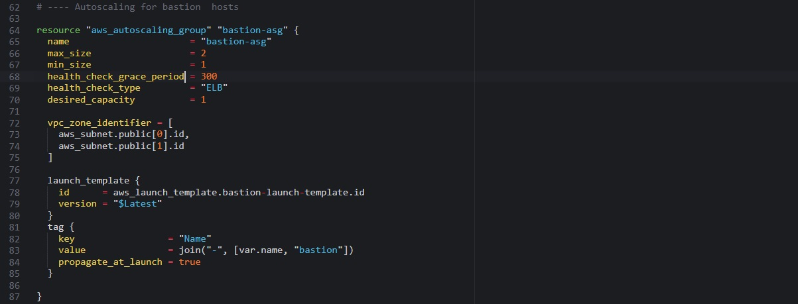
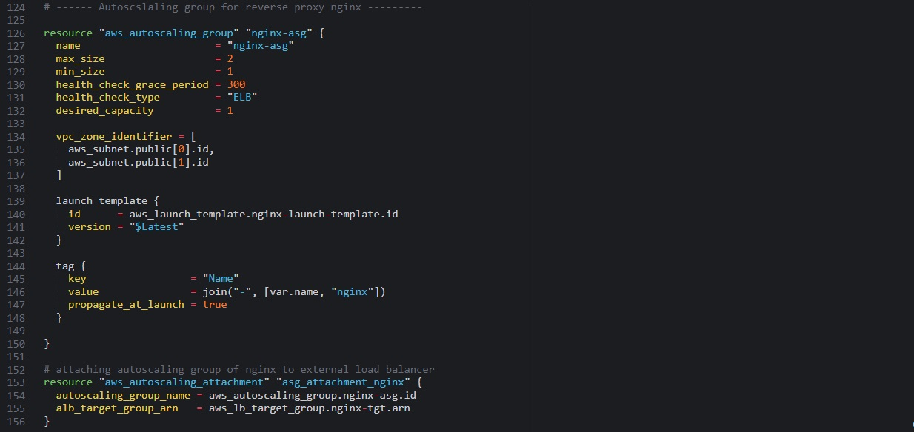
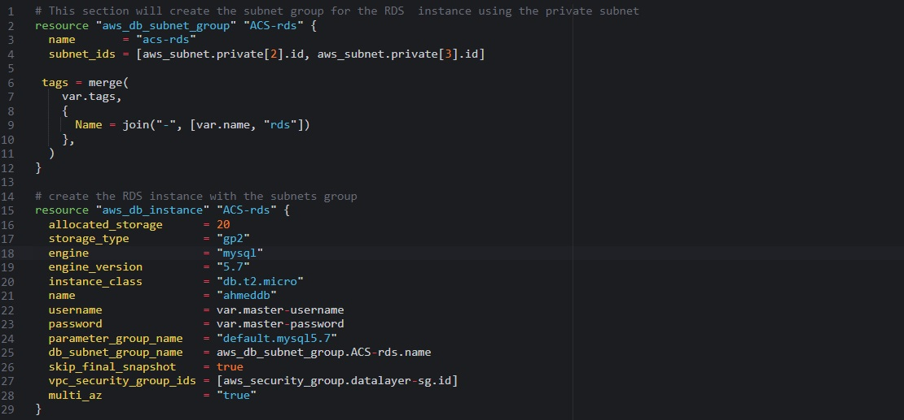

# **AUTOMATE INFRASTRUCTURE WITH IAC USING TERRAFORM PART 2**
In this project, we would continue to automate the process of building an AWS infrastructure for 2 websites.

   
*Solution architecture*  
<br>

# **Step 1 - Networking** 

Let us continue from where we have stopped in the previous project.

Create 4 private subnets with respective tags:
   
*Private subnets*  
<br>

We can add multiple tags as a default set. for example, in terraform.tfvars file we can have default tags defined.
   
*Default tags*  
<br>

Now we can tag all our resources using the format below
```
tags = merge(
    var.tags,
    {
      Name = "Name of the resource"
    },
  )
```
<br/>

Update the variables.tf to declare the variable tags used in the format above;
   
*Update variables.tf*  
<br>

The nice thing about this is – anytime we need to make a change to the tags, we simply do that in one single place (terraform.tfvars).

### Internet Gateways & format() function
Create an Internet Gateway in a separate Terraform file internet_gateway.tf
   
*Create internet gateway*  
<br>

Each of our subnets should have a unique name in the tag section. Without the format() function, we would not be able to see uniqueness. With the format function, each private subnet’s tag will look like this.
```
Name = PrvateSubnet-0
Name = PrvateSubnet-1
Name = PrvateSubnet-2
```

Lets try and see that in action.
```
tags = merge(
  var.tags,
  {
    Name = format("PrivateSubnet-%s", count.index)
  } 
)
```

### NAT Gateways
Create 1 NAT Gateway and 1 Elastic IP (EIP) address

We need to create an Elastic IP for the NAT Gateway, and you we see the use of depends_on to indicate that the Internet Gateway resource must be available before this should be created. Although Terraform does a good job to manage dependencies, but in some cases, it is good to be explicit.

   
*Create nat gateway*  
<br>

# **Step 2 - AWS Routes** 
Create a file called route_tables.tf and use it to create routes for both public and private subnets, create the below resources. Ensure they are properly tagged.

* aws_route_table
* aws_route
* aws_route_table_association

   
*Create route table*  
<br>

   
*Create route table*  
<br>

Now if you run terraform plan and terraform apply it will add the following resources to AWS in multi-az set up:

* Our main vpc
* 2 Public subnets
* 4 Private subnets
* 1 Internet Gateway
* 1 NAT Gateway
* 1 EIP
* 2 Route tables

Now, we are done with Networking part of AWS set up, let us move on to Compute and Access Control configuration automation using Terraform!

# **Step 3 - AWS Identity and Access Management** 
We want to pass an IAM role our EC2 instances to give them access to some specific resources, so we need to do the following

* Create AssumeRole
  <br>  
  Add the following code to a new file named roles.tf
     
  *Create assumerole*  
  <br>

  In this code we are creating AssumeRole with AssumeRole policy. It grants to an entity, in our case it is an EC2, permissions to assume the role.  

* Create IAM policy for this role   
  <br>
  This is where we need to define a required policy (i.e., permissions) according to our requirements. For example, allowing an IAM role to perform action describe applied to EC2 instances:
     
  *Create policy*  
  <br>
  
* Attach the Policy to the IAM Role
  <br>  
  This is where, we will be attaching the policy which we created above, to the role we created in the first step.
     
  *Attach policy*  
  <br>

* Create an Instance Profile and interpolate the IAM Role
  <br />  
     
  *Create instance profile*  
  <br>  

We are pretty much done with Identity and Management part for now, let us move on and create other resources required.
  
### Resources to be created
As per our architecture we need to do the following:

* Create Security Groups
* Create Target Group for Nginx, WordPress and Tooling
* Create certificate from AWS certificate manager
* Create an External Application Load Balancer and Internal Application Load Balancer.
* create launch template for Bastion, Tooling, Nginx and WordPress
* Create an Auto Scaling Group (ASG) for Bastion, Tooling, Nginx and WordPress
* Create Elastic Filesystem
* Create Relational Database (RDS)

# **Step 4 - Create security groups**
### Create a file and name it security.tf, use the snippets as below

   
*Create security groups*  
<br>  


   
*Create security groups*  
<br>  


   
*Create security groups*  
<br>  


   
*Create security groups*  
<br>  


   
*Create security groups*  
<br>  


   
*Create security groups*  
<br>  

   
*Create security groups*  
<br>  

We used the aws_security_group_rule to refrence another security group in a security group.

# **Step 5 - Create certificate from amazon certificate manager**
### Create cert.tf file and add the following code snippets to it.

   
*Create certificate*  
<br>  

   
*Create certificate*  
<br>  

### Create an external (Internet facing) Application Load Balancer (ALB)
Create a file called alb.tf   
<br>
First of all we will create the ALB, then we create the target group and lastly we will create the lsitener rule.   
<br>

We need to create an ALB to balance the traffic between the Instances:
   
*create alb*  
<br>  

To inform our ALB to where route the traffic we need to create a Target Group to point to its targets:
   
*Create target group*  
<br>  

Then we will need to create a Listener for this target Group
   
*Create listener*  
<br>  

Add the following outputs to output.tf to print them on screen
   
*Outputing*  
<br>  

### Create an Internal (Internal) Application Load Balancer (ALB)
For the Internal Load balancer we will fillow thje same concepts with the external load balancer.
<br>

Add the code snippets inside the alb.tf file
   
*create internal alb*  
<br>  

To inform our internal ALB to where route the traffic we need to create a Target Group to point to its targets:
   
*Create target group*  
<br>  

Then we will need to create a Listner for this target Group
   
*Create listener*  
<br>  

# **Step 6 - Create auto scaling groups**
### This Section we will create the Auto Scaling Group (ASG)
<br>
Now we need to configure our ASG to be able to scale the EC2s out and in depending on the application traffic.   

<br>   
Create asg-bastion-nginx.tf and paste all the code snippet below;

   
*Sns for auto scaling groups*  
<br>  

### Creating notification for all the auto scaling groups
   
*Create notification*  
<br>  

### Launch template and autoscaling for bastion and nginx
   
*Create launch template*  
<br>  

   
*Create ASG*  
<br>  

   
*Create launch template*  
<br>  

   
*Create ASG*  
<br>  

### Launch template and autoscaling for wordpress and tooling will be created in a seperate file
Create asg-wordpress-tooling.tf and paste the following code
   
*Create launch template*  
<br>  

   
*Create ASG*  
<br>  

   
*Create launch template*  
<br>  

   
*Create ASG*  
<br>  

# **Step 7 - Storage and database**
### Create Elastic File System (EFS) (In order to create an EFS you need to create a KMS key.)

Add the following code to efs.tf
   
*Create kms key*  
<br>  

Let us create EFS and it mount targets- add the following code to efs.tf
   
*Create efs*  
<br>  

   
*Create efs*  
<br>  

### Create MySQL RDS
Let us create the RDS itself using this snippet of code in rds.tf file:
   
*Create mysql rds*  
<br>

Before Applying, if you take note, we gave refrence to a lot of varibales in our resources that has not been declared in the variables.tf file. Go through the entire code and spot this variables and declare them in the variables.tf file.

If you have done that well, you file should like this one below.
   
*Updated variables.tf*  
<br>

   
*Updated variables.tf*  
<br>

Now, we are almost done but we need to update the last file which is terraform.tfvars file. In this file we are going to declare the values for the variables in our varibales.tf file.

Open the terraform.tfvars file and add the code below
   
*Updated terraform.tfvars*  
<br>

At this point, you shall have pretty much all infrastructure elements ready to be deployed automatically, but before we paln and apply our code we need to take note of two things;

* we have a long list of files which may looks confusing but that is not bad for a start, we are going to fix this using the concepts of modules in the upcoming project
* Secondly, our application wont work becuase in out shell script that was passed into the launch some endpoints like the RDs and EFS point is needed in which they have not been created yet. So in an upcoming project, we will use our Ansible knowledge to fix this.

Try to plan and apply your Terraform codes, explore the resources in AWS console and make sure you destroy them right away to avoid massive costs.   
   
*Terraform destroy*  
<br>

This completes the processs of fully automating the creation of AWS Infrastructure for 2 websites with Terraform. in an upcoming project, we will further enhance our codes by refactoring and introducing more exciting Terraform concepts!
