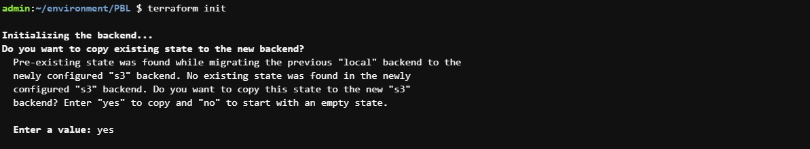

# **AUTOMATE INFRASTRUCTURE WITH IAC USING TERRAFORM PART 3**
In the last two projects, we developed an AWS infrastructure for 2 websites using terraform and tried to run it from our local workstation.   

Now it is time to introduce some more advanced concepts and enhance our code.

Firstly, we will explore alternative Terraform backends.   

# **Step 1 - Introducing Backend on S3** 
Each Terraform configuration can specify a backend, which defines where and how operations are performed, where state snapshots are stored, etc.

Let us configure it!

* Create a file and name it backend.tf. Add the code below and replace the name of the S3 bucket accordingly.
   
*Create backend*  
 

* Next, we will create a DynamoDB table to handle locks and perform consistency checks.   
  Dynamo DB resource for locking and consistency checking
     
  *Create dynamodb resource*  
   

  Terraform expects that both S3 bucket and DynamoDB resources are already created before we configure the backend. So, let us run terraform apply to provision resources.

* Configure S3 Backend
     
  *Configure backend*  
   
  
  Now its time to re-initialize the backend. Run terraform init and confirm you are happy to change the backend by typing yes
     
  *Reinitialize backend*  
   

* Verify the changes   
  Before doing anything if you opened AWS now to see what happened you should be able to see the following:
  * tfstatefile is now inside the S3 bucket
  * DynamoDB table which we create has an entry which includes state file status
  
     
  *Verify changes*  
   

     
  *Verify changes*  
   

* Add Terraform Output
  
  Before you run terraform apply let us add an output so that the S3 bucket Amazon Resource Names ARN and DynamoDB table name can be displayed.   
   
  Create a new file and name it output.tf and add below code.

     
  *Create output*  
   

* Let us run terraform apply   
   
  Terraform will automatically read the latest state from the S3 bucket to determine the current state of the infrastructure. Even if another engineer has applied changes, the state file will always be up to date.

     
  *Terraform apply*  
   

With help of remote backend and locking configuration that we have just configured, collaboration is no longer a problem.

However, there is still one more problem: Isolation Of Environments. Most likely we will need to create resources for different environments, such as: Dev, sit, uat, preprod, prod, etc.

This separation of environments can be achieved using one of two methods:
* Terraform Workspaces
* Directory based separation using terraform.tfvars file

# **Step 2 - Refactoring** 

### Security Groups refactoring with dynamic block
Refactor Security Groups creation with dynamic blocks.
   
*Refactor security groups*  
 

   
*Refactor security groups*  
 

   
*Refactor security groups*  
 

   
*Refactor security groups*  
 

### EC2 refactoring with Map and Lookup
Amazon Machine Image (AMI) is a regional service which means it is only available in the region it was created. But what if we change the region later, and want to dynamically pick up AMI IDs based on the available AMIs in that region? This is where we will introduce Map and Lookup functions.   
 

Map uses a key and value pairs as a data structure that can be set as a default type for variables.
   
*Refactor images variable*  
 

   
*Refactor images variable*  
 

To select an appropriate AMI per region, we will use a lookup function which has following syntax:  
`lookup(map, key, [default])`.

   
*Refactor EC2*  
 

 A default value is better to be used to avoid failure whenever the map data has no key.

# **Step 3 - Refactoring the project using modules**
Let us review the repository from the previous project, you will notice that we had a single list of long file for creating all of our resources, but that is not the best way to go about it because it makes our code base vey hard to read and understand therefore making future changes can be quite stressful.

   
*refactor ALB*  
 

   
*refactor EFS*  
 

   
*refactor RDS*  
 

   
*refactor Autoscaling*  
 

   
*refactor VPC*  
 

   
*refactor Security*  
 

# **Step 4 - Completing the terraform configuration**
The resulting configuration structure in our working directory looks like this:
   
*Resulting configuration*  
 

   
*Resulting configuration*  
 

Now, the code is much more well-structured and can be easily read, edited and reused by other DevOps team members.   
 
The website would not be available because the userdata scripts we added to the launch template does not contain the latest endpoints for EFS, ALB and RDS and also our AMI is not properly configured, so how do we fix this?   
 
In the next project, we would see how to use packer to create AMIs, Terrafrom to create the infrastructure and Ansible to configure the infrasrtucture.   
 
We will also see how to use terraform cloud for our backends.   

### This concludes developing and refactoring AWS Infrastructure as Code with Terraform!

