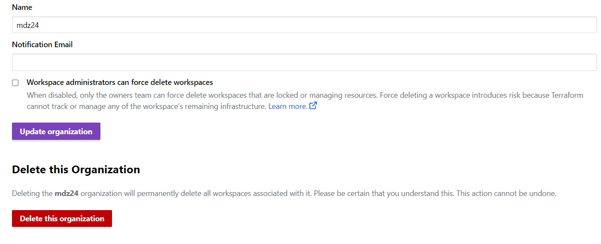
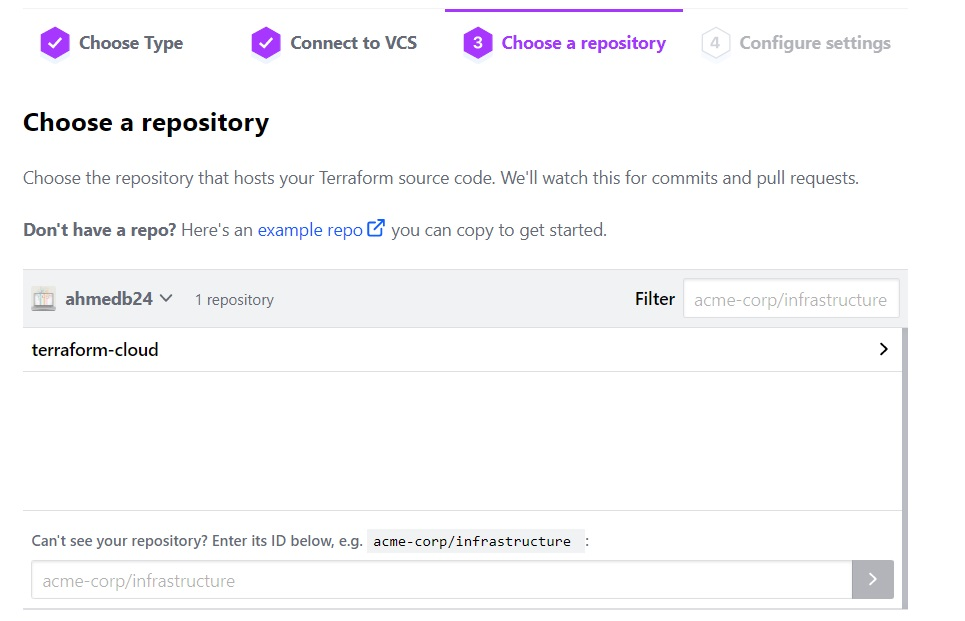
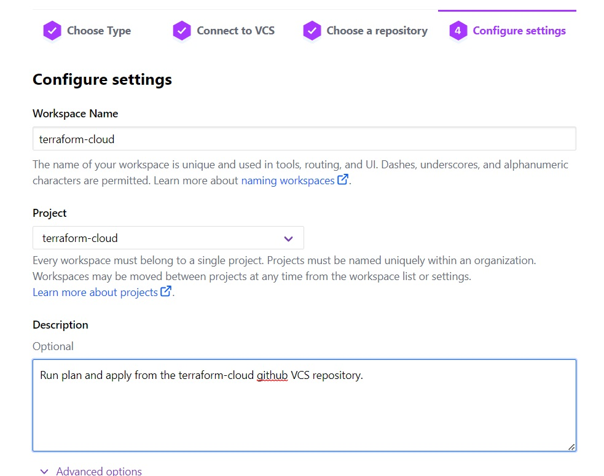
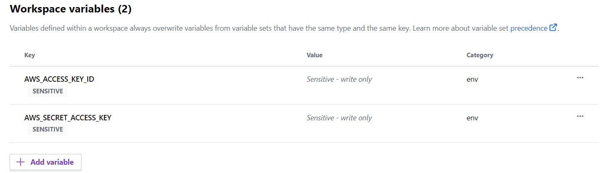

# **AUTOMATE INFRASTRUCTURE WITH IAC USING TERRAFORM PART 4 - TERRAFORM CLOUD**
Terraform Cloud is a managed service that provides you with Terraform CLI to provision infrastructure, either on demand or in response to various events.

### Migrate your .tf codes to Terraform Cloud
Let us explore how we can migrate our codes to Terraform Cloud and manage our AWS infrastructure from there:
* Create a Terraform Cloud account
* Create an organization
     
  *Organization*  
   
* Configure a workspace   
  We will use version control workflow as the most common and recommended way to run Terraform commands triggered from our git repository. 
      
  Create a new repository in your GitHub and call it terraform-cloud, push your Terraform codes developed in the previous projects to the repository.
     
  *Create repository*  
   

  Choose version control workflow and you will be promped to connect your GitHub account to your workspace – follow the prompt and add your newly created repository to the workspace.
     
  *Add new repository*  
   

  Move on to "Configure settings", provide a description for your workspace and leave all the rest settings default, click "Create workspace".
     
  *Configure settings*  
   

* Configure variables   
  Set two environment variables: AWS_ACCESS_KEY_ID and AWS_SECRET_ACCESS_KEY. These credentials will be used to provision your AWS infrastructure by Terraform Cloud.
     
  *Set variables*  
   

  After you have set these 2 environment variables – your Terraform Cloud is all set to apply the codes from GitHub and create all necessary AWS resources.

* Refactor repository to use packer and ansible   
  Before you proceed ensure you have the following tools installed on your local machine;
  * packer
  * Ansible   
  Refer to this [repository](https://github.com/ahmedb24/terraform-cloud) for guidiance on how to refactor your enviroment to meet the new changes above and ensure you go through the README.md file.

* Run terraform plan and terraform apply from web console   
  Switch to "Runs" tab and click on "Queue plan manualy" button. If planning has been successfull, you can proceed and confirm Apply – press "Confirm and apply", provide a comment and "Confirm plan"
     
  *Successful apply*  
   
  Check the logs and verify that everything has run correctly. Note that Terraform Cloud has generated a unique state version that you can open and see the codes applied and the changes made since the last run.

* Test automated terraform plan   
  By now, you have tried to launch plan and apply manually from Terraform Cloud web console. But since we have an integration with GitHub, the process can be triggered automatically. 
      
  Try to change something in any of .tf files and look at "Runs" tab again – plan must be launched automatically, but to apply you still need to approve manually. Since provisioning of new Cloud resources might incur significant costs. Even though you can configure "Auto apply", it is always a good idea to verify your plan results before pushing it to apply to avoid any misconfigurations that can cause ‘bill shock’.
     
  *Automated successful apply*  
   