# **WEB STACK IMPLEMENTATION (LEMP STACK) IN AWS**
LEMP web stack is a technology stack that combines a set of frameworks and tools specifically chosen to work 
<br>together and used to develop a software product.  
<br>

# **Step 1 - Preparing prerequisites** 
In order to complete this project, an AWS account and a virtual server with Ubuntu Server OS is required.  
<br>

Creation of a new AWS account gives access to the free tier plan which allows to spin up a new EC2 instance
<br>(an instance of a virtual server) for free in only a matter of a few clicks.  
<br>

You can watch the videos below to learn how to Provision a server and connect to it.
- [AWS account setup and Provisioning an Ubuntu Server](https://www.youtube.com/watch?v=xxKuB9kJoYM&list=PLtPuNR8I4TvkwU7Zu0l0G_uwtSUXLckvh&index=6) 
- [Connecting to your EC2 Instance](https://www.youtube.com/watch?v=TxT6PNJts-s&list=PLtPuNR8I4TvkwU7Zu0l0G_uwtSUXLckvh&index=7)    
<br>

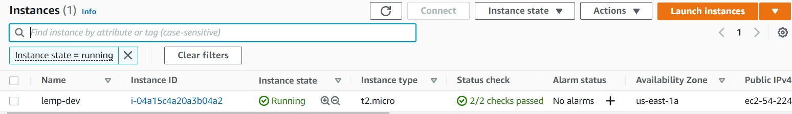
*EC2 machine in running state*  
<br>

Let us move on and configure our EC2 machine to serve a Web server!  
<br>

# **STEP 2 — INSTALLING THE NGINX WEB SERVER AND UPDATING THE FIREWALL** 
In order to display web pages to our site visitors, we are going to employ Nginx, a high-performance web server. We’ll use the 
<br>apt package manager to install this package.   
<br>

Since this is our first time using apt for this session, start off by updating your server’s package index. Following that, you can use
<br>apt install to get Nginx installed:
<br>   

> #update a list of packages in package manager
<br>`sudo apt update`
<br>
<br>#run nginx package installation
<br>`sudo apt install nginx`   

<br>To verify that nginx is running as a Service in our OS, use the following command:
>`sudo systemctl status nginx`  
<br>          

<br>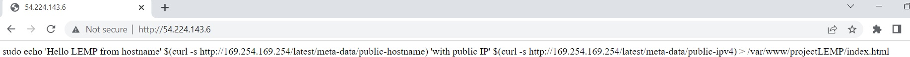
*Verifying nginx is running* 
<br>

Before we can receive any traffic by our Web Server, we need to open TCP port 80 which is the default port that web browsers use 
<br>to access web pages on the Internet   

<br>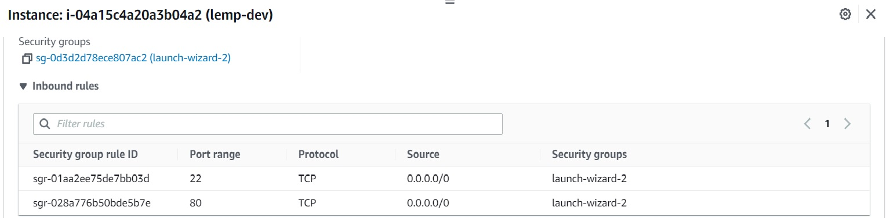
*Opened port 80*  

<br>Now it is time for us to test how our Nginx HTTP server can respond to requests from the Internet.
<br>Open a web browser of your choice and try to access following url
>`http://<Public-IP-Address>:80`

<br>If you see following page, then your web server is now correctly installed and accessible through your firewall.
<br>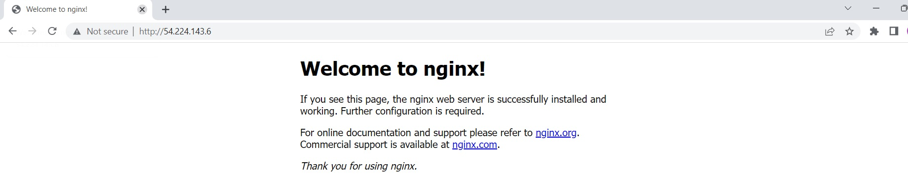
<br>*Nginx default page*   
<br>

# **STEP 3 — INSTALLING MYSQL** 
Now that you have a web server up and running, you need to install a Database Management System (DBMS) to be able to store and manage 
<br>data for your site in a relational database. MySQL is a popular relational database management system used within PHP environments, 
<br>so we will use it in our project.  
<br>
  
Again, use ‘apt’ to acquire and install this software:   
>`sudo apt install mysql-server`  
<br>       

<br>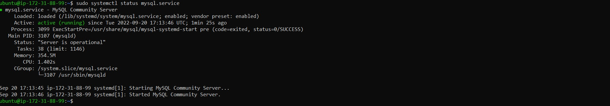
<br>*Verifying MYSQL is running*   
<br>

<br>It’s recommended that you run a security script that comes pre-installed with MySQL. This script will remove some insecure default settings 
<br>and lock down access to your database system. Before running the script you will set a password for the root user, using mysql_native_password 
<br>as default authentication method. We’re defining this user’s password as PassWord.1.   
<br>

>#Login to mysql as root
<br>`sudo mysql`  
<br>
#Change password
<br>`ALTER USER 'root'@'localhost' IDENTIFIED WITH mysql_native_password BY 'PassWord.1'`;
<br>   
#exit the console
<br>`exit`
<br>  

<br>Start the interactive script by running:
>`sudo mysql_secure_installation`
<br>     

<br>When you’re finished, test if you’re able to log in to the MySQL console by typing:
>`sudo mysql -p`  
<br>#exit the console
<br>`exit`   
<br>

<br>For increased security, it’s best to have dedicated user accounts with less expansive privileges set up for every database, especially if you plan on 
<br>having multiple databases hosted on your server.   
<br>

Your MySQL server is now installed and secured. Next, we will install PHP, the final component in the LEMP stack.   
<br>

# **STEP 4 — INSTALLING PHP** 
You have Nginx installed to serve your content and MySQL installed to store and manage your data. Now you can install PHP to process code and generate dynamic 
<br>content for the web server.   
<br>

While Apache embeds the PHP interpreter in each request, Nginx requires an external program to handle PHP processing and act as a bridge between the PHP 
<br>interpreter itself and the web server. This allows for a better overall performance in most PHP-based websites, but it requires additional configuration.
<br>
<br>You’ll need to install php-fpm, which stands for “PHP fastCGI process manager”, and tell Nginx to pass PHP requests to this software for processing. Additionally, <br>you’ll need php-mysql, a PHP module that allows PHP to communicate with MySQL-based databases. Core PHP packages will automatically be installed as dependencies.   
<br>   

To install these 2 packages at once, run:
>`sudo apt install php-fpm php-mysql`   
<br>
#Confirm php is installed
<br>`php -v`   

<br>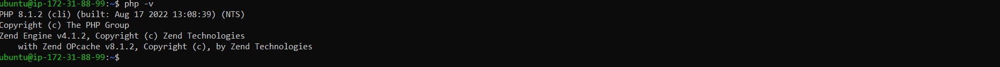
<br>*Verifying PHP is installed*   
<br>   

You now have your PHP components installed. Next, you will configure Nginx to use them.   
<br>

# **STEP 5 — CONFIGURING NGINX TO USE PHP PROCESSOR** 
On Ubuntu 20.04, Nginx has one server block enabled by default and is configured to serve documents out of a directory at /var/www/html. 
<br>
<br>While this works well for a single site, it can become difficult to manage if you are hosting multiple sites. Instead of modifying /var/www/html, 
<br>we’ll create a directory structure within /var/www for the your_domain website, leaving /var/www/html in place as the default directory to be 
<br>served if a client request does not match any other sites.   
<br>   


Create the root web directory and assign ownership of the directory with your current system user:
>#Create directory for projectlemp
<br>`sudo mkdir /var/www/projectlemp`   
<br>#Assign ownership
<br> `sudo chown -R $USER:$USER /var/www/projectlemp`   
<br>    

<br>
Then, create and add configuration settings to a new configuration file in Nginx’s sites-available directory using your preferred command-line editor:   
<br>   

>`sudo vi /etc/nginx/sites-available/projectlemp.conf`
```
#Config file content
server {
    listen 80;
    server_name projectLEMP www.projectLEMP;
    root /var/www/projectLEMP;

    index index.html index.htm index.php;

    location / {
        try_files $uri $uri/ =404;
    }

    location ~ \.php$ {
        include snippets/fastcgi-php.conf;
        fastcgi_pass unix:/var/run/php/php8.1-fpm.sock;
     }

    location ~ /\.ht {
        deny all;
    }

}
```   

<br>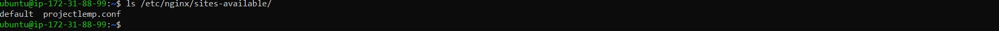
<br>*Verifying porjectlemp config creation*   
<br>   

We would need to activate the configuration by linking to the config file from Nginx’s sites-enabled directory and also disable default Nginx host that 
<br>is currently configured to listen on port 80, for this run: 
> #Activate config
<br>`sudo ln -s /etc/nginx/sites-available/projectLEMP /etc/nginx/sites-enabled/`   
<br>#Disable default Nginx host   
`sudo unlink /etc/nginx/sites-enabled/default`   
<br>#Test configuration for syntax errors   
`sudo nginx -t`   
<br>#Reload Nginx   
`sudo systemctl reload nginx`  

<br>Your new website is now active, but the web root /var/www/projectLEMP is still empty. Create an index.html file in that location so that we can test that your 
<br>new server block works as expected:   

>`sudo echo 'Hello LEMP from hostname' $(curl -s http://169.254.169.254/latest/meta-data/public-hostname) 'with public IP' $(curl -s http://169.254.169.254/latest/meta-data/public-ipv4) > /var/www/projectLEMP/index.html`
<br>   

<br>
<br>*Verifying nginx is serving projectlemp*   
<br>

Your LEMP stack is now fully configured. In the next step, we’ll create a PHP script to test that Nginx is in fact able to handle .php files within your 
<br>newly configured website.   
<br>

# **STEP 6 — TESTING PHP WITH NGINX** 
You can test the LEMP stack to validate that Nginx can correctly hand .php files off to your PHP processor.    
<br>
You can do this by creating a test PHP file in your document root. Open a new file called info.php within your document root in your text editor: 
>#create info.php
<br>`sudo nano /var/www/projectlemp/info.php`
<br>
<br>#File content
<br>`<?php`
<br>`phpinfo();`   

<br>You can access the web page via the browser and will see detailed information about your server:

<br>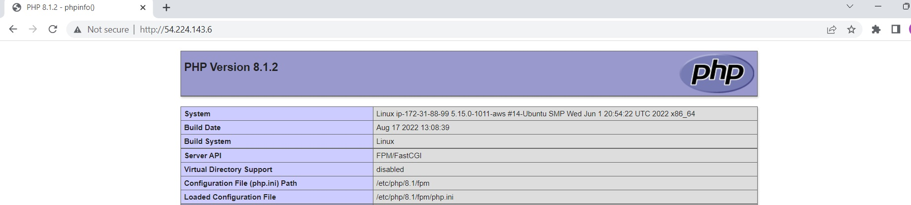
<br>*Verifying nginx is serving projectlemp*   
<br> 

After checking the relevant information about your PHP server through that page, it’s best to remove the file you created as it contains sensitive information 
<br>about your PHP environment and your Ubuntu server.   
<br>

# **STEP 7 – RETRIEVING DATA FROM MYSQL DATABASE WITH PHP (CONTINUED)** 
In this step you will create a test database (DB) with simple "To do list" and configure access to it, so the Nginx website would be able to query data from the 
<br>DB and display it.    
<br>   

We will create a database named example_database and a user named example_user, but you can replace these names with different values. 
<br>   

>#Connect to the MySQL console using the root account 
<br>`sudo mysql`
<br>   
#Create a new database
<br>`CREATE DATABASE `example_database`;`
<br>   
#Create a new user named example_user, using mysql_native_password as default authentication method
<br>`CREATE USER 'example_user'@'%' IDENTIFIED WITH mysql_native_password BY 'password';`
<br>   
#Give this user permission over the example_database database
<br>`GRANT ALL ON example_database.* TO 'example_user'@'%';`
<br>   
#Exit the MySQL shell
<br>`exit`   

<br>You can test if the new user has the proper permissions by logging in to the MySQL console again, this time using the custom user credentials
>`mysql -u example_user -p`   
<br>#Confirm access to the example_database database
<br>`SHOW DATABASES;`   
<br>

<br>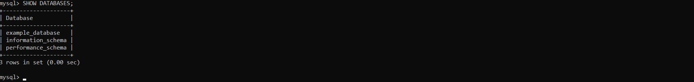
<br>*Verifying newly created database*   
<br>   

Next, we’ll create a test table named todo_list. From the MySQL console, run the following statement:
>`CREATE TABLE example_database.todo_list (`
<br>`item_id INT AUTO_INCREMENT,`
<br>`content VARCHAR(255),`
<br>`PRIMARY KEY(item_id)`
<br>`);`   

<br>Insert a few rows of content in the test table. You might want to repeat the next command a few times, using different VALUES:
>`INSERT INTO example_database.todo_list (content) VALUES ("My first important item");`   
<br>#Confirm data saved successfully
<br>`SELECT * FROM example_database.todo_list;`   
<br>#Exit the MySQL shell
<br>`exit`

<br>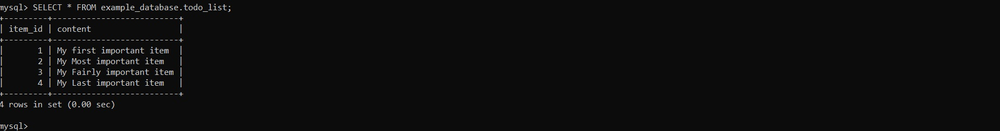
<br>*Verifying data saved successfully*   
<br> 

Now you can create a PHP script that will connect to MySQL and query for your content. Create a new PHP file in your custom web root 
<br>directory using your preferred editor. We’ll use vi for that:
>`nano /var/www/projectLEMP/todo_list.php`   

<br>The following PHP script connects to the MySQL database and queries for the content of the todo_list table, displays the results in a list.
<br>If there is a problem with the database connection, it will throw an exception.

```
<?php
$user = "example_user";
$password = "password";
$database = "example_database";
$table = "todo_list";

try {
  $db = new PDO("mysql:host=localhost;dbname=$database", $user, $password);
  echo "<h2>TODO</h2><ol>";
  foreach($db->query("SELECT content FROM $table") as $row) {
    echo "<li>" . $row['content'] . "</li>";
  }
  echo "</ol>";
} catch (PDOException $e) {
    print "Error!: " . $e->getMessage() . "<br/>";
    die();
}
```
<br>   

You can now access this page in your web browser by visiting the domain name or public IP address configured for your website, followed by
<br>/todo_list.php:
>`http://<Public_domain_or_IP>/todo_list.php`   
<br>   

<br>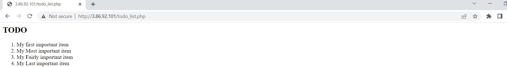
<br>*Verifying from browser data inserted successfully*   
<br> 

*Congratulations!*   

In this guide, we have built a flexible foundation for serving PHP websites and applications to your visitors, using Nginx as web server and 
<br>MySQL as database management system.
