# **MIGRATION TO THE СLOUD WITH CONTAINERIZATION. PART 1 – DOCKER & DOCKER COMPOSE**

# **Step 1 - Install Docker and prepare for migration to the Cloud** 
First, we need to install Docker Engine, which is a client-server application that contains:
* A server with a long-running daemon process dockerd.
* APIs that specify interfaces that programs can use to talk to and instruct the Docker daemon.
* A command-line interface (CLI) client docker.

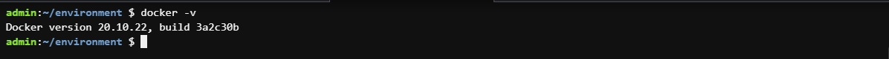   
*Verifying docker*  
<br>

# **Step 2 - MySQL in container** 
Let us start assembling our application from the Database layer – we will use a pre-built MySQL database container, configure it, and make sure it is ready to receive requests from our PHP application.

### Pull MySQL Docker Image from Docker Hub Registry
Start by pulling the appropriate Docker image for MySQL. You can download a specific version or opt for the latest release, as seen in the following command:   
`docker pull mysql/mysql-server:latest`

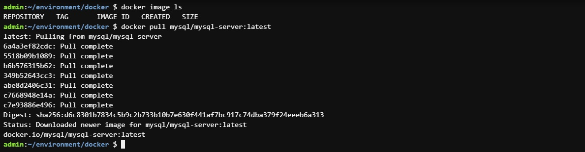   
*Pulling mysql image*  
<br>

List the images to check that you have downloaded them successfully:   
`docker image ls`

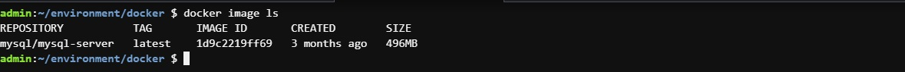   
*Listing images*  
<br>

### Deploy the MySQL Container to your Docker Engine
Once you have the image, move on to deploying a new MySQL container with:   
`docker run --name <container_name> -e MYSQL_ROOT_PASSWORD=<my-secret-pw> -d mysql/mysql-server:latest`

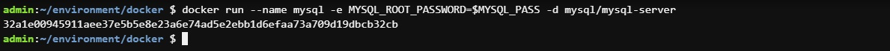   
*Deploy mysql container*  
<br>

Then, check to see if the MySQL container is running: Assuming the container name specified is mysql-server   
`docker ps -a`

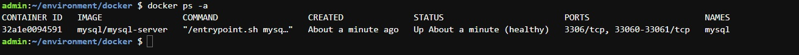   
*Verifying container is running*  
<br>

You should see the newly created container listed in the output. It includes container details, one being the status of this virtual environment. The status changes from health: starting to healthy, once the setup is complete.

# **Step 3 - Connecting to mysql docker container** 

### Approach 1
Connecting directly to the container running the MySQL server:
```
$ docker exec -it mysql bash

or

$ docker exec -it mysql mysql -uroot -p
```
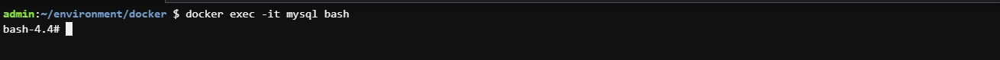   
*Connect to mysql container*  
<br>

Provide the root password when prompted. With that, you’ve connected the MySQL client to the server.

### Approach 2
At this stage you are now able to create a docker container but we will need to add a network. So, stop and remove the previous mysql docker container.
```
docker ps -a
docker stop mysql 
docker rm mysql or <container ID> 04a34f46fb98
```

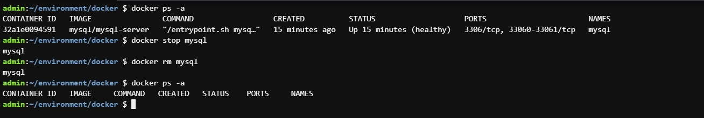   
*Stop and remove mysql container*  
<br>

First, create a network:   
` $ docker network create --subnet=172.18.0.0/24 tooling_app_network `

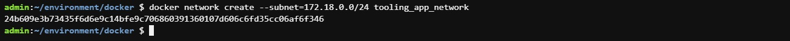   
*Create tooling network*  
<br>

Run the MySQL Server container using the created network. First, let us create an environment variable to store the root password:   
`$ export MYSQL_PW=`
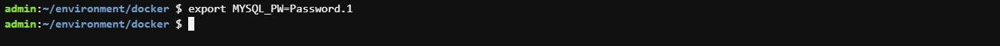   
*Create environment variable*  
<br>

Then, pull the image and run the container, all in one command like below:   
` $ docker run --network tooling_app_network -h mysqlserverhost --name=mysql-server -e MYSQL_ROOT_PASSWORD=$MYSQL_PW  -d mysql/mysql-server:latest`
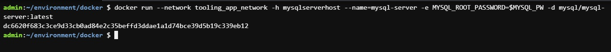   
*Run container*  
<br>

Verify the container is running:   
`$ docker ps -a` 
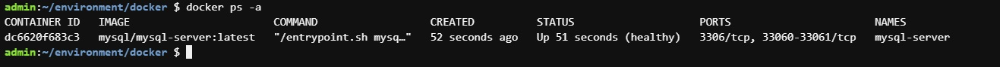   
*Verify container*  
<br>

it is best practice not to connect to the MySQL server remotely using the root user. Therefore, we will create an SQL script that will create a user we can use to connect remotely.

Create a file and name it create_user.sql and add the below code in the file:   
` $ CREATE USER ''@'%' IDENTIFIED BY ''; GRANT ALL PRIVILEGES ON * . * TO ''@'%'; `   
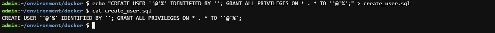   
*Create file*
<br>   

### Connecting to the MySQL server from a second container running the MySQL client utility
The good thing about this approach is that you do not have to install any client tool on your laptop, and you do not need to connect directly to the container running the MySQL server.

` $ docker run --network tooling_app_network --name mysql-client -it --rm mysql mysql -h mysqlserverhost -u  -p `   
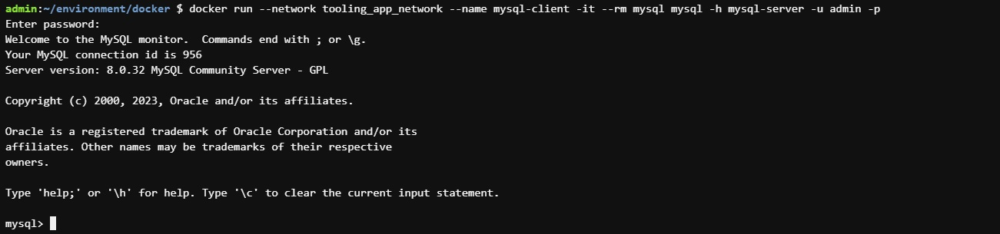   
*Connect to mysql container*  
<br>

### Prepare database schema
Now you need to prepare a database schema so that the Tooling application can connect to it.

* Clone the Tooling-app repository from [here](https://github.com/ahmedb24/tooling)   
 ` $ git clone https://github.com/ahmedb24/tooling.git `
* On your terminal, export the location of the SQL file   
 ` $ export tooling_db_schema=/tooling_db_schema.sql `

  You can find the tooling_db_schema.sql in the tooling/html/tooling_db_schema.sql folder of cloned repo.
* Use the SQL script to create the database and prepare the schema. With the docker exec command, you can execute a command in a running container.   
 ` $ docker exec -i mysql-server mysql -u root -p$MYSQL_PW < $tooling_db_schema `
 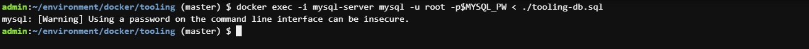   
 *Execute command*  
 <br>


* Update the .env file with connection details to the database
  The .env file is located in the html tooling/html/.env folder but not visible in terminal. you can use vi or nano

  ```
  sudo vi .env
  
  MYSQL_IP=mysqlserverhost
  MYSQL_USER=username
  MYSQL_PASS=client-secrete-password
  MYSQL_DBNAME=toolingdb
  ```

* Run the Tooling App   
  Containerization of an application starts with creation of a file with a special name - 'Dockerfile' (without any extensions). This can be considered as a 'recipe' or 'instruction' that tells Docker how to pack your application into a container.

  Make sure you have checked out the Tooling repo to your machine with Docker engine. Ensure you are inside the directory "tooling" that has the file Dockerfile and build the image:   
  ` $ docker build -t tooling:0.0.1 . `
  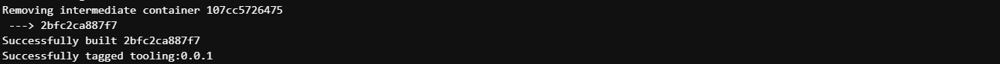   
  *Build image*  
  <br>

* Run the container:   
  ` $ docker run --network tooling_app_network -p 8085:80 -it tooling:0.0.1 `

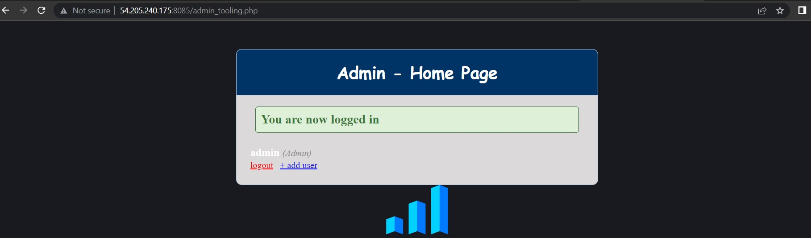   
*Tooling app running*  
<br>


