# **DEPLOYING APPLICATIONS INTO KUBERNETES CLUSTER**

# **Step 1 - Common kubernetes objects**
* Pod
* Namespace
* ResplicaSet (Manages Pods)
* DeploymentController (Manages Pods)
* StatefulSet
* DaemonSet
* Service
* ConfigMap
* Volume
* Job/Cronjob

### Deploying a random Pod 
Create a Pod yaml manifest on your master node and then apply it with the help of kubectl
```
sudo cat <<EOF | sudo tee ./nginx-pod.yaml
apiVersion: v1
kind: Pod
metadata:
name: nginx-pod
spec:
containers:
- image: nginx:latest
name: nginx-pod
ports:
- containerPort: 80
  protocol: TCP
EOF

#Apply the manifest
kubectl apply -f nginx-pod.yaml

```

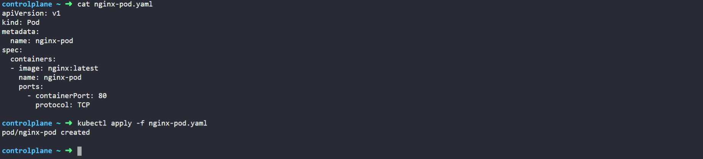   
*Apply manifest*  
<br>

Get an output of the pods running in the cluster   
`kubectl get pods`
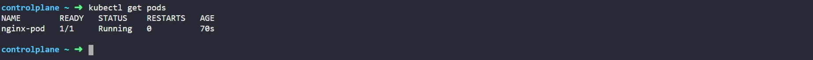   
*List of pods*  
<br>

See other fields introduced by kubernetes after you have deployed the resource   
```
kubectl get pod nginx-pod -o yaml
or
kubectl describe pod nginx-pod
```
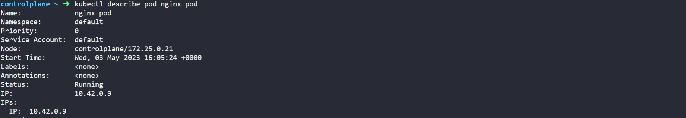   
*More pod fields*  
<br>

# **Step 2 - Accessing the app from the browser**
### Access the Pod through its IP address from within the K8s cluster

We need an image that already has curl software installed.   
`busybox/busybox`

Run kubectl to connect inside the container
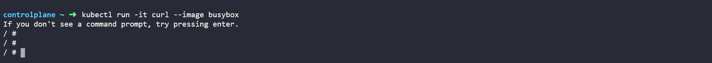   
*Connect to container*  
<br>

Run curl and point to the IP address of the Nginx Pod
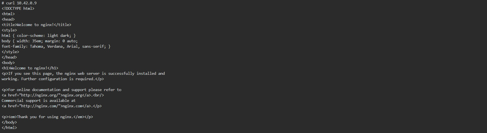   
*Test connection to pod*  
<br>

If the use case for your solution is required for internal use ONLY, without public Internet requirement. Then, this should be OK. But in most cases, it is NOT! To solve this problem, kubernetes uses Service

### Create a service to access the Nginx Pod
Create a Service yaml manifest file and apply
```
sudo cat <<EOF | sudo tee ./nginx-service.yaml
apiVersion: v1
kind: Service
metadata:
  name: nginx-service
spec:
  selector:
    app: nginx-pod 
  ports:
    - protocol: TCP
      port: 80
      targetPort: 80
EOF

#Apply manifest
kubectl apply -f nginx-service.yaml
```
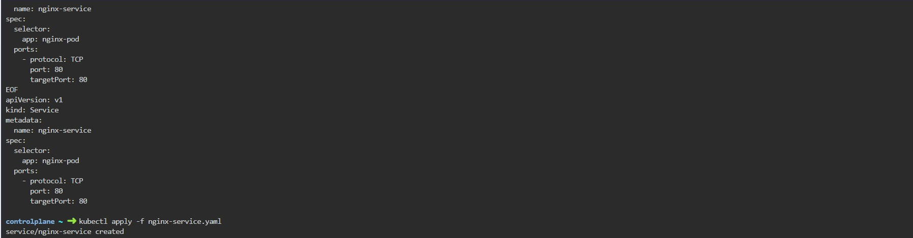   
*Create service manifest*  
<br>

Check the created service
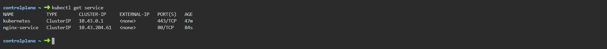   
*Verify service*  
<br>

Access the app via the service. Since there is no public IP address, we can leverage kubectl's port-forward functionality.   
`kubectl  port-forward svc/nginx-service 8089:80`

### Reconfigure the Pod manifest and introduce labels
Update the Pod manifest with the below and apply the manifest:
```
apiVersion: v1
kind: Pod
metadata:
  name: nginx-pod
  labels:
    app: nginx-pod  
spec:
  containers:
  - image: nginx:latest
    name: nginx-pod
    ports:
    - containerPort: 80
      protocol: TCP

#Apply the manifest
kubectl apply -f nginx-pod.yaml
```
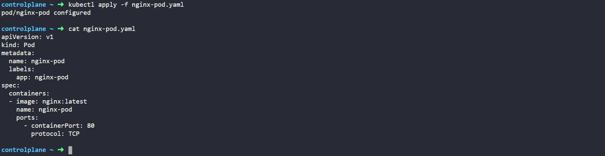   
*Reconfigure pod*  
<br>

Accessing the site via the web browser
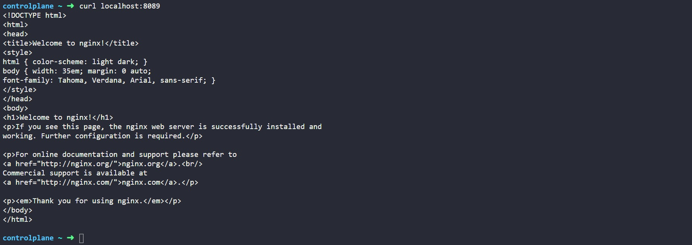   
*Access the site*  
<br>

# **Step 3 - Create a replicaset**
Create a rs.yaml manifest for a ReplicaSet object and apply it:
```
#Part 1
apiVersion: apps/v1
kind: ReplicaSet
metadata:
  name: nginx-rs
spec:
  replicas: 3
  selector:
    app: nginx-pod
#Part 2
  template:
    metadata:
      name: nginx-pod
      labels:
         app: nginx-pod
    spec:
      containers:
      - image: nginx:latest
        name: nginx-pod
        ports:
        - containerPort: 80
          protocol: TCP

# Apply the manifest
kubectl apply -f rs.yaml
```
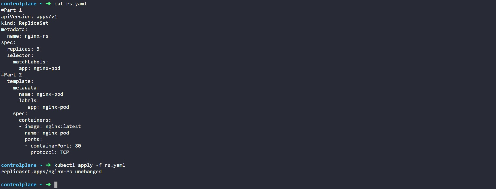   
*Create replicaset*  
<br>

Check what Pods have been created:   
`kubectl get pods`
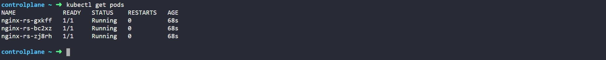   
*Check pods*  
<br>

Try to delete one of the Pods:   
`kubectl delete po nginx-pod-j784r`
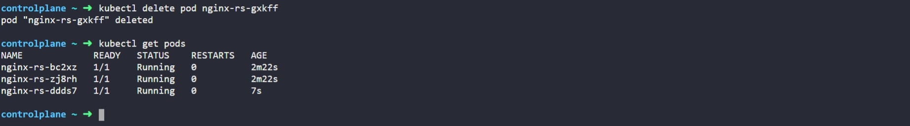   
*Delete a pod*  
<br>

We still have all 3 Pods, but one has been recreated.

Explore the ReplicaSet created:   
`kubectl get rs -o wide`
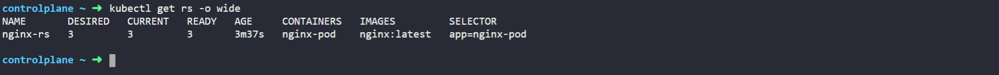   
*Explore replicaset*  
<br>

### Get detailed information of a ReplicaSet
To display detailed information about any Kubernetes object, you can use 2 different commands:

kubectl describe %object_type% %object_name% (e.g. kubectl describe rs nginx-rs)    
kubectl get %object_type% %object_name% -o yaml (e.g. kubectl describe rs nginx-rs -o yaml)
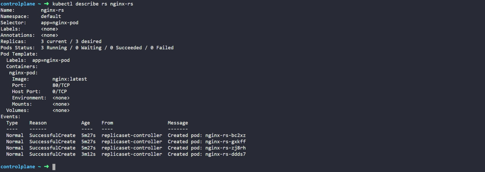   
*Explore replicaset*  
<br>

### Scale ReplicaSet up and down:
We can easily scale our ReplicaSet up by specifying the desired number of replicas in an imperative command, like this:
`kubectl scale rs nginx-rs --replicas=5`   
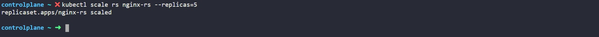   
*Scale replicaset*  
<br>

### Advanced label matching
ReplicationControllers do not meet certain complex business requirements when it comes to using selectors.   
Let us look at the following manifest file and apply it:
```
apiVersion: apps/v1
kind: ReplicaSet
metadata: 
  name: nginx-rs
spec:
  replicas: 3
  selector:
    matchLabels:
      env: prod
    matchExpressions:
    - { key: tier, operator: In, values: [frontend] }
  template:
    metadata:
      name: nginx
      labels: 
        env: prod
        tier: frontend
    spec:
      containers:
      - name: nginx-container
        image: nginx:latest
        ports:
        - containerPort: 80
          protocol: TCP
```
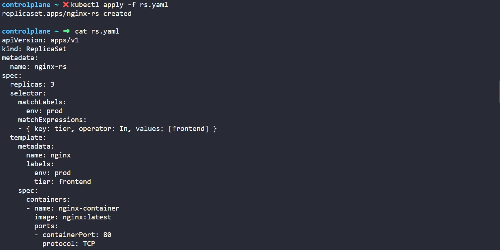   
*Complex selectors*  
<br>

Under the selector, matchLabels and matchExpression are used to specify the key-value pair.   


Get the replication set:
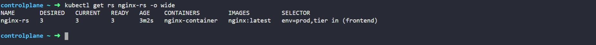   
*Display replication set*  
<br>

# **Step 4 - Using Deployment Controllers**
### Create the deployment manifest and apply it
``` 
apiVersion: apps/v1
kind: Deployment
metadata:
  name: nginx-deployment
  labels:
    tier: frontend
spec:
  replicas: 3
  selector:
    matchLabels:
      tier: frontend
  template:
    metadata:
      labels:
        tier: frontend
    spec:
      containers:
      - name: nginx
        image: nginx:latest
        ports:
        - containerPort: 80

#Apply the manifest
kubectl apply -f nginx-deploy.yaml
``` 
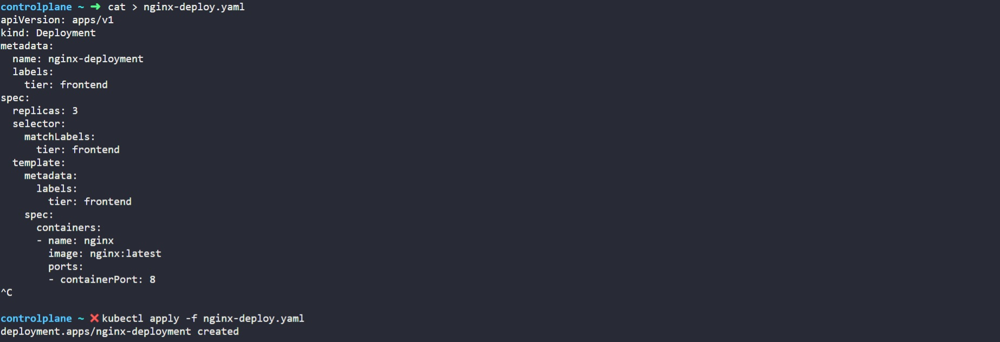   
*Create deployment*  
<br>

Get the Deployment
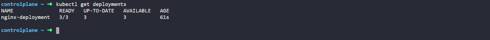   
*Get deployment*  
<br>

Get the ReplicaSet
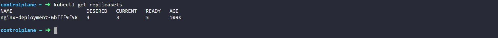   
*Get replicaset*  
<br>

Get the Pods
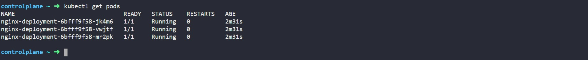   
*Get pods*  
<br>

Scale the replicas in the Deployment to 15 Pods
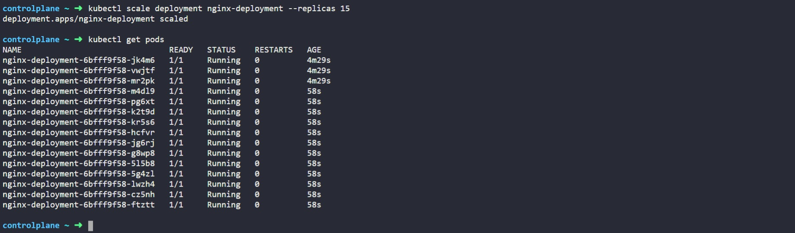   
*Get pods*  
<br>

Exec into one of the Pod’s container to run Linux commands
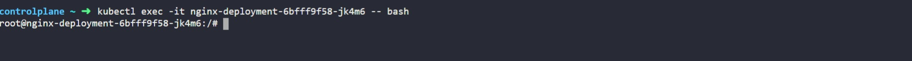   
*Exec into pod*  
<br>

List the files and folders in the Nginx directory
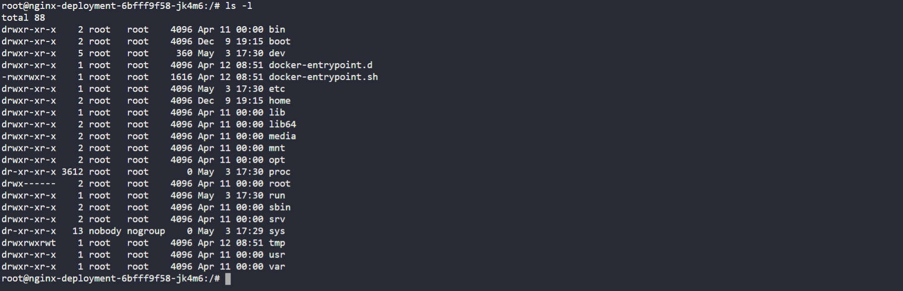   
*List directory*  
<br>

Check the content of the default Nginx configuration file
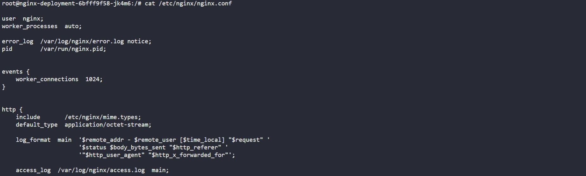   
*Check content*  
<br>

it is time to explore how Kubernetes is able to manage persistent data.

# **Step 5 - Persisting data for pods**
Deployments are stateless by design. Hence, any data stored inside the Pod’s container does not persist when the Pod dies.

Scale the Pods down to 1 replica.
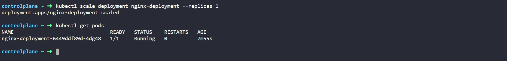   
*Scale the pods*  
<br>

Exec into the running container
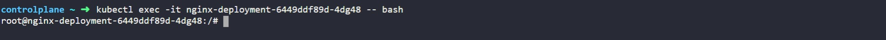   
*Exec into container*  
<br>

Install vim so that you can edit the file
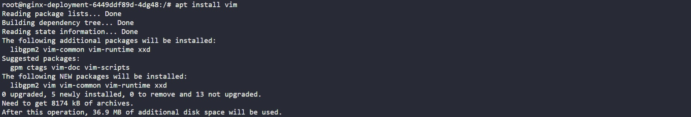   
*Install vim*  
<br>

Update the content of the file `index.html` and add the code below /usr/share/nginx/html/index.html
```
<!DOCTYPE html>
<html>
<head>
<title>Welcome to THESITE!</title>
<style>
    body {
        width: 35em;
        margin: 0 auto;
        font-family: Tahoma, Verdana, Arial, sans-serif;
    }
</style>
</head>
<body>
<h1>Welcome to THESITE!</h1>
<p>I love experiencing Kubernetes</p>

<p>Learning by doing is absolutely the best strategy at 
<a href="https://thesite.io/">www.thesite.io</a>.<br/>
for skills acquisition
<a href="https://thesite.io/">www.thesite.io</a>.</p>

<p><em>Thank you for learning from THESITE</em></p>
</body>
</html>
```

Do a curl – You should see this
   
*Check curl response*  
<br>

Now, delete the only running Pod
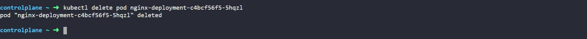   
*Delete the one pod*  
<br>

Do a curl again – You will see that the content you saved in the container is no longer there. That is because Pods do not store data when they are being recreated – that is why they are called ephemeral or stateless. 
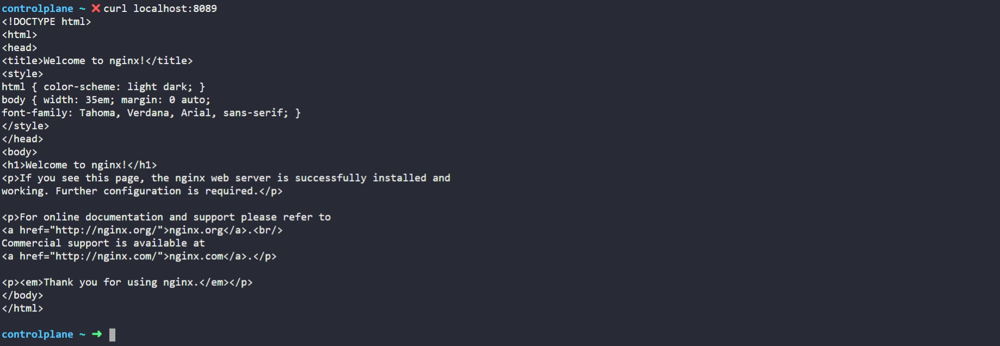   
*Check curl response*  
<br>

To make the data persist in case of a Pod’s failure, you will need to configure the Pod to use following objects:

* Persistent Volume or pv – is a piece of storage in the cluster that has been provisioned by an administrator or dynamically provisioned using Storage Classes.
* Persistent Volume Claim or pvc. Persistent Volume Claim is simply a request for storage, hence the "claim" in its name.


