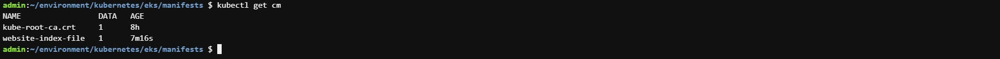

# **PERSISTING DATA IN KUBERNETES**

# **Step 1 - Volumes - awsElasticBlockStore**
An awsElasticBlockStore volume mounts an Amazon Web Services (AWS) EBS volume into your pod.   
<br>
Before you create a volume, lets run the nginx deployment into kubernetes without a volume.
```
sudo cat <<EOF | sudo tee ./nginx-pod.yaml
apiVersion: apps/v1
kind: Deployment
metadata:
  name: nginx-deployment
  labels:
    tier: frontend
spec:
  replicas: 3
  selector:
    matchLabels:
      tier: frontend
  template:
    metadata:
      labels:
        tier: frontend
    spec:
      containers:
      - name: nginx
        image: nginx:latest
        ports:
        - containerPort: 80
EOF
```

Verying Pod is running
   
*Verify pods*  
<br>

Check the logs of the pod
   
*Check logs*  
<br>

### Now that we have the pod running without a volume, Lets now create a volume from the AWS console.
In your AWS console, head over to the EC2 service and scroll down to the Elastic Block Storage section.
   
*EBS section*  
<br>

Click on Volumes and click on Create Volume
   
*Create volume*  
<br>


Part of the requirements is to ensure that the volume exists in the same region and availability zone as the EC2 instance running the pod. Hence, we need to find out

* Which node is running the pod
     
  *List nodes*  
  <br>

* In which Availability Zone the node is running.
     
  *Availability zone*  
  <br>
  The information is written in the labels section of the descibe command. So, in the case above, we know the AZ for the node is in eu-west-2c hence, the volume must be created in the same AZ. Choose the size of the required volume.

The create volume selection should be like:
   
*Create volume*  
<br>

Copy the VolumeID
   
*Copy volumeid*  
<br>

Update the deployment configuration with the volume spec.
   
*Update deployment*  
<br>

Apply the new configuration and check the pod.
   
*Apply new config*  
<br>

To complete the configuration, we will need to add another section to the deployment yaml manifest. The volumeMounts which basically answers the question "Where should this Volume be mounted inside the container?" Mounting a volume to a directory means that all data written to the directory will be stored on that volume.

```
cat <<EOF | tee ./nginx-pod.yaml
apiVersion: apps/v1
kind: Deployment
metadata:
  name: nginx-deployment
  labels:
    tier: frontend
spec:
  replicas: 1
  selector:
    matchLabels:
      tier: frontend
  template:
    metadata:
      labels:
        tier: frontend
    spec:
      containers:
      - name: nginx
        image: nginx:latest
        ports:
        - containerPort: 80
        volumeMounts:
        - name: nginx-volume
          mountPath: /usr/share/nginx/
      volumes:
      - name: nginx-volume
        # This AWS EBS volume must already exist.
        awsElasticBlockStore:
          volumeID: "vol-0fd9c7bb8f731731b"
          fsType: ext4
EOF
```

In as much as we now have a way to persist data, we also have new problems.

  * If you port forward the service and try to reach the endpoint, you will get a 403 error. This is because mounting a volume on a filesystem that already contains data will automatically erase all the existing data. This strategy for statefulness is preferred if the mounted volume already contains the data which you want to be made available to the container
  
     
  *Access service*  
  <br>

  * It is still a manual process to create a volume, manually ensure that the volume created is in the same Avaioability zone in which the pod is running, and then update the manifest file to use the volume ID.

The more elegant way to achieve this is through Persistent Volume and Persistent Volume claims.


# **Step 2 - Managing Volumes Dynamically With PVS And PVCS**
Run the command below to check if we already have a storageclass in your cluster 
`kubectl get storageclass`
   
*Check storageclass*  
<br>

### Now lets create some persistence for our nginx deployment.
Create a manifest file for a PVC and based on the gp2 storageClass a PV will be dynamically created
```
apiVersion: v1
kind: PersistentVolumeClaim
metadata:
  name: nginx-volume-claim
spec:
  accessModes:
  - ReadWriteOnce
  resources:
    requests:
      storage: 2Gi
  storageClassName: gp2

#Apply manifest
kubectl apply -f nginx-pvc.yaml  
```
   
*Create pvc*  
<br>

Verify the PVC
   
*Verify pvc*  
<br>

We notice that it is in pending state. To troubleshoot this, simply run a describe on the pvc. Then you will see in the Message section that this pvc is waiting for the first consumer to be created before binding the PVC to a PV.
<br>

Describe the PVC
   
*Describe pvc*  
<br>

To proceed, simply apply the new deployment configuration below and configure the Pod spec to use the PVC
```
apiVersion: apps/v1
kind: Deployment
metadata:
  name: nginx-deployment
  labels:
    tier: frontend
spec:
  replicas: 1
  selector:
    matchLabels:
      tier: frontend
  template:
    metadata:
      labels:
        tier: frontend
    spec:
      containers:
      - name: nginx
        image: nginx:latest
        ports:
        - containerPort: 80
        volumeMounts:
        - name: nginx-volume-claim
          mountPath: "/tmp/dare"
      volumes:
      - name: nginx-volume-claim
        persistentVolumeClaim:
          claimName: nginx-volume-claim

#Apply manifest
kubectl apply -f nginx-deploy.yaml
```

Create new deployment
   
*Create deployment*  
<br>


Verify PVC
   
*Verify pvc*  
<br>

# **Step 3 - ConfigMap**
### Persisting configuration data with configMaps
We will use configMap to create a file in a volume. The manifest file would look like:
```
cat <<EOF | tee ./nginx-configmap.yaml
apiVersion: v1
kind: ConfigMap
metadata:
  name: website-index-file
data:
  # file to be mounted inside a volume
  index-file: |
    <!DOCTYPE html>
    <html>
    <head>
    <title>Welcome to nginx!</title>
    <style>
    html { color-scheme: light dark; }
    body { width: 35em; margin: 0 auto;
    font-family: Tahoma, Verdana, Arial, sans-serif; }
    </style>
    </head>
    <body>
    <h1>Welcome to nginx!</h1>
    <p>If you see this page, the nginx web server is successfully installed and
    working. Further configuration is required.</p>

    <p>For online documentation and support please refer to
    <a href="http://nginx.org/">nginx.org</a>.<br/>
    Commercial support is available at
    <a href="http://nginx.com/">nginx.com</a>.</p>

    <p><em>Thank you for using nginx.</em></p>
    </body>
    </html>
EOF

#Apply the manifest
kubectl apply -f nginx-configmap.yaml
```
   
*Create configmap*  
<br>

Update the deployment file to use the configmap in the volumeMounts section
```
cat <<EOF | tee ./nginx-pod-with-cm.yaml
apiVersion: apps/v1
kind: Deployment
metadata:
  name: nginx-deployment
  labels:
    tier: frontend
spec:
  replicas: 1
  selector:
    matchLabels:
      tier: frontend
  template:
    metadata:
      labels:
        tier: frontend
    spec:
      containers:
      - name: nginx
        image: nginx:latest
        ports:
        - containerPort: 80
        volumeMounts:
          - name: config
            mountPath: /usr/share/nginx/html
            readOnly: true
      volumes:
      - name: config
        configMap:
          name: website-index-file
          items:
          - key: index-file
            path: index.html
EOF
```
   
*Update deployment*  
<br>

Now the index.html file is no longer ephemeral because it is using a configMap that has been mounted onto the filesystem. This is now evident when you exec into the pod and list the /usr/share/nginx/html directory
```
root@nginx-deployment-84b799b888-fqzwk:/# ls -ltr  /usr/share/nginx/html
lrwxrwxrwx 1 root root 17 Feb 19 16:16 index.html -> ..data/index.html
```
   
*Exec into pod*  
<br>

You can now see that the index.html is now a soft link to ../data

List the available configmaps. You can either use kubectl get configmap or kubectl get cm
   
*List configmaps*  
<br>

Update the configmap. You can either update the manifest file, or the kubernetes object directly. Lets use the latter approach this time.
`kubectl edit cm website-index-file `
   
*Update configmap*  
<br>
   
*Update configmap*  
<br>

Without restarting the pod, your site should be loaded automatically.
   
*Site output*  
<br>

If you wish to restart the deployment for any reason, simply use the command   
`kubectl rollout restart deploy nginx-deployment`

   
*Restart deployment*  
<br>

This will terminate the running pod and spin up a new one.

