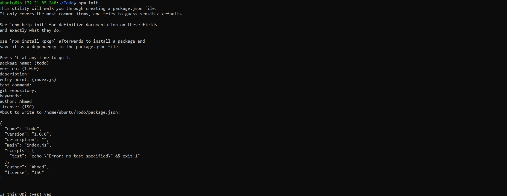
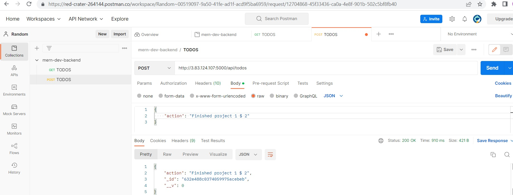
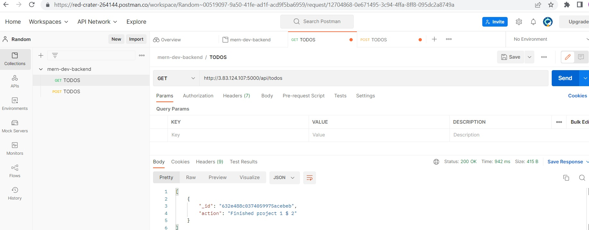

# **SIMPLE TO-DO APPLICATION ON MERN WEB STACK**
MERN web stack is a technology stack that combines a set of frameworks and tools specifically chosen to work 
<br>together and used to develop a software product.  
<br>

MERN Web stack consists of following components:   
1. MongoDB: A document-based, No-SQL database used to store application data in a form of documents.
2. ExpressJS: A server side Web Application framework for Node.js.
3. ReactJS: A frontend framework developed by Facebook. It is based on JavaScript, used to build User Interface (UI) components.
4. Node.js: A JavaScript runtime environment. It is used to run JavaScript on a machine rather than in a browser.   
<br>

We will be implementing a simple To-Do application based on MERN stack in AWS Cloud.   
<br>

# **Step 1 - Preparing prerequisites** 
In order to complete this project, an AWS account and a virtual server with Ubuntu Server OS is required.  
<br>

Creation of a new AWS account gives access to the free tier plan which allows to spin up a new EC2 instance
<br>(an instance of a virtual server) for free in only a matter of a few clicks.  
<br>

You can watch the videos below to learn how to Provision a server and connect to it.
- [AWS account setup and Provisioning an Ubuntu Server](https://www.youtube.com/watch?v=xxKuB9kJoYM&list=PLtPuNR8I4TvkwU7Zu0l0G_uwtSUXLckvh&index=6) 
- [Connecting to your EC2 Instance](https://www.youtube.com/watch?v=TxT6PNJts-s&list=PLtPuNR8I4TvkwU7Zu0l0G_uwtSUXLckvh&index=7)    
<br>


*EC2 machine in running state*  
<br>

Let us move on and configure the backend on our EC2 machine!  
<br>   

# **BACKEND CONFIGURATION** 
Update and ugrade package manager for ubuntu (APT)
> `sudo apt update`   
`sudo apt upgrade`   
<br>   

<br>Now we install NodeJS
>#Get the location of Node.js software from Ubuntu repositories.
<br>`curl -fsSL https://deb.nodesource.com/setup_18.x | sudo -E bash -`   
<br>#Install Node.js
<br>`sudo apt-get install -y nodejs`   

**Note**: The command above installs both nodejs and npm. NPM is a package manager for Node like apt for Ubuntu, 
<br>it is used to install Node modules & packages and to manage dependency conflicts.   
<br>

Verify node and npm were installed successfully
> `node -v`   
`npm -v`   

<br>
*Verifying node and npm*  
<br>   

Application Code Setup
>#Create a new directory for your To-Do project   
`mkdir Todo`
<br>   
#Verify that the Todo directory is created   
`ls`
<br>   

<br>Now change your current directory to the newly created one:
> `cd Todo`   

<br>Next, you will use the command npm init to initialise your project, so that a new file named package.json will be created. 
<br>This file will normally contain information about your application and the dependencies that it needs to run. Follow the prompts 
<br>after running the command. You can press Enter several times to accept default values, then accept to write out the package.json 
<br>file by typing yes.

>`npm init`

<br>
*Initialising project*  
<br>   

Next, we will Install ExpressJs and create the Routes directory.   
<br>

# **INSTALL EXPRESSJS**
Remember that Express is a framework for Node.js, therefore a lot of things developers would have programmed is already taken care of 
<br>out of the box. Therefore it simplifies development, and abstracts a lot of low level details. For example, Express helps to define 
<br>routes of your application based on HTTP methods and URLs.   
<br>   

To use express, install it using npm:
>`npm install express`   
<br>#Create a file index.js
<br>`touch index.js`   
<br>#Install the *dotenv* module
<br>`npm install dotenv`   

<br>Open the index.js file and paste the following file content
>`vim index.js`   

```
#File content

const express = require('express');
require('dotenv').config();

const app = express();

const port = process.env.PORT || 5000;

app.use((req, res, next) => {
res.header("Access-Control-Allow-Origin", "\*");
res.header("Access-Control-Allow-Headers", "Origin, X-Requested-With, Content-Type, Accept");
next();
});

app.use((req, res, next) => {
res.send('Welcome to Express');
});

app.listen(port, () => {
console.log(`Server running on port ${port}`)
});
```   
<br>

Now it is time to start our server to see if it works. Open your terminal in the same directory as your index.js file and type:
> `node index.js`

<br>If every thing goes well, you should see Server running on port 5000 in your terminal.

<br>
*Server started successfully*  
<br>  

Now we need to open this port in EC2 Security Groups.   
<br>
*Opened port 5000*  
<br>

Open up your browser and try to access your server’s Public IP or Public DNS name followed by port 5000:
<br>
*Verifying app running on 5000 from browser*  
<br>   

Routes   
There are three actions that our To-Do application needs to be able to do:   
1. Create a new task
2. Display list of all tasks
3. Delete a completed task   
<br>

Each task will be associated with some particular endpoint and will use different standard HTTP request methods: POST, GET, DELETE.   
<br>

For each task, we need to create routes that will define various endpoints that the To-do app will depend on. So let us create a folder routes
> `mkdir routes`   
<br>#Change directory to routes folder.   
`cd routes`   
<br>#Now, create a file api.js   
`touch api.js`   
<br>#Open the file   
`vim api.js`   

```
#Copy the code below into the file.

const express = require ('express');
const router = express.Router();

router.get('/todos', (req, res, next) => {

});

router.post('/todos', (req, res, next) => {

});

router.delete('/todos/:id', (req, res, next) => {

})

module.exports = router;
```   
<br>
Moving forward let's create Models directory.   
<br>   
<br>   

# **MODELS**
A model is at the heart of JavaScript based applications, and it is what makes it interactive.   
<br>

We will also use models to define the database schema . This is important so that we will be able to define the fields stored in each 
<br>Mongodb document.   
<br>

In essence, the Schema is a blueprint of how the database will be constructed, including other data fields that may not be required to 
<br>be stored in the database. These are known as virtual properties   
<br>

To create a Schema and a model, install mongoose which is a Node.js package that makes working with mongodb easier.
>#Change directory back Todo folder with cd .. and install Mongoose   
`npm install mongoose`   
<br>
#Create a new folder models   
`mkdir models`   
<br>
#Change directory into the newly created ‘models’ folder   
`cd models`   
<br>
#Inside the models folder, create a file and name it todo.js   
`touch todo.js`   

<br>Open the newly created todo.js file then paste the code below in the file   

```
const mongoose = require('mongoose');
const Schema = mongoose.Schema;

//create schema for todo
const TodoSchema = new Schema({
action: {
type: String,
required: [true, 'The todo text field is required']
}
})

//create model for todo
const Todo = mongoose.model('todo', TodoSchema);

module.exports = Todo;
```
<br>
Now we need to update our routes in the file api.js in ‘routes’ directory to make use of the new model.
<br>
<br>
In Routes directory, open api.js with vim api.js, delete the code inside with `:%d` command and paste the code below into it then save and exit

```
const express = require ('express');
const router = express.Router();
const Todo = require('../models/todo');

router.get('/todos', (req, res, next) => {

//this will return all the data, exposing only the id and action field to the client
Todo.find({}, 'action')
.then(data => res.json(data))
.catch(next)
});

router.post('/todos', (req, res, next) => {
if(req.body.action){
Todo.create(req.body)
.then(data => res.json(data))
.catch(next)
}else {
res.json({
error: "The input field is empty"
})
}
});

router.delete('/todos/:id', (req, res, next) => {
Todo.findOneAndDelete({"_id": req.params.id})
.then(data => res.json(data))
.catch(next)
})

module.exports = router;
```   
<br>
The next piece of our application will be the MongoDB Database   
<br>   
<br>   

# **MONGODB DATABASE**
We need a database where we will store our data. For this we will make use of mLab. mLab provides MongoDB database as a service solution (DBaaS), 
<br>so to make life easy, you will need to sign up for a shared clusters free account, which is ideal for our use case. Sign up here. Follow the sign up process, <br>select AWS as the cloud provider, and choose a region near you.   
<br>
In the index.js file, we specified process.env to access environment variables, but we have not yet created this file. So we need to do that now.
>#Create a file in your Todo directory and name it .env   
`touch .env`   
`vi .env`   
<br>
#Add the connection string to access the database in it   
`DB = 'mongodb+srv://<username>:<password>@<network-address>/<dbname>?retryWrites=true&w=majority'`   

<br>Ensure to update `<username>`, `<password>`, `<network-address>` and `<database>` according to your setup   
<br>
Now we need to update the index.js to reflect the use of .env so that Node.js can connect to the database.

```
const express = require('express');
const bodyParser = require('body-parser');
const mongoose = require('mongoose');
const routes = require('./routes/api');
const path = require('path');
require('dotenv').config();

const app = express();

const port = process.env.PORT || 5000;

//connect to the database
mongoose.connect(process.env.DB, { useNewUrlParser: true, useUnifiedTopology: true })
.then(() => console.log(`Database connected successfully`))
.catch(err => console.log(err));

//since mongoose promise is depreciated, we overide it with node's promise
mongoose.Promise = global.Promise;

app.use((req, res, next) => {
res.header("Access-Control-Allow-Origin", "\*");
res.header("Access-Control-Allow-Headers", "Origin, X-Requested-With, Content-Type, Accept");
next();
});

app.use(bodyParser.json());

app.use('/api', routes);

app.use((err, req, res, next) => {
console.log(err);
next();
});

app.listen(port, () => {
console.log(`Server running on port ${port}`)
});
```   
<br>
Using environment variables to store information is considered more secure and best practice to separate configuration and secret data from 
<br>the application, instead of writing connection strings directly inside the index.js application file.   
<br>   
<br>
Start your server using the command:   

>`node index.js`   

<br>You shall see a message ‘Database connected successfully’, if so – we have our backend configured. Now we are going to test it.


*Verifying database connected successfully*  
<br> 

### Testing Backend Code without Frontend using RESTful API
So far we have written backend part of our To-Do application, and configured a database, but we do not have a frontend UI yet. We need 
<br>ReactJS code to achieve that. But during development, we will need a way to test our code using RESTfulL API. Therefore, we will need to 
<br>make use of some API development client to test our code.   
<br>

In this project, we will use Postman to test our API.   
<br>

Open your Postman, create a POST request to the API `http://<PublicIP-or-PublicDNS>:5000/api/todos`. This request sends a new 
<br>task to our To-Do list so the application could store it in the database.   
<br>

**Note**: make sure your set header key Content-Type as application/json

<br>
*Verifying POST request from postman*  
<br> 

Create a GET request to your API on `http://<PublicIP-or-PublicDNS>:5000/api/todos`. This request retrieves all existing records from our To-do application (backend <br>requests these records from the database and sends it us back as a response to GET request).   
<br>

<br>
*Verifying GET request from postman*  
<br>   

<br>
*Verifying DELETE request from postman*  
<br>   

We have successfully created our Backend, now lets go create the Frontend.   
<br>
<br>

# **STEP 2 – FRONTEND CREATION**
Since we are done with the functionality we want from our backend and API, it is time to create a user interface for a Web client (browser) to interact with the <br>application via API. To start out with the frontend of the To-do app, we will use the create-react-app command to scaffold our app.   
<br>

In the same root directory as your backend code, which is the Todo directory, run:
> `npx create-react-app client`

<br>This will create a new folder in your Todo directory called client, where you will add all the react code.   
<br>

### Running a React App
Before testing the react app, there are some dependencies that need to be installed.   
1. Install concurrently. It is used to run more than one command simultaneously from the same terminal window.
   <br>   
   >`npm install concurrently --save-dev`   
2. Install nodemon. It is used to run and monitor the server. If there is any change in the server code, nodemon will restart it automatically and load the 
   <br>new changes.
   >`npm install nodemon --save-dev`
3. In Todo folder open the package.json file. Replace the script block with the code below.
   ```
   "scripts": {
   "start": "node index.js",
   "start-watch": "nodemon index.js",
   "dev": "concurrently \"npm run start-watch\" \"cd client && npm start\""
   },
   ```   
<br>
*Updated package.json*  
<br>

### Configure Proxy in package.json
1. Change directory to ‘client’
    >`cd client`

2. Open the package.json file
    >`vi package.json`

3. Add the key value pair in the package.json file "proxy": "http://localhost:5000".
<br>   
<br>

The whole purpose of adding the proxy configuration in number 3 above is to make it possible to access the application directly from the browser by simply 
<br>calling the server url like http://localhost:5000 rather than always including the entire path like http://localhost:5000/api/todos   
<br>

Now, ensure you are inside the Todo directory, and simply do:
>npm run dev

<br>Your app should open and start running on localhost:3000

<br>
*Opened port 3000*  
<br>
**Important note**: In order to be able to access the application from the Internet you have to open TCP port 3000 on EC2 by adding a new Security Group rule. 
<br>You already know how to do it.


<br>
*Frontend running in the browser*  
<br>

### Creating your React Components
One of the advantages of react is that it makes use of components, which are reusable and also makes code modular. For our Todo app, there will be two stateful <br>components and one stateless component.
>#From your Todo directory run   
`cd client`   
<br>
#Move to the src directory   
`cd src`   
<br>#Inside your src folder create another folder called components   
`mkdir components`   
<br>#Move into the components directory with   
`cd components`   
<br>#Inside ‘components’ directory create three files Input.js, ListTodo.js and Todo.js.   
`touch Input.js ListTodo.js Todo.js`   
<br>

```
#Open Input.js file
vi Input.js

#Copy and paste the following
import React, { Component } from 'react';
import axios from 'axios';

class Input extends Component {

state = {
action: ""
}

addTodo = () => {
const task = {action: this.state.action}

    if(task.action && task.action.length > 0){
      axios.post('/api/todos', task)
        .then(res => {
          if(res.data){
            this.props.getTodos();
            this.setState({action: ""})
          }
        })
        .catch(err => console.log(err))
    }else {
      console.log('input field required')
    }

}

handleChange = (e) => {
this.setState({
action: e.target.value
})
}

render() {
let { action } = this.state;
return (
<div>
<input type="text" onChange={this.handleChange} value={action} />
<button onClick={this.addTodo}>add todo</button>
</div>
)
}
}

export default Input
```
<br>

To make use of Axios, which is a Promise based HTTP client for the browser and node.js, you need to cd into your client from your terminal and run 
<br>`yarn add axios or npm install axios`.
>#Move to the src folder   
`cd ..`   
<br>#Move to the client folder   
`cd ..`   
<br>#Install Axios   
`npm install axios`
<br>   

<br>Sip a coffee and lets finish this up.   
<br>

# **FRONTEND CREATION (CONTINUED)**
>#Go to ‘components’ directory   
`cd src/components`   
<br>
#After that open your ListTodo.js   
`vi ListTodo.js`   
<br>

In the ListTodo.js copy and paste the following code
```
import React from 'react';

const ListTodo = ({ todos, deleteTodo }) => {

return (
<ul>
{
todos &&
todos.length > 0 ?
(
todos.map(todo => {
return (
<li key={todo._id} onClick={() => deleteTodo(todo._id)}>{todo.action}</li>
)
})
)
:
(
<li>No todo(s) left</li>
)
}
</ul>
)
}

export default ListTodo
```
<br>

Then in your Todo.js file you write the following code
```
import React, {Component} from 'react';
import axios from 'axios';

import Input from './Input';
import ListTodo from './ListTodo';

class Todo extends Component {

state = {
todos: []
}

componentDidMount(){
this.getTodos();
}

getTodos = () => {
axios.get('/api/todos')
.then(res => {
if(res.data){
this.setState({
todos: res.data
})
}
})
.catch(err => console.log(err))
}

deleteTodo = (id) => {

    axios.delete(`/api/todos/${id}`)
      .then(res => {
        if(res.data){
          this.getTodos()
        }
      })
      .catch(err => console.log(err))

}

render() {
let { todos } = this.state;

    return(
      <div>
        <h1>My Todo(s)</h1>
        <Input getTodos={this.getTodos}/>
        <ListTodo todos={todos} deleteTodo={this.deleteTodo}/>
      </div>
    )

}
}

export default Todo;
```
<br>

We need to make little adjustment to our react code. Delete the logo and adjust our App.js to look like this.
```
import React from 'react';

import Todo from './components/Todo';
import './App.css';

const App = () => {
return (
<div className="App">
<Todo />
</div>
);
}

export default App;
```
<br>

Then paste the following code into App.css:

```
.App {
text-align: center;
font-size: calc(10px + 2vmin);
width: 60%;
margin-left: auto;
margin-right: auto;
}

input {
height: 40px;
width: 50%;
border: none;
border-bottom: 2px #101113 solid;
background: none;
font-size: 1.5rem;
color: #787a80;
}

input:focus {
outline: none;
}

button {
width: 25%;
height: 45px;
border: none;
margin-left: 10px;
font-size: 25px;
background: #101113;
border-radius: 5px;
color: #787a80;
cursor: pointer;
}

button:focus {
outline: none;
}

ul {
list-style: none;
text-align: left;
padding: 15px;
background: #171a1f;
border-radius: 5px;
}

li {
padding: 15px;
font-size: 1.5rem;
margin-bottom: 15px;
background: #282c34;
border-radius: 5px;
overflow-wrap: break-word;
cursor: pointer;
}

@media only screen and (min-width: 300px) {
.App {
width: 80%;
}

input {
width: 100%
}

button {
width: 100%;
margin-top: 15px;
margin-left: 0;
}
}

@media only screen and (min-width: 640px) {
.App {
width: 60%;
}

input {
width: 50%;
}

button {
width: 30%;
margin-left: 10px;
margin-top: 0;
}
}
```
<br>

In the src directory open the index.css, Copy and paste the code below:
```
body {
margin: 0;
padding: 0;
font-family: -apple-system, BlinkMacSystemFont, "Segoe UI", "Roboto", "Oxygen",
"Ubuntu", "Cantarell", "Fira Sans", "Droid Sans", "Helvetica Neue",
sans-serif;
-webkit-font-smoothing: antialiased;
-moz-osx-font-smoothing: grayscale;
box-sizing: border-box;
background-color: #282c34;
color: #787a80;
}

code {
font-family: source-code-pro, Menlo, Monaco, Consolas, "Courier New",
monospace;
}
```
<br>

Go to the Todo directory and run 
>`npm run dev`

<br>Assuming no errors when saving all these files, our To-Do app should be ready and fully functional with the functionality discussed earlier: creating a task, <br>deleting a task and viewing all your tasks.
<br>   

<br>
*Todo application running in the browser*  
<br>

### Congratulations

In this Project you have created a simple To-Do and deployed it to MERN stack. You wrote a frontend application using React.js that communicates with a 
<br>backend application written using Expressjs. You also created a Mongodb backend for storing tasks in a database.

Credits:
1. [This guide was inspired by Digital Ocean](https://www.digitalocean.com/community/tutorials/getting-started-with-the-mern-stack)
2. [Educative.io](https://www.educative.io/edpresso/what-is-mern-stack)
