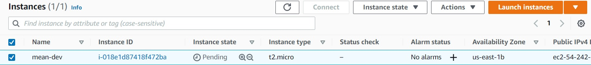

# **MEAN STACK DEPLOYMENT TO UBUNTU IN AWS**
MEAN web stack is a technology stack that combines a set of frameworks and tools specifically chosen to work 
 together and used to develop a software product.  
 

# **Step 1 - Preparing prerequisites** 
In order to complete this project, an AWS account and a virtual server with Ubuntu Server OS is required.  
 

Creation of a new AWS account gives access to the free tier plan which allows to spin up a new EC2 instance
 (an instance of a virtual server) for free in only a matter of a few clicks.  
 

You can watch the videos below to learn how to Provision a server and connect to it.
- [AWS account setup and Provisioning an Ubuntu Server](https://www.youtube.com/watch?v=xxKuB9kJoYM&list=PLtPuNR8I4TvkwU7Zu0l0G_uwtSUXLckvh&index=6) 
- [Connecting to your EC2 Instance](https://www.youtube.com/watch?v=TxT6PNJts-s&list=PLtPuNR8I4TvkwU7Zu0l0G_uwtSUXLckvh&index=7)    
 

*EC2 machine in running state*  
 

# **TASK** 
Implement a simple Book Register web form using MEAN stack.
 
 

# **Step 2 - Install NodeJS**
Node.js is a JavaScript runtime built on Chrome’s V8 JavaScript engine. Node.js is used in this tutorial to set up the Express routes and AngularJS controllers.   
>#Update ubuntu   
`sudo apt update`   

>#Upgrade ubuntu   
`sudo apt upgrade`

