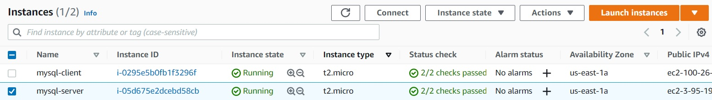
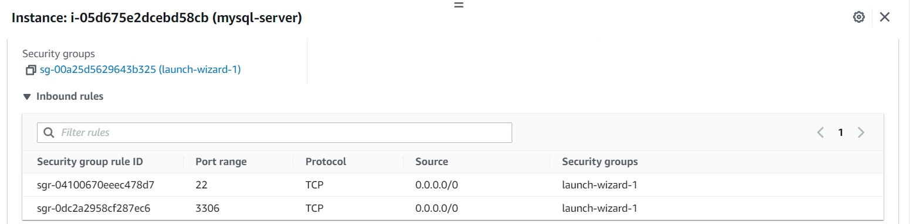
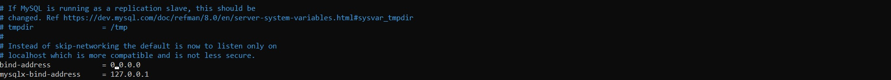
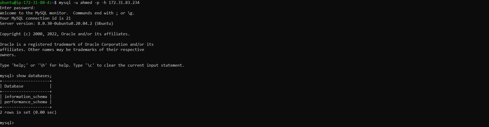

# **CLIENT SERVER ARCHITECTURE USING MYSQL DATABASE MANAGEMENT SYSTEM (DBMS)**
# **TASK** 
Implement a Client Server Architecture using MySQL Database Management System (DBMS).
<br>
<br>
# **Step 1 - Preparing prerequisites** 
In order to complete this project, an AWS account and a virtual server with Ubuntu Server OS is required.  
<br>

Creation of a new AWS account gives access to the free tier plan which allows to spin up a new EC2 instance
<br>(an instance of a virtual server) for free in only a matter of a few clicks.  
<br>

You can watch the videos below to learn how to Provision a server and connect to it.
- [AWS account setup and Provisioning an Ubuntu Server](https://www.youtube.com/watch?v=xxKuB9kJoYM&list=PLtPuNR8I4TvkwU7Zu0l0G_uwtSUXLckvh&index=6) 
- [Connecting to your EC2 Instance](https://www.youtube.com/watch?v=TxT6PNJts-s&list=PLtPuNR8I4TvkwU7Zu0l0G_uwtSUXLckvh&index=7)    
<br>

Create and configure two Linux-based virtual servers (EC2 instances in AWS).



*EC2 machines in running state*  
<br>

# **Step 2 -  Install MySQL Server** 
On mysql server Linux Server install MySQL Server software.   

**Interesting fact**: MySQL is an open-source relational database management system. Its name is a combination of "My", the name of co-founder Michael Widenius’s daughter, and "SQL", the abbreviation for Structured Query Language.

# **Step 3 -  Install MySQL Client** 
On mysql client Linux Server install MySQL Client software.

# **Step 4 -  Test Connection** 
By default, both of your EC2 virtual servers are located in the same local virtual network, so they can communicate to each other using local IP addresses. Use mysql server's local IP address to connect from mysql client.   

MySQL server uses TCP port 3306 by default, so you will have to open it by creating a new entry in ‘Inbound rules’ in ‘mysql server’ Security Groups. For extra security, do not allow all IP addresses to reach your ‘mysql server’ – allow access only to the specific local IP address of your ‘mysql client’.


*Opened port 3306*  
<br>

# **Step 5 -  Configure MySQL server**
You might need to configure MySQL server to allow connections from remote hosts.   

>sudo vi /etc/mysql/mysql.conf.d/mysqld.cnf

```
#Replace where it says bind-address from ‘127.0.0.1’ to ‘0.0.0.0’ like this:
bind-address           = 0.0.0.0
```

*allow remote hosts*  
<br>

# **Step 6 -  Connect to MySQL server**
From mysql client Linux Server connect remotely to mysql server Database Engine without using SSH. You must use the mysql utility to perform this action.

# **Step 7 -  Verify connection to remote MySQL server**
Check that you have successfully connected to a remote MySQL server and can perform SQL queries:

>Show databases;

If you see an output similar to the below image, then you have successfully completed this project – you have deloyed a fully functional MySQL Client-Server set up.


*Verifying connection to remote mySQL server*  
<br>