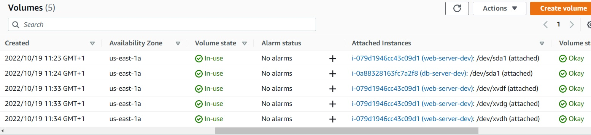

# **WEB SOLUTION WITH WORDPRESS**
In this project we would prepare a storage infrastructure on two Linux servers and implement a basic web solution using WordPress.   

# **Step 1 - Preparing prerequisites** 
In order to complete this project, an AWS account and a virtual server with Ubuntu Server OS is required.  
<br>

Creation of a new AWS account gives access to the free tier plan which allows to spin up a new EC2 instance
<br>(an instance of a virtual server) for free in only a matter of a few clicks.  
<br>

You can watch the videos below to learn how to Provision a server and connect to it.
- [AWS account setup and Provisioning an Ubuntu Server](https://www.youtube.com/watch?v=xxKuB9kJoYM&list=PLtPuNR8I4TvkwU7Zu0l0G_uwtSUXLckvh&index=6) 
- [Connecting to your EC2 Instance](https://www.youtube.com/watch?v=TxT6PNJts-s&list=PLtPuNR8I4TvkwU7Zu0l0G_uwtSUXLckvh&index=7)    
<br>

Create and configure two Linux-based virtual servers (EC2 instances in AWS).


*EC2 machines in running state*  
<br>

# **Step 2 - Add EBS volumes to WEB Server EC2 instance** 
Attach all three volumes one by one to your Web Server EC2 instance


*Created volumes*  
<br>


*Devices attached to Server*  
<br>

Open up the Linux terminal to begin configuration

Use `lsblk` command to inspect what block devices are attached to the server. Notice names of your newly created devices. All devices in Linux reside in /dev/ directory. Inspect it with ls /dev/ and make sure you see all 3 newly created block devices there – their names will likely be xvdf, xvdh, xvdg.

>#See all mounts and free space on your server   
>`df -h`   
><br>
>#Use gdisk utility to create a single partition on each of the 3 disks   
>`sudo gdisk /dev/xvdf`   
><br>
>#Use lsblk utility to view the newly configured partition on each of the 3 disks.   
>`lsblk`


*Newly configured partitions*  
<br>

Install lvm2 package using sudo yum install lvm2. Run sudo lvmdiskscan command to check for available partitions.

>#Use pvcreate utility to mark each of 3 disks as physical volumes (PVs) to be used by LVM   
>`sudo pvcreate /dev/xvdf1`   
>`sudo pvcreate /dev/xvdg1`   
>`sudo pvcreate /dev/xvdh1`   

Verify that your Physical volume has been created successfully by running `sudo pvs`   


*Verifying physical volumes*  
<br>

>#Use vgcreate utility to add all 3 PVs to a volume group (VG). Name the VG webdata-vg   
>`sudo vgcreate webdata-vg /dev/xvdh1 /dev/xvdg1 /dev/xvdf1`   
><br>
>#Verify that your VG has been created successfully by running   
>`sudo vgs`   
><br>
>#Use lvcreate utility to create 2 logical volumes   
>`sudo lvcreate -n apps-lv -L 14G webdata-vg`   
>`sudo lvcreate -n logs-lv -L 14G webdata-vg`   
><br>
>#Verify that your Logical Volume has been created successfully by running   
>`sudo lvs`   
><br>
>#Verify the entire setup   
>`sudo lsblk`


*Verifying logical volumes*  
<br>

>#Use mkfs.ext4 to format the logical volumes with ext4 filesystem   
>`sudo mkfs -t ext4 /dev/webdata-vg/apps-lv`   
>`sudo mkfs -t ext4 /dev/webdata-vg/logs-lv`   
><br>
>#Create /var/www/html directory to store website files   
>`sudo mkdir -p /var/www/html`   
><br>
>#Create /home/recovery/logs to store backup of log data   
>`sudo mkdir -p /home/recovery/logs`   
><br>
>#Mount /var/www/html on apps-lv logical volume   
>`sudo mount /dev/webdata-vg/apps-lv /var/www/html/`   
><br>
>#Use rsync utility to backup all the files in the log directory /var/log into /home/recovery/logs (This is required before mounting the file system)   
>`sudo rsync -av /var/log/. /home/recovery/logs/`   
><br>
>Mount /var/log on logs-lv logical volume. (Note that all the existing data on /var/log will be deleted. That is why the step above is very
important)   
>`sudo mount /dev/webdata-vg/logs-lv /var/log`   
><br>
>Restore log files back into /var/log directory   
>`sudo rsync -av /home/recovery/logs/. /var/log`   
><br>


*Verifying logical volumes are mounted*  
<br>

Next, update /etc/fstab file so that the mount configuration will persist after restart of the server

# **Step 3 - Update the 'etc/fstab' file** 
>#The UUID of the device will be used to update the /etc/fstab file   
>`sudo blkid`   
><br>
>#Update /etc/fstab in this format using your own UUID and rememeber to remove the leading and ending quotes
>`sudo vi /etc/fstab`


*Updated fstab file*  
<br>

>#Test the configuration and reload the daemon   
>`sudo mount -a`   
>`sudo systemctl daemon-reload`   
><br>
>#Verify your setup by running df -h, output must look like this:


*Verifying setup*  
<br>

# **Step 4 - Prepare the Database Server**
Repeat the same steps as for the Web Server, but instead of apps-lv create db-lv and mount it to /db directory instead of /var/www/html/.


# **Step 5 - Install WordPress on your Web Server EC2** 
>#Update the repository   
>`sudo yum -y update`   
><br>
>#Install wget, Apache and it’s dependencies   
>`sudo yum -y install wget httpd php php-mysqlnd php-fpm php-json`   
><br>
>#Start Apache   
>`sudo systemctl enable httpd`   

```
#To install PHP and it’s dependencies
   sudo yum install https://dl.fedoraproject.org/pub/epel/epel-release-latest-8.noarch.rpm
   sudo yum install yum-utils http://rpms.remirepo.net/enterprise/remi-release-8.rpm
   sudo yum module list php
   sudo yum module reset php
   sudo yum module enable php:remi-7.4
   sudo yum install php php-opcache php-gd php-curl php-mysqlnd
   sudo systemctl start php-fpm
   sudo systemctl enable php-fpm
   setsebool -P httpd_execmem 1
```

>#Restart Apache   
>`sudo systemctl restart httpd`

```
#Download wordpress and copy wordpress to var/www/html
   mkdir wordpress
   cd   wordpress
   sudo wget http://wordpress.org/latest.tar.gz
   sudo tar xzvf latest.tar.gz
   sudo rm -rf latest.tar.gz
   cp wordpress/wp-config-sample.php wordpress/wp-config.php
   cp -R wordpress /var/www/html/
```

```
#Configure SELinux Policies
   sudo chown -R apache:apache /var/www/html/wordpress
   sudo chcon -t httpd_sys_rw_content_t /var/www/html/wordpress -R
   sudo setsebool -P httpd_can_network_connect=1
```

# **Step 6 - Install MySQL on your DB Server EC2** 
>`sudo yum update`   
>`sudo yum install mysql-server`

Verify that the service is up and running by using sudo systemctl status mysqld, if it is not running, restart the service and enable it so it will be running even after reboot:
>`sudo systemctl restart mysqld`   
>`sudo systemctl enable mysqld`

# **Step 7 - Configure DB to work with WordPress** 
```
sudo mysql
CREATE DATABASE wordpress;
CREATE USER `myuser`@`<Web-Server-Private-IP-Address>` IDENTIFIED BY 'mypass';
GRANT ALL ON wordpress.* TO 'myuser'@'<Web-Server-Private-IP-Address>';
FLUSH PRIVILEGES;
SHOW DATABASES;
exit
```

# **Step 8 - Configure WordPress to connect to remote database** 
Hint: Do not forget to open MySQL port 3306 on DB Server EC2. For extra security, you shall allow access to the DB server ONLY from your Web Server’s IP address, so in the Inbound Rule configuration specify source as the Server's IP.


*Opened port 3306*  
<br>

>#Install MySQL client and test that you can connect from your Web Server to your DB server by using mysql-client   
>`sudo yum install mysql`   
>`sudo mysql -u admin -p -h <DB-Server-Private-IP-address>`   
><br>
>#Verify if you can successfully execute the command below andd see a list of existing databases.   
>`SHOW DATABASES;`   
><br>
>#Change permissions and configuration so Apache could use WordPress:   
><br>

Enable TCP port 80 in Inbound Rules configuration for your Web Server EC2 (enable from everywhere 0.0.0.0/0 or from your workstation’s IP)   

Try to access from your browser the link to your WordPress `http://<Web-Server-Public-IP-Address>/wordpress/`


*Accessing wordpress via a browser*  
<br>

If you see this message – it means your WordPress has successfully connected to your remote MySQL database


*Accessing wordpress via a browser*  
<br>

Important: Do not forget to STOP your EC2 instances after completion of the project to avoid extra costs.

CONGRATULATIONS!   
You have learned how to configure Linux storage susbystem and have also deployed a full-scale Web Solution using WordPress CMS and MySQL RDBMS!