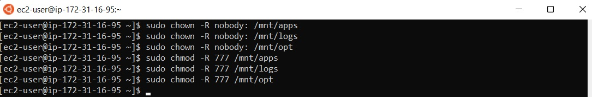

# **DEVOPS TOOLING WEBSITE SOLUTION**
As a member of a DevOps team, we will implement a tooling website solution which makes access to DevOps tools within the corporate infrastructure easily accessible.

# **Step 1 - Preparing prerequisites** 
In order to complete this project, an AWS account and virtual servers with Ubuntu and Red Hat server OS is required.  
<br>

Creation of a new AWS account gives access to the free tier plan which allows to spin up a new EC2 instance
<br>(an instance of a virtual server) for free in only a matter of a few clicks.  
<br>

You can watch the videos below to learn how to Provision a server and connect to it.
- [AWS account setup and Provisioning an Ubuntu Server](https://www.youtube.com/watch?v=xxKuB9kJoYM&list=PLtPuNR8I4TvkwU7Zu0l0G_uwtSUXLckvh&index=6) 
- [Connecting to your EC2 Instance](https://www.youtube.com/watch?v=TxT6PNJts-s&list=PLtPuNR8I4TvkwU7Zu0l0G_uwtSUXLckvh&index=7)    
<br>

# **Step 2 - Prepare the NFS server** 
Spin up a new EC2 instance with RHEL Linux 8 Operating System.


*NFS instance in running state*  
<br>

Configure LVM on the Server


*logical volumes created on nfs*  
<br>

Install NFS server, configure it to start on reboot and make sure it is up and running
>`sudo yum -y update`   
>`sudo yum install nfs-utils -y`   


*Installing nfs*  
<br>

>`sudo systemctl start nfs-server.service`   


*Starting nfs*  
<br>

>`sudo systemctl enable nfs-server.service`   


*Enabling nfs*  
<br>

>`sudo systemctl status nfs-server.service`


*Verifying nfs*  
<br>

Make sure we set up permission that will allow our Web servers to read, write and execute files on NFS:

>sudo chown -R nobody: /mnt/apps   
>sudo chown -R nobody: /mnt/logs   
>sudo chown -R nobody: /mnt/opt   
><br>
>sudo chmod -R 777 /mnt/apps   
>sudo chmod -R 777 /mnt/logs   
>sudo chmod -R 777 /mnt/opt   
><br>
>sudo systemctl restart nfs-server.service


*Setup permissions for web servers*  
<br>

Export the mounts for webservers’ subnet cidr to connect as clients. For simplicity, we will install all three Web Servers inside the same subnet, but in production set up we would probably want to separate each tier inside its own subnet for higher level of security.   
<br>
To check your subnet cidr – open your EC2 details in AWS web console and locate ‘Networking’ tab and open a Subnet link   
<br>

Configure access to NFS for clients within the same subnet (My Subnet CIDR – 172.31.16.0/20 ):   
>sudo vi /etc/exports   
><br>
>/mnt/apps 172.31.16.0/20(rw,sync,no_all_squash,no_root_squash)   
>/mnt/logs 172.31.16.0/20(rw,sync,no_all_squash,no_root_squash)   
>/mnt/opt 172.31.16.0/20(rw,sync,no_all_squash,no_root_squash)   
><br>
>Esc + :wq!   
><br>
>sudo exportfs -arv


*Configure access to nfs*  
<br>

Check which port is used by NFS and open it using Security Groups (add new Inbound Rule)
>rpcinfo -p | grep nfs


*Port used by nfs*  
<br>

Important note: In order for NFS server to be accessible from your client, you must also open following ports: TCP 111, UDP 111, UDP 2049


*Open ports*  
<br>

# **Step 3 - Configure the database server** 

Install MySQL server   
<br>
Create a database and name it tooling   

Create a database user and name it webaccess   

*Create user webaccesss*  
<br>

Grant permission to webaccess user on tooling database to do anything only from the webservers subnet cidr   

*Grant permission to user webaccess*  
<br>

# **Step 3 - Prepare the Web Servers** 
We need to make sure that our Web Servers can serve the same content from shared storage solutions, in our case – NFS Server and MySQL database.   
<br>
You already know that one DB can be accessed for reads and writes by multiple clients. For storing shared files that our Web Servers will use – we will utilize NFS and mount previously created Logical Volume lv-apps to the folder where Apache stores files to be served to the users (/var/www).   
<br>
This approach will make our Web Servers stateless, which means we will be able to add new ones or remove them whenever we need, and the integrity of the data (in the database and on NFS) will be preserved.   
<br>

Launch a new EC2 instance with RHEL 8 Operating System   

*Instance running*  
<br>

Install NFS client   
>`sudo yum install nfs-utils nfs4-acl-tools -y`   


*Install nfs client*  
<br>

Mount /var/www/ and target the NFS server’s export for apps
>`sudo mkdir /var/www`   
>`sudo mount -t nfs -o rw,nosuid <NFS-Server-Private-IP-Address>:/mnt/apps /var/www`
   

*Mount to /var/www/*  
<br>

Verify that NFS was mounted successfully by running `df -h`. Make sure that the changes will persist on Web Server after reboot:
>`sudo vi /etc/fstab`   

add following line
>`<NFS-Server-Private-IP-Address>:/mnt/apps /var/www nfs defaults 0 0`   

Install Remi’s repository, Apache and PHP

```
sudo yum install httpd -y

sudo dnf install https://dl.fedoraproject.org/pub/epel/epel-release-latest-8.noarch.rpm

sudo dnf install dnf-utils http://rpms.remirepo.net/enterprise/remi-release-8.rpm

sudo dnf module reset php

sudo dnf module enable php:remi-7.4

sudo dnf install php php-opcache php-gd php-curl php-mysqlnd

sudo systemctl start php-fpm

sudo systemctl enable php-fpm

setsebool -P httpd_execmem 1
```

### Repeat the steps above for another 2 Web Servers.
Verify that Apache files and directories are available on the Web Server in /var/www and also on the NFS server in /mnt/apps. If you see the same files – it means NFS is mounted correctly. You can try to create a new file touch test.txt from one server and check if the same file is accessible from other Web Servers.
<br>

Locate the log folder for Apache on the Web Server and mount it to NFS server’s export for logs. Repeat the step above to make sure the mount point will persist after reboot.
<br>

Fork the tooling source code from [Darey.io Github Account](https://github.com/darey-io/tooling.git) to your Github account. (Learn how to fork a repo [here](https://youtu.be/f5grYMXbAV0))
<br>

Deploy the tooling website’s code to the Webserver. Ensure that the html folder from the repository is deployed to /var/www/html
<br>

Note 1: Do not forget to open TCP port 80 on the Web Server.

Note 2: If you encounter 403 Error – check permissions to your `/var/www/html` folder and also disable SELinux `sudo setenforce 0`   
To make this change permanent – open following config file `sudo vi /etc/sysconfig/selinux` and set `SELINUX=disabled` then restart httpd.
<br>

Update the website’s configuration to connect to the database (in /var/www/html/functions.php file). Apply `tooling-db.sql` script to your database using this command mysql -h <databse-private-ip> -u <db-username> -p <db-pasword> < tooling-db.sql
<br>

Create in MySQL a new admin user with username: myuser and password: password:
<br>

INSERT INTO ‘users’ (‘id’, ‘username’, ‘password’, ’email’, ‘user_type’, ‘status’) VALUES
-> (1, ‘myuser’, ‘5f4dcc3b5aa765d61d8327deb882cf99’, ‘user@mail.com’, ‘admin’, ‘1’);
<br>

Open the website in your browser `http://<Web-Server-Public-IP-Address-or-Public-DNS-Name>/index.php` and make sure you can login into the website with myuser user.


*Website running*  
<br>

## Congratulations!
You have just implemented a web solution for a DevOps team using LAMP stack with remote Database and NFS servers.


