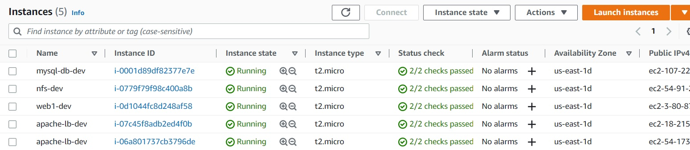
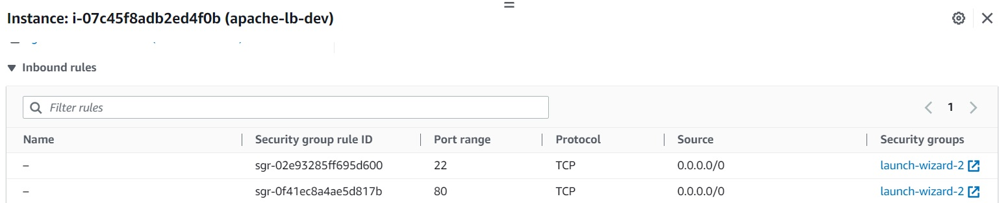
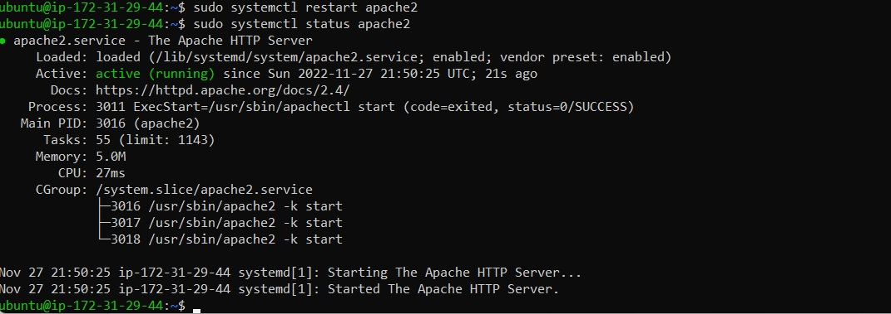
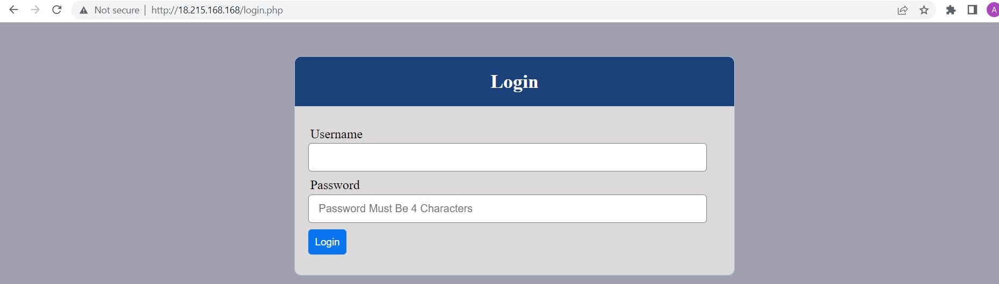
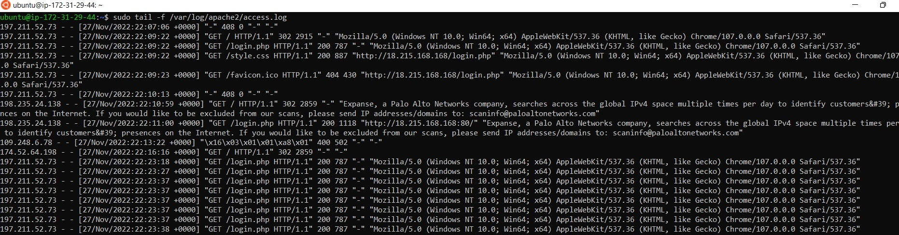
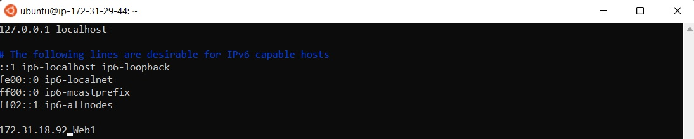
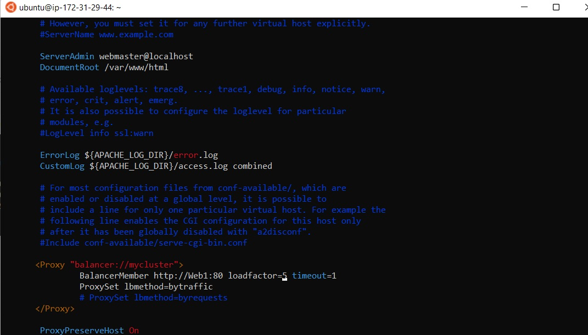
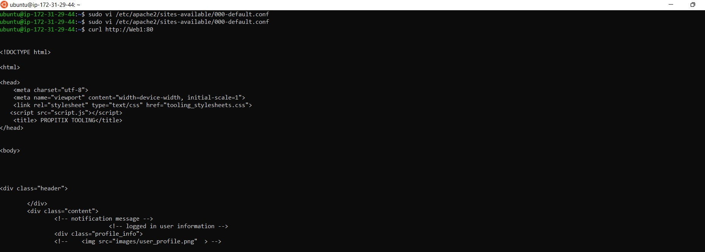

# **LOAD BALANCER SOLUTION WITH APACHE**
We will deploy and configure an Apache Load Balancer for Tooling Website solution on a separate Ubuntu EC2 intance. Make sure that users can be served by Web servers through the Load Balancer.

# **Step 1 - Preparing prerequisites** 
In order to complete this project, an AWS account, RHEL8 Web Servers, one MySQL DB Server (based on Ubuntu 20.04) and one RHEL8 NFS server is required.  
<br>

Creation of a new AWS account gives access to the free tier plan which allows to spin up a new EC2 instance (an instance of a virtual server) for free in only a matter of a few clicks.  
<br>

You can watch the videos below to learn how to Provision a server and connect to it.
- [AWS account setup and Provisioning an Ubuntu Server](https://www.youtube.com/watch?v=xxKuB9kJoYM&list=PLtPuNR8I4TvkwU7Zu0l0G_uwtSUXLckvh&index=6) 
- [Connecting to your EC2 Instance](https://www.youtube.com/watch?v=TxT6PNJts-s&list=PLtPuNR8I4TvkwU7Zu0l0G_uwtSUXLckvh&index=7)    
<br>

# **Step 2 - Configure Apache as a load balancer**
Create an Ubuntu Server 20.04 EC2 instance, so your EC2 list will look like this:


*All instances running*  
<br>

Open TCP port 80 on apache-lb by creating an Inbound Rule in Security Group.


*Open port 80*  
<br>

Install Apache Load Balancer on Project-8-apache-lb server and configure it to point traffic coming to LB to both Web Servers:
```
#Install apache2
sudo apt update
sudo apt install apache2 -y
sudo apt-get install libxml2-dev

#Enable following modules:
sudo a2enmod rewrite
sudo a2enmod proxy
sudo a2enmod proxy_balancer
sudo a2enmod proxy_http
sudo a2enmod headers
sudo a2enmod lbmethod_bytraffic

#Restart apache2 service
sudo systemctl restart apache2
```

Make sure apache2 is up and running
>sudo systemctl status apache2


*Apache running*  
<br>

Configure load balancing
```
sudo vi /etc/apache2/sites-available/000-default.conf

#Add this configuration into this section <VirtualHost *:80>  </VirtualHost>

<Proxy "balancer://mycluster">
    BalancerMember http://<WebServer1-Private-IP-Address>:80 loadfactor=5 timeout=1
    BalancerMember http://<WebServer2-Private-IP-Address>:80 loadfactor=5 timeout=1
    ProxySet lbmethod=bytraffic
    # ProxySet lbmethod=byrequests
</Proxy>

ProxyPreserveHost On
ProxyPass / balancer://mycluster/
ProxyPassReverse / balancer://mycluster/

#Restart apache server

sudo systemctl restart apache2
```
<br>

bytraffic balancing method will distribute incoming load between your Web Servers according to current traffic load. We can control in which proportion the traffic must be distributed by loadfactor parameter.

You can also study and try other methods, like: bybusyness, byrequests, heartbeat
<br>
<br>

Verify that our configuration works – try to access your LB’s public IP address or Public DNS name from your browser:
>`http://<Load-Balancer-Public-IP-Address-or-Public-DNS-Name>/index.php`


*Verifying configuration works*  
<br>

Open two ssh/Putty consoles for both Web Servers and run following command:
>`sudo tail -f /var/log/httpd/access_log`


*Verifying servers get requests*  
<br>

Try to refresh your browser page `http://<Load-Balancer-Public-IP-Address-or-Public-DNS-Name>/index.php` several times and make sure that both servers receive HTTP GET requests from your LB – new records must appear in each server’s log file. The number of requests to each server will be approximately the same since we set loadfactor to the same value for both servers – it means that traffic will be disctributed evenly between them.

If you have configured everything correctly – your users will not even notice that their requests are served by more than one server.

# **Step 3 - Configure local DNS name resolution**
Sometimes it is tedious to remember and switch between IP addresses, especially if you have a lot of servers under your management.   
<br>
What we can do, is to configure local domain name resolution. The easiest way is to use /etc/hosts file, although this approach is not very scalable, but it is very easy to configure and shows the concept well. So let us configure IP address to domain name mapping for our LB.

```
#Open this file on your LB server

sudo vi /etc/hosts

#Add 2 records into this file with Local IP address and arbitrary name for both of your Web Servers

<WebServer1-Private-IP-Address> Web1
<WebServer2-Private-IP-Address> Web2
```


*Updating /etc/hosts file*  
<br>

Now you can update your LB config file with those names instead of IP addresses.

```
BalancerMember http://Web1:80 loadfactor=5 timeout=1
BalancerMember http://Web2:80 loadfactor=5 timeout=1
```


*Updating LB config file*  
<br>

You can try to curl your Web Servers from LB locally curl http://Web1 or curl http://Web2 – it shall work.   
<br>


*Curling web server*  
<br>

Remember, this is only internal configuration and it is also local to your LB server, these names will neither be ‘resolvable’ from other servers internally nor from the Internet.

### Congratulations!
You have just implemented a Load balancing Web Solution for your DevOps team.


