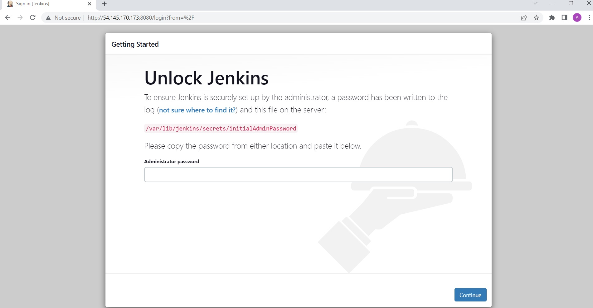

# **CONTINUOUS INTEGRATION PIPELINE FOR TOOLING WEBSITE**
Enhance the architecture prepared in LOAD BALANCER SOLUTION WITH APACHE PROJECT by adding a Jenkins server, configure a job to automatically deploy source code changes from Git to NFS server.

# **Step 1 - Preparing prerequisites** 
In order to complete this project, an AWS account, Jenkins Server(based on Ubuntu 20.04), RHEL8 Web Servers, one MySQL DB Server (based on Ubuntu 20.04) and one RHEL8 NFS server is required.  
 

Creation of a new AWS account gives access to the free tier plan which allows to spin up a new EC2 instance (an instance of a virtual server) for free in only a matter of a few clicks.  
 

You can watch the videos below to learn how to Provision a server and connect to it.
- [AWS account setup and Provisioning an Ubuntu Server](https://www.youtube.com/watch?v=xxKuB9kJoYM&list=PLtPuNR8I4TvkwU7Zu0l0G_uwtSUXLckvh&index=6) 
- [Connecting to your EC2 Instance](https://www.youtube.com/watch?v=TxT6PNJts-s&list=PLtPuNR8I4TvkwU7Zu0l0G_uwtSUXLckvh&index=7)    
 

# **Step 2 - Install Jenkins server** 
Create an Ubuntu Server 20.04 EC2 instance for Jenkins, so your EC2 list will look like this:

*All instances running*  
 

Install JDK (since Jenkins is a Java-based application)
>`sudo apt update`   
>`sudo apt install default-jdk-headless`   

*Install java jdk*  
 

Install Jenkins
>`wget -q -O - https://pkg.jenkins.io/debian-stable/jenkins.io.key | sudo apt-key add -`   
>`sudo sh -c 'echo deb https://pkg.jenkins.io/debian-stable binary/ > \
    /etc/apt/sources.list.d/jenkins.list'`   
>`sudo apt update`   
>`sudo apt-get install jenkins`   

*Install jenkins*  
 

Make sure Jenkins is up and running   
>`sudo systemctl status jenkins`   

*Jenkins running*  
 

By default Jenkins server uses TCP port 8080 – open it by creating a new Inbound Rule in your EC2 Security Group   

*Open port 8080*  
 

Perform initial Jenkins setup.   

From your browser access `http://<Jenkins-Server-Public-IP-Address-or-Public-DNS-Name>:8080`   

Providing default admin password obtained from `/var/lib/jenkins/secrets/initialAdminPassword`      

*Default admin password*  
 

Then you will be asked which plugings to install – choose suggested plugins.   

*Suggested plugins*  
 

Once plugins installation is done – create an admin user and you will get your Jenkins server address.   

The installation is completed!   

*Jenkins ready*  
 

# **Step 3 - Configure Jenkins to retrieve source codes from GitHub using Webhooks**
In this part, we will configure a simple Jenkins job/project. This job will will be triggered by GitHub webhooks and will execute a ‘build’ task to retrieve codes from GitHub and store it locally on Jenkins server.   
  

Enable webhooks in your GitHub repository settings   

*Enable webhooks*  
 

Go to Jenkins web console, click "New Item" and create a "Freestyle project"   

*Create freestyle project*  
 

In configuration of your Jenkins freestyle project choose Git repository, provide there the link to your Tooling GitHub repository and credentials (user/password) so Jenkins could access files in the repository.   

*Configure freestyle project*  
 

Save the configuration and let us try to run the build. For now we can only do it manually.
Click "Build Now" button, if you have configured everything correctly, the build will be successfull and you will see it under #1   

*Build run*  
 

You can open the build and check in "Console Output" if it has run successfully.   

If so – congratulations! You have just made your very first Jenkins build!   

But this build does not produce anything and it runs only when we trigger it manually. Let us fix it.   
 

Click "Configure" your job/project and add these two configurations   

Configure triggering the job from GitHub webhook:   

*Triggering the job*  
 

Configure "Post-build Actions" to archive all the files – files resulted from a build are called "artifacts".   

*Post build actions*  
 

Now, go ahead and make some change in any file in your GitHub repository (e.g. README.MD file) and push the changes to the master branch.   

You will see that a new build has been launched automatically (by webhook) and you can see its results – artifacts, saved on Jenkins server.   

You have now configured an automated Jenkins job that receives files from GitHub by webhook trigger (this method is considered as ‘push’ because the changes are being ‘pushed’ and files transfer is initiated by GitHub). There are also other methods: trigger one job (downstream) from another (upstream), poll GitHub periodically and others.    

*Successful build trigger*  
 

By default, the artifacts are stored on Jenkins server locally   

>ls /var/lib/jenkins/jobs/tooling_github/builds/<build_number>/archive/

# **Step 4 - Configure Jenkins to copy files to NFS server via SSH**   
The artifacts are saved locally on Jenkins server, the next step is to copy them to our NFS server to /mnt/apps directory.   

Install "Publish Over SSH" plugin" from the Manage Jenkins and select Manage Plugins under System Configuration.   

*Install plugin*  
 

Click on manage jenkins and then configure system. Scroll down to Publish over SSH plugin configuration section and configure it to be able to connect to your NFS server.

*Configure publish over ssh plugin*  
 

Save the configuration, open your Jenkins job/project configuration page and add the "send build artifacts over ssh" post-build action.

Configure it to send all files produced by the build into our previously define remote directory. In our case we want to copy all files and directories - so we use "**".

*Configure to send all files*  
 

Make changes in the README.MD file in the git account and confirm if it will sync along with jenkins and show in the NFS server.

*Change readme file*  
 

Below is the output from the NFS server, checking the README.MD file

*Confirming nfs server sync*  
 

